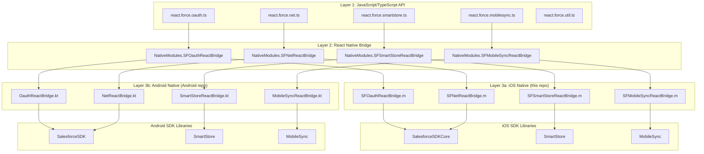
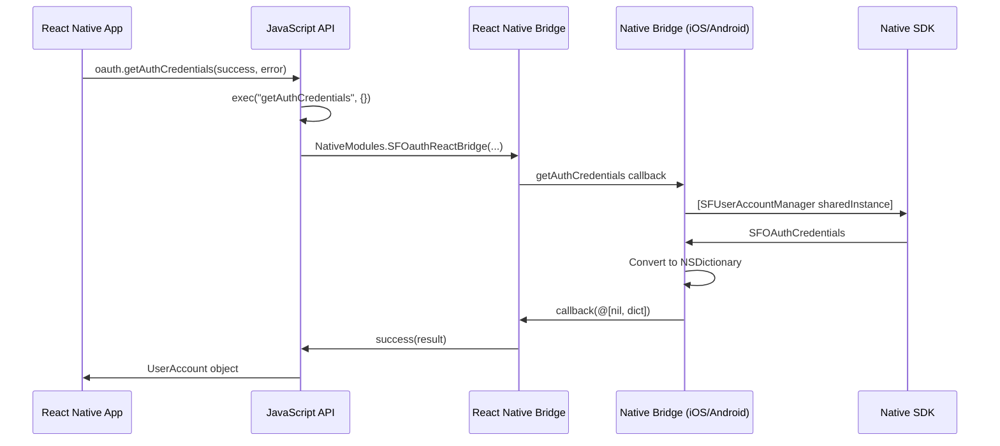
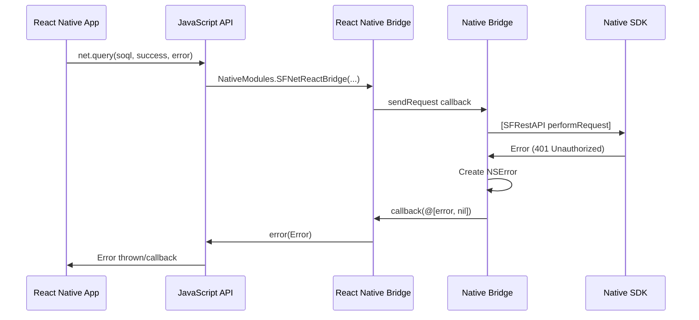
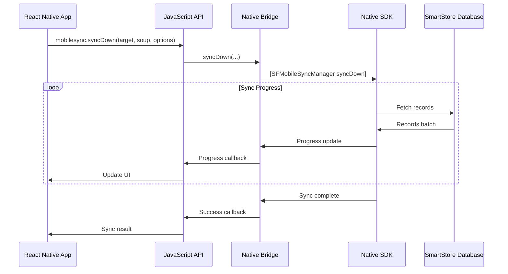
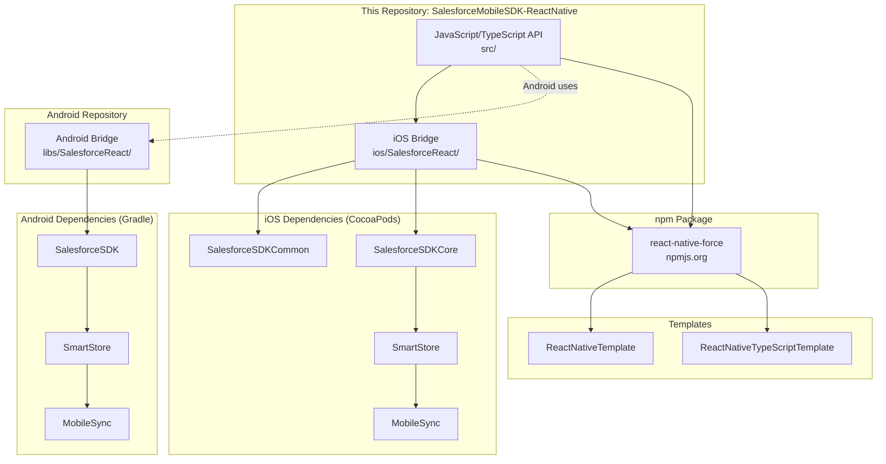
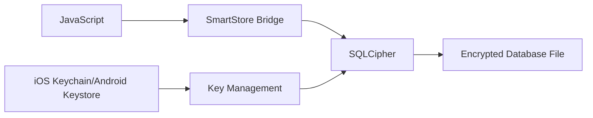
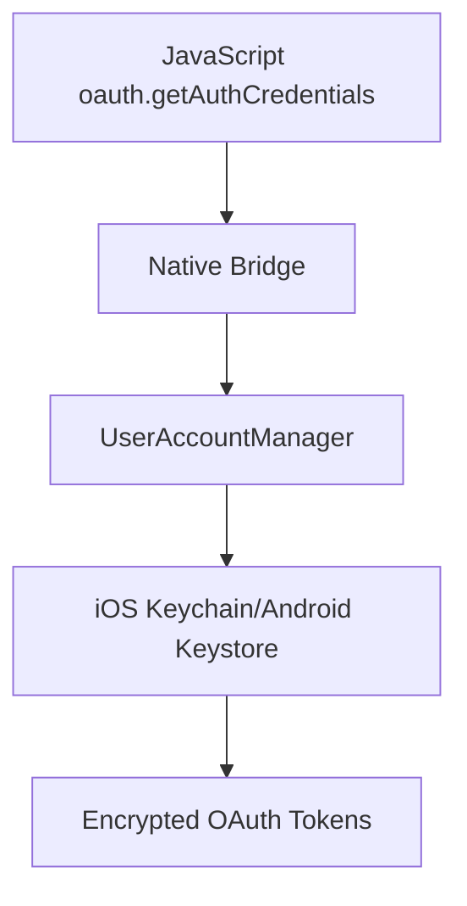

# Architecture

This document describes the technical architecture of the Salesforce Mobile SDK for React Native, including the three-layer bridge pattern and data flow between JavaScript and native code.

## Table of Contents

- [Overview](#overview)
- [Three-Layer Architecture](#three-layer-architecture)
- [Bridge Pattern](#bridge-pattern)
- [Module Architecture](#module-architecture)
- [Data Flow](#data-flow)
- [Cross-Platform Differences](#cross-platform-differences)
- [Dependency Graph](#dependency-graph)

## Overview

The Salesforce Mobile SDK for React Native provides a JavaScript/TypeScript API that bridges to native iOS and Android implementations. This architecture allows React Native apps to access Salesforce features while maintaining platform-specific optimizations and security.

### Design Principles

1. **Single JavaScript API**: One TypeScript API surface for both iOS and Android
2. **Native Performance**: Heavy operations run in native code (encryption, networking)
3. **Platform Parity**: Both platforms implement the same features identically
4. **Type Safety**: Full TypeScript support with exported type definitions
5. **Promise-Based**: Modern async/await patterns throughout

## Three-Layer Architecture



### Layer 1: JavaScript/TypeScript API

**Location**: `src/` directory

The public-facing API that React Native developers use. Written in TypeScript with exported type definitions.

**Responsibilities**:
- Define public API surface
- Handle parameter validation
- Convert callbacks to native bridge format
- Export TypeScript types

**Key Files**:
- `src/react.force.oauth.ts` - OAuth/authentication
- `src/react.force.net.ts` - REST API client
- `src/react.force.smartstore.ts` - Encrypted storage
- `src/react.force.mobilesync.ts` - Data sync
- `src/react.force.common.ts` - Bridge execution logic
- `src/typings/` - TypeScript type definitions

### Layer 2: React Native Bridge

**Location**: React Native's `NativeModules` API

The communication layer between JavaScript and native code. React Native provides this infrastructure.

**Responsibilities**:
- Serialize JavaScript arguments to JSON
- Marshal calls from JavaScript to native thread
- Return results via callbacks/promises
- Handle errors and exceptions

**Key APIs**:
- `NativeModules.SFOauthReactBridge` (iOS) / `SalesforceOauthReactBridge` (Android)
- `NativeModules.SFNetReactBridge` (iOS) / `SalesforceNetReactBridge` (Android)
- `NativeModules.SFSmartStoreReactBridge` (iOS) / `SmartStoreReactBridge` (Android)
- `NativeModules.SFMobileSyncReactBridge` (iOS) / `MobileSyncReactBridge` (Android)

### Layer 3a: iOS Native Bridge (This Repository)

**Location**: `ios/SalesforceReact/` directory

Objective-C modules that implement the React Native bridge protocol and call iOS SDK libraries.

**Responsibilities**:
- Implement `RCTBridgeModule` protocol
- Export methods to JavaScript via `RCT_EXPORT_METHOD`
- Parse JSON arguments
- Call iOS SDK APIs
- Return results via `RCTResponseSenderBlock` callbacks

**Key Files**:
- `ios/SalesforceReact/SFOauthReactBridge.{h,m}` - OAuth bridge
- `ios/SalesforceReact/SFNetReactBridge.{h,m}` - REST API bridge
- `ios/SalesforceReact/SFSmartStoreReactBridge.{h,m}` - SmartStore bridge
- `ios/SalesforceReact/SFMobileSyncReactBridge.{h,m}` - MobileSync bridge
- `ios/SalesforceReact/SFSDKReactLogger.{h,m}` - Logging utilities
- `ios/SalesforceReact/SalesforceReactSDKManager.{h,m}` - SDK initialization

### Layer 3b: Android Native Bridge (Separate Repository)

**Location**: `SalesforceMobileSDK-Android/libs/SalesforceReact/`

Java modules that implement React Native's bridge interface and call Android SDK libraries. (Per project standards new code should be Kotlin; existing bridge files are currently Java with a planned Kotlin migration.)

**Note**: This code lives in the Android repository, NOT this repository.

### Layer 4: Native SDK Libraries

**iOS**: Installed via CocoaPods from `SalesforceMobileSDK-iOS` repository
**Android**: Installed via Gradle from `SalesforceMobileSDK-Android` repository

The core native SDKs that provide Salesforce functionality:
- **OAuth/Authentication**: User login, token management
- **REST API**: Network requests, response parsing
- **SmartStore**: SQLCipher-encrypted database
- **MobileSync**: Bidirectional sync engine

## Bridge Pattern

### Callback-Based Execution

The bridge uses a callback pattern internally:

```typescript
// JavaScript side (react.force.common.ts)
export const exec = <T>(
  moduleIOSName: ModuleIOSName,
  moduleAndroidName: ModuleAndroidName,
  moduleIOS: ModuleIOS<T>,
  moduleAndroid: ModuleAndroid,
  successCB: ExecSuccessCallback<T> | null,
  errorCB: ExecErrorCallback | null,
  methodName: string,
  args: Record<string, unknown>,
): void => {
  if (moduleIOS) {
    // iOS: Single callback with (error, result) signature
    moduleIOS[methodName](args, (error: Error, result) => {
      if (error) {
        if (errorCB) errorCB(error);
      } else {
        if (successCB) successCB(result);
      }
    });
  } else if (moduleAndroid) {
    // Android: Separate success and error callbacks
    moduleAndroid[methodName](
      args,
      (result) => {
        if (successCB) successCB(safeJSONparse(result));
      },
      (error) => {
        if (errorCB) errorCB(safeJSONparse(error));
      }
    );
  }
};
```

### iOS Bridge Implementation

```objective-c
// iOS side (SFOauthReactBridge.m)
@implementation SFOauthReactBridge

RCT_EXPORT_MODULE();

RCT_EXPORT_METHOD(getAuthCredentials:(NSDictionary *)args 
                  callback:(RCTResponseSenderBlock)callback)
{
    SFOAuthCredentials *creds = [SFUserAccountManager sharedInstance].currentUser.credentials;
    if (nil != creds) {
        NSDictionary* credentialsDict = @{
            @"accessToken": creds.accessToken,
            @"refreshToken": creds.refreshToken,
            @"userId": creds.userId,
            // ... more fields
        };
        callback(@[[NSNull null], credentialsDict]); // (error, result)
    } else {
        NSError *error = [NSError errorWithDomain:@"OAuth" ...];
        callback(@[error, [NSNull null]]);
    }
}

@end
```

### Android Bridge Implementation

```java
// Android side (SalesforceOauthReactBridge.java)
public class SalesforceOauthReactBridge extends ReactContextBaseJavaModule {

    public SalesforceOauthReactBridge(ReactApplicationContext reactContext) {
        super(reactContext);
    }

    @ReactMethod
    public void getAuthCredentials(ReadableMap args, Callback successCallback, Callback errorCallback) {
        try {
            UserAccount account = UserAccountManager.getInstance().getCurrentUser();
            JSONObject credentials = new JSONObject();
            credentials.put("accessToken", account.getAuthToken());
            credentials.put("refreshToken", account.getRefreshToken());
            credentials.put("userId", account.getUserId());
            // ... more fields
            successCallback.invoke(credentials.toString());
        } catch (Exception e) {
            errorCallback.invoke(e.getMessage());
        }
    }
}
```

(Code shown is illustrative; actual `SalesforceOauthReactBridge.java` is in the Android repo.)

## Module Architecture

Each module follows the same pattern:


### Example: OAuth Module

```typescript
// 1. JavaScript API (react.force.oauth.ts)
export const getAuthCredentials = (
  successCB: ExecSuccessCallback<UserAccount>,
  errorCB: ExecErrorCallback
): void => {
  exec(successCB, errorCB, "getAuthCredentials", {});
};

const exec = <T>(
  successCB: ExecSuccessCallback<T>,
  errorCB: ExecErrorCallback,
  methodName: OAuthMethod,
  args: Record<string, unknown>,
): void => {
  forceExec(
    "SFOauthReactBridge",         // iOS module name
    "SalesforceOauthReactBridge", // Android module name
    SFOauthReactBridge,           // iOS NativeModule
    SalesforceOauthReactBridge,   // Android NativeModule
    successCB,
    errorCB,
    methodName,
    args,
  );
};
```

```objective-c
// 2. iOS Bridge (SFOauthReactBridge.m)
RCT_EXPORT_METHOD(getAuthCredentials:(NSDictionary *)args 
                  callback:(RCTResponseSenderBlock)callback)
{
    // 3. Call iOS SDK
    SFOAuthCredentials *creds = 
        [SFUserAccountManager sharedInstance].currentUser.credentials;
    
    // 4. Return result
    callback(@[[NSNull null], credentialsDict]);
}
```

## Data Flow

### Complete Request-Response Flow



### Error Flow



### Async Operation Flow (MobileSync)



## Cross-Platform Differences

While the JavaScript API is identical on both platforms, there are implementation differences:

### Module Names

| JavaScript | iOS Module | Android Module |
|-----------|-----------|---------------|
| oauth | `SFOauthReactBridge` | `SalesforceOauthReactBridge` |
| net | `SFNetReactBridge` | `SalesforceNetReactBridge` |
| smartstore | `SFSmartStoreReactBridge` | `SmartStoreReactBridge` |
| mobilesync | `SFMobileSyncReactBridge` | `MobileSyncReactBridge` |

### Callback Signature

**iOS**: Single callback with `(error, result)` tuple
```objective-c
callback(@[[NSNull null], result]); // success
callback(@[error, [NSNull null]]);  // error
```

**Android**: Separate success and error callbacks
```java
successCallback.invoke(result.toString());  // success
errorCallback.invoke(error.getMessage());   // error
```

### Data Serialization

**iOS**: 
- Arguments: `NSDictionary` (from JSON)
- Results: `NSDictionary`, `NSArray`, or `NSString`
- Bridge handles JSON conversion automatically

**Android**:
- Arguments: `ReadableMap` (React Native type)
- Results: Serialized JSON strings
- JavaScript side parses JSON via `safeJSONparse`

### Threading Model

**iOS**:
- Bridge methods run on React Native bridge thread
- Main thread operations must use `dispatch_async(dispatch_get_main_queue(), ...)`
- Example: OAuth login UI must run on main thread

**Android**:
- Bridge methods run on React Native bridge thread
- UI operations must post to main thread/UI thread
- Background operations use AsyncTask/ExecutorService (legacy Java code; coroutines used in newer Kotlin code per project standards)

## Dependency Graph

### Repository Dependencies



### CocoaPods Dependency (SalesforceReact.podspec)

```ruby
Pod::Spec.new do |s|
  s.name         = "SalesforceReact"
  s.version      = "14.0.0"
  
  s.dependency 'React-Core'
  s.dependency 'SalesforceSDKCommon', "~>14.0.0"
  s.dependency 'SalesforceAnalytics', "~>14.0.0"
  s.dependency 'SalesforceSDKCore', "~>14.0.0"
  s.dependency 'SmartStore', "~>14.0.0"
  s.dependency 'MobileSync', "~>14.0.0"
  
  s.source_files = 'ios/SalesforceReact/**/*.{h,m}'
end
```

### npm Package Dependencies (package.json)

```json
{
  "name": "react-native-force",
  "version": "14.0.0",
  "peerDependencies": {
    "react-native": "0.81.5"
  },
  "dependencies": {
    "react": "19.1.0",
    "react-native": "0.81.5",
    "react-native-timer": "^1.3.6"
  }
}
```

## Build Process

### TypeScript Compilation

```bash
# src/ (TypeScript) -> dist/ (JavaScript)
npm run build  # Runs: tsc --build
```

**Output**:
- `dist/index.js` - Compiled JavaScript
- `dist/index.d.ts` - Type definitions
- `dist/*.js.map` - Source maps

### iOS Build (via CocoaPods)

```bash
# In React Native app
cd ios
pod install  # Installs SalesforceReact and dependencies
```

**Process**:
1. CocoaPods reads `SalesforceReact.podspec`
2. Downloads iOS SDK pods from `SalesforceMobileSDK-iOS-Specs`
3. Compiles Objective-C bridge code
4. Links into React Native app

### Android Build (via Gradle)

```bash
# In React Native app
cd android
./gradlew assembleDebug
```

**Process**:
1. Gradle resolves `react-native-force` npm package
2. Finds Android bridge in separate Android repo (currently Java; planned Kotlin migration)
3. Compiles bridge code
4. Links Android SDK libraries from Maven Central

## Module Registration

### iOS Module Registration

Modules are automatically registered by React Native when they implement `RCTBridgeModule`:

```objective-c
@interface SFOauthReactBridge : NSObject <RCTBridgeModule>
@end

@implementation SFOauthReactBridge

RCT_EXPORT_MODULE();  // Registers as "SFOauthReactBridge"

RCT_EXPORT_METHOD(getAuthCredentials:(NSDictionary *)args 
                  callback:(RCTResponseSenderBlock)callback)
{
    // Implementation
}

@end
```

### Android Module Registration

Modules are registered via a `ReactPackage` (currently Java in `SalesforceMobileSDK-Android/libs/SalesforceReact/`):

```java
public class SalesforceReactPackage implements ReactPackage {
    @Override
    public List<NativeModule> createNativeModules(ReactApplicationContext reactContext) {
        return Arrays.asList(
            new SalesforceOauthReactBridge(reactContext),
            new SalesforceNetReactBridge(reactContext),
            new SmartStoreReactBridge(reactContext),
            new MobileSyncReactBridge(reactContext)
        );
    }
}
```

## Performance Considerations

### Native Thread Execution

Heavy operations run on native threads:
- **Database queries** (SmartStore): Background thread
- **Network requests** (REST API): Network thread
- **Encryption** (SmartStore): Background thread
- **Sync operations** (MobileSync): Background thread pool

### JSON Serialization

The bridge serializes data between JavaScript and native:
- **Small objects**: Negligible overhead
- **Large arrays**: Can impact performance (use pagination)
- **Binary data**: Base64 encoded (file uploads/downloads)

### Memory Management

- **iOS**: ARC manages memory automatically
- **Android**: Garbage collection handles cleanup
- **JavaScript**: Large results can pressure heap (use cursors/pagination)

## Security Architecture

### Encrypted Storage (SmartStore)



**Key Points**:
- Database encryption is transparent to JavaScript layer
- Encryption keys stored in OS-secure storage (Keychain/Keystore)
- All SmartStore data encrypted at rest

### Token Management



**Key Points**:
- Access tokens never persisted in JavaScript
- Refresh tokens stored in OS-secure storage only
- Automatic token refresh on 401 errors

## Testing Architecture

### Test Harness

Tests are written in JavaScript and executed on both platforms:

```
test/alltests.js (JavaScript test suite)
        ↓
iosTests/ios/ (XCTest runs JavaScript)
        ↓
iOS Bridge → iOS SDK
        ↓
Test Results

Android Tests (JUnit runs JavaScript)
        ↓
Android Bridge → Android SDK
        ↓
Test Results
```

See [ios-tests/README.md](ios-tests/README.md) for testing details.

## Further Reading

- [JavaScript API Reference](javascript/API_REFERENCE.md) - Complete API documentation
- [iOS Implementation Details](ios/README.md) - iOS-specific architecture
- [Contributing Guide](../CLAUDE.md) - Development standards
- [Main README](../README.md) - Getting started and installation
