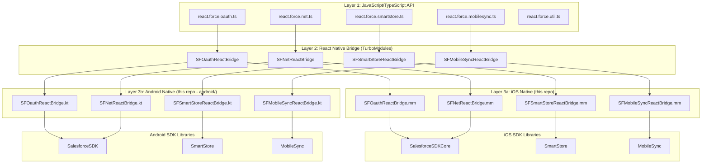
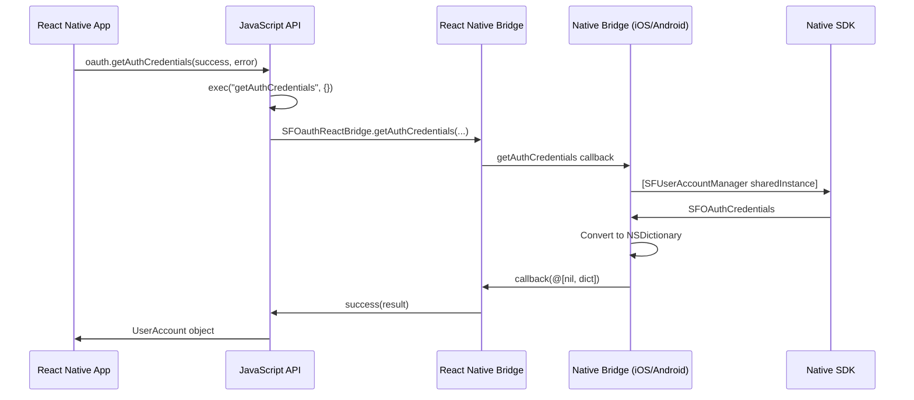
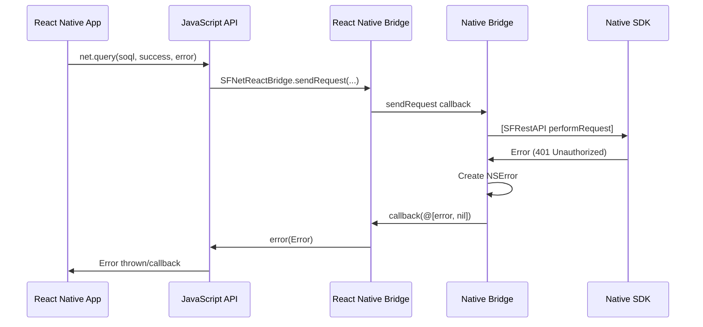
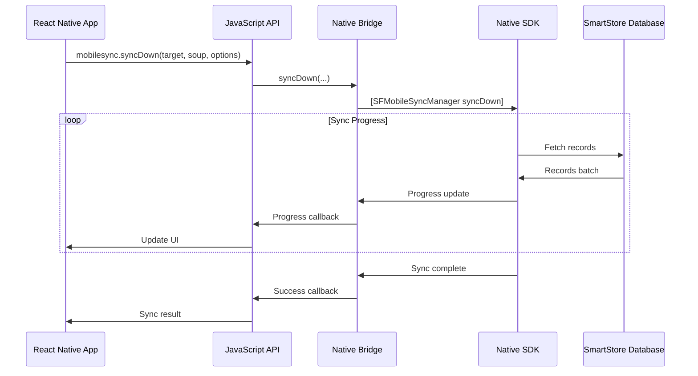
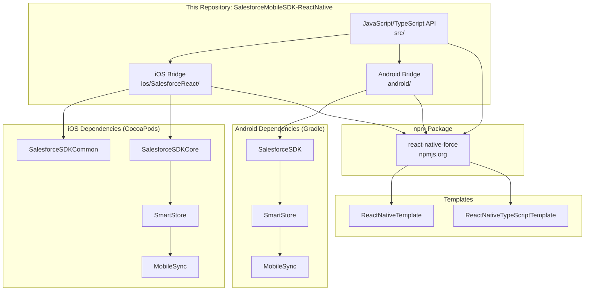
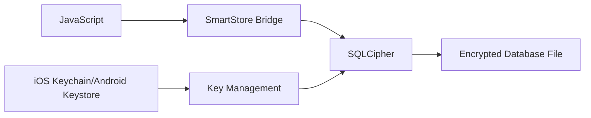
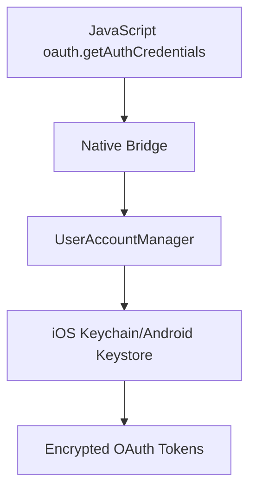

# Architecture

This document describes the technical architecture of the Salesforce Mobile SDK for React Native, including the three-layer bridge pattern and data flow between JavaScript and native code.

## Table of Contents

- [Overview](#overview)
- [Three-Layer Architecture](#three-layer-architecture)
- [Bridge Pattern](#bridge-pattern)
- [Module Architecture](#module-architecture)
- [Data Flow](#data-flow)
- [Cross-Platform Differences](#cross-platform-differences)
- [Dependency Graph](#dependency-graph)

## Overview

The Salesforce Mobile SDK for React Native provides a JavaScript/TypeScript API that bridges to native iOS and Android implementations. This architecture allows React Native apps to access Salesforce features while maintaining platform-specific optimizations and security.

### Design Principles

1. **Single JavaScript API**: One TypeScript API surface for both iOS and Android
2. **Native Performance**: Heavy operations run in native code (encryption, networking)
3. **Platform Parity**: Both platforms implement the same features identically
4. **Type Safety**: Full TypeScript support with exported type definitions
5. **Promise-Based**: Modern async/await patterns throughout

## Three-Layer Architecture


```mermaid
graph TB
    subgraph "Layer 1: JavaScript/TypeScript API"
        A[react.force.oauth.ts]
        B[react.force.net.ts]
        C[react.force.smartstore.ts]
        D[react.force.mobilesync.ts]
        E[react.force.util.ts]
    end
    
    subgraph "Layer 2: React Native Bridge (TurboModules)"
        F[SFOauthReactBridge]
        G[SFNetReactBridge]
        H[SFSmartStoreReactBridge]
        I[SFMobileSyncReactBridge]
    end
    
    subgraph "Layer 3a: iOS Native (this repo)"
        J[SFOauthReactBridge.mm]
        K[SFNetReactBridge.mm]
        L[SFSmartStoreReactBridge.mm]
        M[SFMobileSyncReactBridge.mm]
    end
    
    subgraph "Layer 3b: Android Native (this repo - android/)"
        N[SFOauthReactBridge.kt]
        O[SFNetReactBridge.kt]
        P[SFSmartStoreReactBridge.kt]
        Q[SFMobileSyncReactBridge.kt]
    end
    
    subgraph "iOS SDK Libraries"
        R[SalesforceSDKCore]
        S[SmartStore]
        T[MobileSync]
    end
    
    subgraph "Android SDK Libraries"
        U[SalesforceSDK]
        V[SmartStore]
        W[MobileSync]
    end
    
    A --> F
    B --> G
    C --> H
    D --> I
    
    F --> J
    F --> N
    G --> K
    G --> O
    H --> L
    H --> P
    I --> M
    I --> Q
    
    J --> R
    K --> R
    L --> S
    M --> T
    
    N --> U
    O --> U
    P --> V
    Q --> W
```

### Layer 1: JavaScript/TypeScript API

**Location**: `src/` directory

The public-facing API that React Native developers use. Written in TypeScript with exported type definitions.

**Responsibilities**:
- Define public API surface
- Handle parameter validation
- Convert callbacks to native bridge format
- Export TypeScript types

**Key Files**:
- `src/react.force.oauth.ts` - OAuth/authentication
- `src/react.force.net.ts` - REST API client
- `src/react.force.smartstore.ts` - Encrypted storage
- `src/react.force.mobilesync.ts` - Data sync
- `src/react.force.common.ts` - Bridge execution logic
- `src/typings/` - TypeScript type definitions

### Layer 2: React Native Bridge (TurboModules)

**Location**: React Native's TurboModuleRegistry API

The communication layer between JavaScript and native code. React Native provides this infrastructure. The project uses the **New Architecture** with **bridgeless mode** and **TurboModules**. Modules are resolved via `TurboModuleRegistry.get()` (codegen specs live in `src/specs/`).

**Responsibilities**:
- Serialize JavaScript arguments to JSON
- Marshal calls from JavaScript to native thread
- Return results via callbacks/promises
- Handle errors and exceptions

**Key APIs** (unified module names on both platforms):
- `TurboModuleRegistry.get('SFOauthReactBridge')`
- `TurboModuleRegistry.get('SFNetReactBridge')`
- `TurboModuleRegistry.get('SFSmartStoreReactBridge')`
- `TurboModuleRegistry.get('SFMobileSyncReactBridge')`

Module registration is handled by React Native autolinking (no manual `PackageList` registration needed).

### Layer 3a: iOS Native Bridge (This Repository)

**Location**: `ios/SalesforceReact/` directory

Objective-C modules that implement the React Native bridge protocol and call iOS SDK libraries.

**Responsibilities**:
- Implement `RCTBridgeModule` protocol
- Export methods to JavaScript via `RCT_EXPORT_METHOD`
- Parse JSON arguments
- Call iOS SDK APIs
- Return results via `RCTResponseSenderBlock` callbacks

**Key Files**:
- `ios/SalesforceReact/SFOauthReactBridge.{h,mm}` - OAuth bridge
- `ios/SalesforceReact/SFNetReactBridge.{h,mm}` - REST API bridge
- `ios/SalesforceReact/SFSmartStoreReactBridge.{h,mm}` - SmartStore bridge
- `ios/SalesforceReact/SFMobileSyncReactBridge.{h,mm}` - MobileSync bridge
- `ios/SalesforceReact/SFSDKReactLogger.{h,m}` - Logging utilities
- `ios/SalesforceReact/SalesforceReactSDKManager.{h,m}` - SDK initialization

### Layer 3b: Android Native Bridge (This Repository)

**Location**: `android/` directory

Kotlin modules that implement React Native's TurboModule interface and call Android SDK libraries.

**Note**: As of SDK 14.0, the Android bridge code has moved from `SalesforceMobileSDK-Android/libs/SalesforceReact/` to this repository's `android/` directory. This mirrors the iOS bridge layout and enables React Native autolinking.

**Key Files**:
- `android/src/main/java/.../bridge/SFOauthReactBridge.kt` - OAuth bridge
- `android/src/main/java/.../bridge/SFNetReactBridge.kt` - REST API bridge
- `android/src/main/java/.../bridge/SFSmartStoreReactBridge.kt` - SmartStore bridge
- `android/src/main/java/.../bridge/SFMobileSyncReactBridge.kt` - MobileSync bridge
- `android/src/main/java/.../bridge/ReactBridgeHelper.kt` - Bridge utilities
- `android/src/main/java/.../ui/SalesforceReactActivity.kt` - Activity (bridgeless mode)

### Layer 4: Native SDK Libraries

**iOS**: Installed via CocoaPods from `SalesforceMobileSDK-iOS` repository
**Android**: Installed via Gradle from `SalesforceMobileSDK-Android` repository

The core native SDKs that provide Salesforce functionality:
- **OAuth/Authentication**: User login, token management
- **REST API**: Network requests, response parsing
- **SmartStore**: SQLCipher-encrypted database
- **MobileSync**: Bidirectional sync engine

## Bridge Pattern

### Unified Single-Callback Execution

Both iOS and Android use a unified single-callback pattern. The JavaScript `exec` function calls the native module with a single callback that receives `(error, result)`:

```typescript
// JavaScript side (react.force.common.ts)
export const exec = <T>(
  moduleIOSName: ModuleIOSName,
  moduleAndroidName: ModuleAndroidName,
  moduleIOS: NativeModule,
  moduleAndroid: NativeModule,
  successCB: ExecSuccessCallback<T> | null,
  errorCB: ExecErrorCallback | null,
  methodName: string,
  args: Record<string, unknown>,
): void => {
  const module = moduleIOS ?? moduleAndroid;

  module[methodName](args, (error: any, result: any) => {
    if (error) {
      if (errorCB) errorCB(typeof error === "string" ? safeJSONparse(error) : error);
    } else {
      if (successCB) successCB(typeof result === "string" ? safeJSONparse(result) : result);
    }
  });
};
```

### iOS Bridge Implementation

```objective-c++
// iOS side (SFOauthReactBridge.mm)
@implementation SFOauthReactBridge

RCT_EXPORT_MODULE(SFOauthReactBridge);

RCT_EXPORT_METHOD(getAuthCredentials:(NSDictionary *)args
                  callback:(RCTResponseSenderBlock)callback)
{
    SFOAuthCredentials *creds = [SFUserAccountManager sharedInstance].currentUser.credentials;
    if (nil != creds) {
        NSDictionary* credentialsDict = @{
            @"accessToken": creds.accessToken,
            @"refreshToken": creds.refreshToken,
            @"userId": creds.userId,
            // ... more fields
        };
        callback(@[[NSNull null], credentialsDict]); // (error, result)
    } else {
        callback(@[@"Not authenticated"]);           // (error)
    }
}

@end
```

### Android Bridge Implementation

```kotlin
// Android side (SFOauthReactBridge.kt) — in this repo at android/
class SFOauthReactBridge(reactContext: ReactApplicationContext)
    : ReactContextBaseJavaModule(reactContext) {

    override fun getName() = "SFOauthReactBridge"

    @ReactMethod
    fun getAuthCredentials(args: ReadableMap, callback: Callback) {
        try {
            val client = (currentActivity as? SalesforceReactActivity)?.restClient
            if (client != null) {
                ReactBridgeHelper.invokeSuccess(callback, client.jsonCredentials)
            } else {
                ReactBridgeHelper.invokeError(callback, "Not authenticated")
            }
        } catch (e: Exception) {
            ReactBridgeHelper.invokeError(callback, e.message)
        }
    }
}
```

Both platforms use the same callback convention: `callback(null, result)` on success, `callback(error)` on error.

## Module Architecture

Each module follows the same pattern:


```mermaid
graph LR
    A[JavaScript Module] --> B[react.force.common.exec]
    B --> C{Platform?}
    C -->|iOS| D[SFxxxReactBridge.mm]
    C -->|Android| E[SFxxxReactBridge.kt]
    D --> F[iOS SDK Class]
    E --> G[Android SDK Class]
    F --> H[Result]
    G --> H
    H --> I[Callback to JavaScript]
```

### Example: OAuth Module

```typescript
// 1. JavaScript API (react.force.oauth.ts)
export const getAuthCredentials = (
  successCB: ExecSuccessCallback<UserAccount>,
  errorCB: ExecErrorCallback
): void => {
  exec(successCB, errorCB, "getAuthCredentials", {});
};

const exec = <T>(
  successCB: ExecSuccessCallback<T>,
  errorCB: ExecErrorCallback,
  methodName: OAuthMethod,
  args: Record<string, unknown>,
): void => {
  forceExec(
    "SFOauthReactBridge",  // Module name (same on both platforms)
    SFOauthReactBridge,    // NativeModule (resolved via TurboModuleRegistry)
    successCB,
    errorCB,
    methodName,
    args,
  );
};
```

```objective-c
// 2. iOS Bridge (SFOauthReactBridge.mm)
RCT_EXPORT_METHOD(getAuthCredentials:(NSDictionary *)args 
                  callback:(RCTResponseSenderBlock)callback)
{
    // 3. Call iOS SDK
    SFOAuthCredentials *creds = 
        [SFUserAccountManager sharedInstance].currentUser.credentials;
    
    // 4. Return result
    callback(@[[NSNull null], credentialsDict]);
}
```

## Data Flow

### Complete Request-Response Flow


```mermaid
sequenceDiagram
    participant App as React Native App
    participant JS as JavaScript API
    participant Bridge as React Native Bridge
    participant Native as Native Bridge (iOS/Android)
    participant SDK as Native SDK
    
    App->>JS: oauth.getAuthCredentials(success, error)
    JS->>JS: exec("getAuthCredentials", {})
    JS->>Bridge: SFOauthReactBridge.getAuthCredentials(...)
    Bridge->>Native: getAuthCredentials callback
    Native->>SDK: [SFUserAccountManager sharedInstance]
    SDK->>Native: SFOAuthCredentials
    Native->>Native: Convert to NSDictionary
    Native->>Bridge: callback(@[nil, dict])
    Bridge->>JS: success(result)
    JS->>App: UserAccount object
```

### Error Flow


```mermaid
sequenceDiagram
    participant App as React Native App
    participant JS as JavaScript API
    participant Bridge as React Native Bridge
    participant Native as Native Bridge
    participant SDK as Native SDK
    
    App->>JS: net.query(soql, success, error)
    JS->>Bridge: SFNetReactBridge.sendRequest(...)
    Bridge->>Native: sendRequest callback
    Native->>SDK: [SFRestAPI performRequest]
    SDK->>Native: Error (401 Unauthorized)
    Native->>Native: Create NSError
    Native->>Bridge: callback(@[error, nil])
    Bridge->>JS: error(Error)
    JS->>App: Error thrown/callback
```

### Async Operation Flow (MobileSync)


```mermaid
sequenceDiagram
    participant App as React Native App
    participant JS as JavaScript API
    participant Native as Native Bridge
    participant SDK as Native SDK
    participant DB as SmartStore Database
    
    App->>JS: mobilesync.syncDown(target, soup, options)
    JS->>Native: syncDown(...)
    Native->>SDK: [SFMobileSyncManager syncDown]
    
    loop Sync Progress
        SDK->>DB: Fetch records
        DB->>SDK: Records batch
        SDK->>Native: Progress update
        Native->>JS: Progress callback
        JS->>App: Update UI
    end
    
    SDK->>Native: Sync complete
    Native->>JS: Success callback
    JS->>App: Sync result
```

## Cross-Platform Differences

While the JavaScript API is identical on both platforms, there are implementation differences:

### Module Names (Unified)

As of SDK 14.0, both platforms use the same `SF*` prefix module names:

| JavaScript | iOS Module | Android Module |
|-----------|-----------|---------------|
| oauth | `SFOauthReactBridge` | `SFOauthReactBridge` |
| net | `SFNetReactBridge` | `SFNetReactBridge` |
| smartstore | `SFSmartStoreReactBridge` | `SFSmartStoreReactBridge` |
| mobilesync | `SFMobileSyncReactBridge` | `SFMobileSyncReactBridge` |

### Callback Signature (Unified)

Both platforms now use the same single-callback pattern with `(error, result)`:

**iOS** (Objective-C):
```objective-c
callback(@[[NSNull null], result]); // success
callback(@[error, [NSNull null]]);  // error
```

**Android** (Kotlin):
```kotlin
ReactBridgeHelper.invokeSuccess(callback, result)  // invokes callback(null, resultString)
ReactBridgeHelper.invokeError(callback, error)     // invokes callback(errorMessage)
```

The JavaScript bridge function handles both platforms with one unified code path.

### Data Serialization

**iOS**: 
- Arguments: `NSDictionary` (from JSON)
- Results: `NSDictionary`, `NSArray`, or `NSString`
- Bridge handles JSON conversion automatically

**Android**:
- Arguments: `ReadableMap` (React Native type)
- Results: Serialized JSON strings
- JavaScript side parses JSON via `safeJSONparse`

### Threading Model

**iOS**:
- Bridge methods run on React Native bridge thread
- Main thread operations must use `dispatch_async(dispatch_get_main_queue(), ...)`
- Example: OAuth login UI must run on main thread

**Android**:
- Bridge methods run on React Native bridge thread
- UI operations must post to main thread/UI thread
- Background operations use AsyncTask/ExecutorService (legacy Java code; coroutines used in newer Kotlin code per project standards)

## Dependency Graph

### Repository Dependencies


```mermaid
graph TB
    subgraph "This Repository: SalesforceMobileSDK-ReactNative"
        A[JavaScript/TypeScript API<br/>src/]
        B[iOS Bridge<br/>ios/SalesforceReact/]
        BA[Android Bridge<br/>android/]
    end
    
    subgraph "iOS Dependencies (CocoaPods)"
        C[SalesforceSDKCommon]
        D[SalesforceSDKCore]
        E[SmartStore]
        F[MobileSync]
    end
    
    subgraph "Android Dependencies (Gradle)"
        H[SalesforceSDK]
        I[SmartStore]
        J[MobileSync]
    end
    
    subgraph "npm Package"
        K[react-native-force<br/>npmjs.org]
    end
    
    subgraph "Templates"
        L[ReactNativeTemplate]
        M[ReactNativeTypeScriptTemplate]
    end
    
    A --> B
    A --> BA
    B --> C
    B --> D
    D --> E
    E --> F
    
    BA --> H
    H --> I
    I --> J
    
    A --> K
    B --> K
    BA --> K
    
    K --> L
    K --> M
```

### CocoaPods Dependency (SalesforceReact.podspec)

```ruby
Pod::Spec.new do |s|
  s.name         = "SalesforceReact"
  s.version      = "14.0.0"
  
  s.dependency 'React-Core'
  s.dependency 'SalesforceSDKCommon', "~>14.0.0"
  s.dependency 'SalesforceAnalytics', "~>14.0.0"
  s.dependency 'SalesforceSDKCore', "~>14.0.0"
  s.dependency 'SmartStore', "~>14.0.0"
  s.dependency 'MobileSync', "~>14.0.0"
  
  s.source_files = 'ios/SalesforceReact/**/*.{h,m,mm}'
end
```

### npm Package Dependencies (package.json)

```json
{
  "name": "react-native-force",
  "version": "14.0.0",
  "peerDependencies": {
    "react-native": "0.86.0"
  },
  "dependencies": {
    "react": "19.2.3",
    "react-native-timer": "^1.3.6"
  }
}
```

## Build Process

### TypeScript Compilation

```bash
# src/ (TypeScript) -> dist/ (JavaScript)
npm run build  # Runs: tsc --build
```

**Output**:
- `dist/index.js` - Compiled JavaScript
- `dist/index.d.ts` - Type definitions
- `dist/*.js.map` - Source maps

### iOS Build (via CocoaPods)

```bash
# In React Native app
cd ios
pod install  # Installs SalesforceReact and dependencies
```

**Process**:
1. CocoaPods reads `SalesforceReact.podspec`
2. Downloads iOS SDK pods from `SalesforceMobileSDK-iOS-Specs`
3. Compiles Objective-C bridge code
4. Links into React Native app

### Android Build (via Gradle + Autolinking)

```bash
# In React Native app
cd android
./gradlew assembleDebug
```

**Process**:
1. React Native autolinking discovers `react-native-force` and its `android/` source
2. Gradle compiles the Kotlin bridge code from this repo
3. Links Android SDK libraries from Maven Central
4. Pre-built C++ JavaTurboModule wrappers (committed to npm package) are used for codegen

## Module Registration

### iOS Module Registration

Modules are automatically registered by React Native when they implement `RCTBridgeModule`:

```objective-c
@interface SFOauthReactBridge : NSObject <RCTBridgeModule>
@end

@implementation SFOauthReactBridge

RCT_EXPORT_MODULE();  // Registers as "SFOauthReactBridge"

RCT_EXPORT_METHOD(getAuthCredentials:(NSDictionary *)args 
                  callback:(RCTResponseSenderBlock)callback)
{
    // Implementation
}

@end
```

### Android Module Registration

Modules are registered via React Native autolinking. The `react-native-force` package declares its native modules in `react-native.config.js`, so no manual `PackageList` registration is needed in app code.

Under the hood, autolinking generates a `ReactPackage` that creates the TurboModule instances:

```kotlin
// Auto-generated by React Native autolinking
SFOauthReactBridge(reactContext)
SFNetReactBridge(reactContext)
SFSmartStoreReactBridge(reactContext)
SFMobileSyncReactBridge(reactContext)
```

## Performance Considerations

### Native Thread Execution

Heavy operations run on native threads:
- **Database queries** (SmartStore): Background thread
- **Network requests** (REST API): Network thread
- **Encryption** (SmartStore): Background thread
- **Sync operations** (MobileSync): Background thread pool

### JSON Serialization

The bridge serializes data between JavaScript and native:
- **Small objects**: Negligible overhead
- **Large arrays**: Can impact performance (use pagination)
- **Binary data**: Base64 encoded (file uploads/downloads)

### Memory Management

- **iOS**: ARC manages memory automatically
- **Android**: Garbage collection handles cleanup
- **JavaScript**: Large results can pressure heap (use cursors/pagination)

## Security Architecture

### Encrypted Storage (SmartStore)


```mermaid
graph LR
    A[JavaScript] --> B[SmartStore Bridge]
    B --> C[SQLCipher]
    C --> D[Encrypted Database File]
    
    E[Key Management] --> C
    F[iOS Keychain/Android Keystore] --> E
```

**Key Points**:
- Database encryption is transparent to JavaScript layer
- Encryption keys stored in OS-secure storage (Keychain/Keystore)
- All SmartStore data encrypted at rest

### Token Management


```mermaid
graph TB
    A[JavaScript oauth.getAuthCredentials] --> B[Native Bridge]
    B --> C[UserAccountManager]
    C --> D[iOS Keychain/Android Keystore]
    D --> E[Encrypted OAuth Tokens]
```

**Key Points**:
- Access tokens never persisted in JavaScript
- Refresh tokens stored in OS-secure storage only
- Automatic token refresh on 401 errors

## Testing Architecture

### UI-Driven Test Infrastructure

Tests are written in JavaScript and executed via automated UI tests on both platforms. The architecture uses:
- **iOS**: XCUITest to drive the test app UI
- **Android**: UIAutomator to drive the test app UI

```
Native UI Test (XCUITest/UIAutomator)
        ↓ (taps "Run All" button for suite)
React Native Test App (test/TestApp.js)
        ↓ (runs all tests in suite sequentially)
Pure JS Test Runner (test/testRunner.js)
        ↓ (executes each test, collects results)
SDK Bridge → Native SDK
        ↓
Test Results (displayed inline in app UI)
        ↓ (native test scrapes results from UI)
Native Test Assertion (pass/fail per test)
```

**Batch Execution Pattern** (adopted from Hybrid SDK's JSTestCase/SFPluginTestSuite):
1. App launches once per test class (`@BeforeClass` / `class func setUp()`)
2. First test's `setUp()` taps "Run All" button for the suite
3. Waits for suite completion (checks for last test result)
4. Collects all results from UI into a cached map
5. Individual test methods look up their result and assert
6. Fallback: if result missing, runs test individually

**Key Benefits**:
- No coupling to React Native internal APIs
- Works with React Native precompiled binaries
- Full error messages visible in app UI
- Tests can be run manually (tap buttons in app)
- Faster execution: 5 "Run All" taps instead of 35 individual taps
- Clearer error reporting: failures captured immediately, not via timeout

**Instant Login**: Tests use a credentials-based instant login mechanism that bypasses the OAuth UI, passing credentials via launch arguments.

See [ios-tests/README.md](ios-tests/README.md) for iOS testing details.
See [android-tests/README.md](android-tests/README.md) for Android testing details.

## Further Reading

- [JavaScript API Reference](javascript/API_REFERENCE.md) - Complete API documentation
- [iOS Implementation Details](ios/README.md) - iOS-specific architecture
- [Contributing Guide](../CLAUDE.md) - Development standards
- [Main README](../README.md) - Getting started and installation
