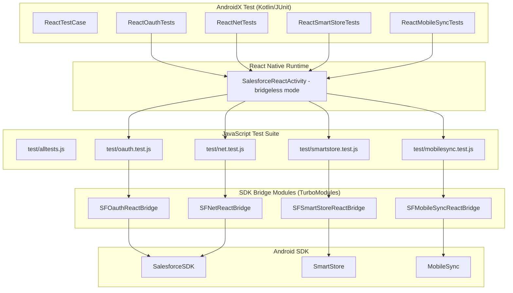

# Android Test App Documentation

This document describes the Android test application structure and how to run tests for the Salesforce Mobile SDK React Native bridge.

## Table of Contents

- [Overview](#overview)
- [Test Architecture](#test-architecture)
- [Directory Structure](#directory-structure)
- [Setup and Running Tests](#setup-and-running-tests)
- [Writing Tests](#writing-tests)
- [Test Utilities](#test-utilities)
- [Troubleshooting](#troubleshooting)

## Overview

The Android test app is a React Native application that runs JavaScript tests through the AndroidX Test framework (instrumentation tests). This approach allows testing the complete bridge from JavaScript → React Native → Android Native → Android SDK.

### Key Components

1. **JavaScript Test Suite** (`test/`) - Shared test files for all platforms
2. **Android Test App** (`androidTests/`) - React Native app that loads tests
3. **AndroidX Test Suite** (`androidTests/android/app/src/androidTest/`) - Instrumentation test runner
4. **Test Harness** (`src/react.force.test.tsx`) - Bridge between JS and native tests

## Test Architecture



## Directory Structure

```
androidTests/
├── android/                              # Android native project
│   ├── app/
│   │   ├── build.gradle.kts              # Gradle build config (includes copyTestCredentials task)
│   │   └── src/
│   │       ├── main/
│   │       │   ├── AndroidManifest.xml
│   │       │   ├── assets/
│   │       │   │   └── test_credentials.json  # Copied at build time (gitignored)
│   │       │   ├── java/.../
│   │       │   │   └── MainApplication.kt     # App entry point
│   │       │   └── res/
│   │       └── androidTest/
│   │           └── java/.../
│   │               ├── ReactTestCase.kt       # Base test class
│   │               ├── ReactOauthTests.kt     # OAuth tests
│   │               ├── ReactNetTests.kt       # REST API tests
│   │               ├── ReactSmartStoreTests.kt # SmartStore tests
│   │               └── ReactMobileSyncTests.kt # MobileSync tests
│   ├── build.gradle                       # Root Gradle config
│   ├── settings.gradle                    # Project settings
│   ├── gradle.properties
│   └── gradlew                            # Gradle wrapper
│
├── mobile_sdk/                           # Cloned Android SDK (from updatesdk.js)
│   └── SalesforceMobileSDK-Android/
│
├── index.js                              # React Native entry point
├── package.json                          # npm dependencies
├── metro.config.js                       # Metro bundler config
├── babel.config.js                       # Babel config
├── prepareandroid.js                     # Setup script
├── updatebundle.js                       # Bundle update script
├── updatesdk.js                          # SDK update script
└── create_test_credentials_from_env.js   # CI credential generation
```

## Setup and Running Tests

### Prerequisites

- **Android Studio**: Latest stable version
- **Java**: JDK 17+
- **Node.js**: 22 or later
- **Android SDK**: API 31+ (compileSdk 36)
- **Emulator or device**: API 31+ for running tests
- **Salesforce Org**: For authentication tests

### Step 1: Setup Test Workspace

From the `androidTests` directory:

```bash
cd androidTests
./prepareandroid.js
```

**What it does** (4 phases):
1. **Phase 1**: Installs npm dependencies (React Native, SDK, build tools)
2. **Phase 2**: Clones Android SDK from configured repository branch (`updatesdk.js`)
3. **Phase 3**: Copies `shared/test/test_credentials.json` into the app assets directory
4. **Phase 4**: Bundles JavaScript tests into `index.android.bundle`

**For detailed explanation of each phase**, see [PREPAREANDROID_DETAILED.md](./PREPAREANDROID_DETAILED.md).

**Key files created**:
- `node_modules/` - npm dependencies
- `mobile_sdk/SalesforceMobileSDK-Android/` - Cloned Android SDK
- `android/app/src/main/assets/test_credentials.json` - Test credentials (copied from shared)
- `android/app/src/main/assets/index.android.bundle` - Bundled JavaScript tests

### Step 2: Configure Test Credentials

Both iOS and Android tests share a single credentials source at `shared/test/test_credentials.json` (relative to the repo root). Copy the sample template and fill in your values:

```bash
cp shared/test/test_credentials.json.sample shared/test/test_credentials.json
```

See the [sample template](../../shared/test/test_credentials.json.sample) for the expected fields.

**Note**: The `prepareandroid.js` script copies this file into `android/app/src/main/assets/test_credentials.json`. Additionally, the Gradle `copyTestCredentials` task re-copies it before each build, so credentials stay up to date even if you edit the source file later.

**Alternative** (using environment variables in CI):

```bash
cd androidTests
node create_test_credentials_from_env.js
```

### Step 3: Run Tests

#### Via Gradle (command line)

Ensure an emulator is running or a device is connected:

```bash
cd androidTests/android
./gradlew :app:connectedDebugAndroidTest
```

#### Via Android Studio

1. Open the `androidTests/android` project in Android Studio
2. Wait for Gradle sync to complete
3. Navigate to `app/src/androidTest/java/`
4. Right-click on the test class you want to run, then "Run"

#### Via Firebase Test Lab

For CI environments, tests can be run on Firebase Test Lab:

```bash
cd androidTests/android

# Build the app APK and test APK
./gradlew :app:assembleDebug :app:assembleDebugAndroidTest

# Run on Firebase Test Lab (requires gcloud CLI configured)
gcloud firebase test android run \
  --type instrumentation \
  --app app/build/outputs/apk/debug/app-debug.apk \
  --test app/build/outputs/apk/androidTest/debug/app-debug-androidTest.apk \
  --device model=Pixel2,version=30
```

## The `copyTestCredentials` Gradle Task

The `build.gradle.kts` for the test app includes a custom Gradle task that ensures test credentials are always available at build time:

```kotlin
// Copy test_credentials.json from shared/test/ into assets before each build
tasks.register<Copy>("copyTestCredentials") {
    from("${rootProject.projectDir}/../../shared/test/test_credentials.json")
    into("src/main/assets")
    duplicatesStrategy = DuplicatesStrategy.INCLUDE
}
tasks.matching { it.name.startsWith("merge") && it.name.contains("Assets") }.configureEach {
    dependsOn("copyTestCredentials")
}
```

This task:
- Runs automatically before any asset-merging step (debug and androidTest builds)
- Copies from the canonical location `shared/test/test_credentials.json`
- Silently succeeds even if `prepareandroid.js` has not been run (the file must exist though)

## The `prepareandroid.js` Script

The setup script automates all steps needed to prepare the Android test environment.

### Phase 1: Install npm Dependencies

```bash
rm -rf node_modules
rm -f yarn.lock
yarn install
```

Installs React Native, the SDK package (`react-native-force` via `file:../`), and build tools.

### Phase 2: Clone Android SDK

```bash
node ./updatesdk.js
```

Reads `sdkDependencies` from `package.json` and shallow-clones the Android SDK into `mobile_sdk/SalesforceMobileSDK-Android/`. The Gradle build uses a composite build to include SDK libraries from this clone.

### Phase 3: Copy Test Credentials

Copies `../shared/test/test_credentials.json` into `android/app/src/main/assets/`. If the source file does not exist, writes an empty JSON object and prints a warning.

### Phase 4: Bundle JavaScript Tests

```bash
node ./updatebundle.js
```

Runs Metro to create `android/app/src/main/assets/index.android.bundle` containing all JavaScript test code.

## Writing Tests

### JavaScript Test Structure

Tests are shared between iOS and Android. They live in `test/` at the repo root and use a lightweight custom assert module (`test/assert.js`) plus the `registerTest`/`testDone` harness.

```javascript
// test/oauth.test.js
import { assert } from './assert';
import * as oauth from '../src/react.force.oauth';
import { registerTest, testDone } from '../src/react.force.test';

testGetAuthCredentials = () => {
    oauth.getAuthCredentials(
        (creds) => {
            assert.containsAllKeys(
              creds,
              ["accessToken","instanceUrl","loginUrl","orgId","refreshToken","userAgent","userId"],
              'Wrong keys in credentials'
            );
            testDone();
        },
        (error) => { throw error; }
    );
    return false; // not done (async)
};

registerTest(testGetAuthCredentials);
```

### Adding a New Test

1. **Add JavaScript test function** in `test/<module>.test.js`
2. **Register it** with `registerTest(testFunctionName);`
3. **Add it to the Android test class** (Kotlin parameterized test list)
4. **Run tests** (see [Setup and Running Tests](#setup-and-running-tests))

### Test Naming Convention

JavaScript test function names start with `test` followed by the name in camelCase. The Android test runner extracts the name (without `test` prefix) and uses it as the React Native component name to mount.

Example mapping:
| JavaScript Function | Registered Component | Android Parameterized Entry |
|---------------------|---------------------|----------------------------|
| `testGetAuthCredentials` | `GetAuthCredentials` | `"GetAuthCredentials"` |
| `testRegisterSoup` | `RegisterSoup` | `"RegisterSoup"` |

## Test Utilities

### Test Credentials Loading

At runtime, the test app loads `test_credentials.json` from the Android assets directory. This file is placed there by:
1. `prepareandroid.js` Phase 3 (initial setup)
2. The Gradle `copyTestCredentials` task (every subsequent build)

### Test Harness (`react.force.test.tsx`)

The `testDone()` function signals test completion to the native side via `NativeModules.SalesforceTestBridge.markTestCompleted()`. This is the Android-specific counterpart to iOS's `TestModule.markTestCompleted()`.

## Test Categories

### 1. OAuth Tests (`test/oauth.test.js`)
- `testGetAuthCredentials` - Get current user credentials

### 2. Net Tests (`test/net.test.js`)
- `testGetApiVersion`, `testVersions`, `testResources`
- `testDescribeGlobal`, `testMetaData`, `testDescribe`, `testDescribeLayout`
- `testCreateRetrieve`, `testUpsertUpdateRetrieve`, `testCreateDelRetrieve`
- `testQuery`, `testSearch`, `testPublicApiCall`
- `testCollectionCreateRetrieve`, `testCollectionUpsertUpdateRetrieve`, `testCollectionCreateDeleteRetrieve`

### 3. SmartStore Tests (`test/smartstore.test.js`)
- `testGetDatabaseSize`, `testRegisterExistsRemoveExists`
- `testGetSoupIndexSpecs`, `testUpsertRetrieve`
- `testQuerySoup`, `testMoveCursor`, `testSmartQuerySoup`
- `testRemoveFromSoup`, `testClearSoup`
- `testGetRemoveStores`, `testGetRemoveGlobalStores`

### 4. MobileSync Tests (`test/mobilesync.test.js`)
- `testSyncUp`, `testSyncDown`, `testReSync`
- `testCleanResyncGhosts`, `testGetSyncStatusDeleteSync`

### 5. Harness Tests (`test/harness.test.js`)
- `testPassing`, `testAsyncPassing`

## Troubleshooting

### Tests Don't Run

**Problem**: Instrumentation tests fail to start or timeout

**Solutions**:
1. Ensure an emulator is running (`adb devices` should show a device)
2. Check that the JavaScript bundle was created: `ls android/app/src/main/assets/index.android.bundle`
3. Verify credentials exist: `ls android/app/src/main/assets/test_credentials.json`
4. Clean and rebuild: `cd android && ./gradlew clean :app:assembleDebug`

### Authentication Failures

**Problem**: OAuth tests fail with "Not authenticated"

**Solutions**:
1. Verify `shared/test/test_credentials.json` is valid and populated
2. Check that the credentials were copied: `cat android/app/src/main/assets/test_credentials.json`
3. Ensure the Connected App allows the configured redirect URI
4. Check logcat for detailed error messages: `adb logcat | grep -i salesforce`

### Build Errors

**Problem**: Gradle build fails

**Solutions**:
```bash
cd androidTests/android
./gradlew clean
./gradlew :app:assembleDebug --info
```

If SDK dependencies are missing:
```bash
cd androidTests
node updatesdk.js
```

### Metro Bundler Issues

**Problem**: JavaScript bundle is outdated or missing

**Solutions**:
```bash
cd androidTests
node updatebundle.js
```

### Emulator Issues

**Problem**: `connectedDebugAndroidTest` fails with "No connected devices"

**Solutions**:
1. Start an emulator from Android Studio or command line
2. Verify connection: `adb devices`
3. For headless CI, create an emulator:
   ```bash
   sdkmanager "system-images;android-30;google_apis;x86_64"
   avdmanager create avd -n test -k "system-images;android-30;google_apis;x86_64"
   emulator -avd test -no-window &
   adb wait-for-device
   ```

## CI/CD Integration

### GitHub Actions Example

```yaml
name: Android Tests

on: [push, pull_request]

jobs:
  test:
    runs-on: ubuntu-latest
    
    steps:
    - uses: actions/checkout@v3
    
    - name: Setup Node
      uses: actions/setup-node@v3
      with:
        node-version: '20'
    
    - name: Setup Java
      uses: actions/setup-java@v3
      with:
        distribution: 'temurin'
        java-version: '17'
    
    - name: Setup Test Credentials
      env:
        SFDC_TEST_CLIENT_ID: ${{ secrets.TEST_CLIENT_ID }}
        SFDC_TEST_USERNAME: ${{ secrets.TEST_USERNAME }}
        SFDC_TEST_PASSWORD: ${{ secrets.TEST_PASSWORD }}
      run: |
        cd androidTests
        node create_test_credentials_from_env.js
    
    - name: Prepare Android Tests
      run: |
        cd androidTests
        ./prepareandroid.js
    
    - name: Start Emulator
      uses: reactivecircus/android-emulator-runner@v2
      with:
        api-level: 30
        script: |
          cd androidTests/android
          ./gradlew :app:connectedDebugAndroidTest
```

## Further Reading

- [JavaScript API Reference](../javascript/API_REFERENCE.md) - Complete API documentation
- [Architecture Guide](../ARCHITECTURE.md) - Overall architecture
- [iOS Test Documentation](../ios-tests/README.md) - iOS testing (mirrors this structure)
- [Main README](../../README.md) - Getting started guide
