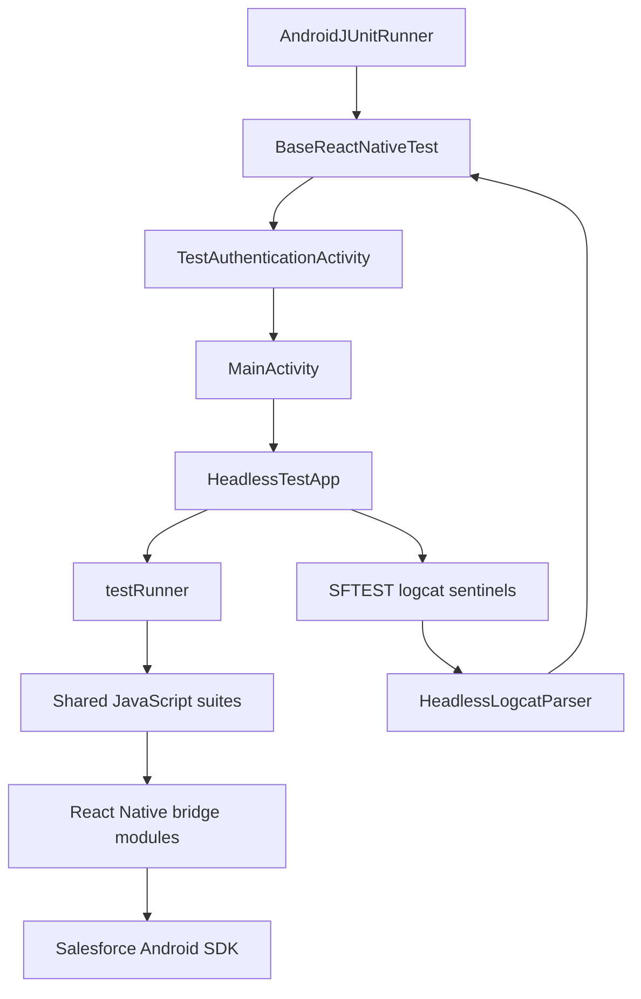

# Android Test App Documentation

The Android test app runs the shared React Native bridge tests through an
AndroidX instrumentation suite. Android uses a headless JavaScript driver and
logcat result protocol; it does not navigate the interactive test UI with
UIAutomator.

## Architecture



The first JUnit method that requests a result launches the app and authenticates
from `test_credentials.json`. `HeadlessTestApp` then runs every registered
JavaScript test sequentially. The instrumentation collector reads the complete
result set once and caches it; each JUnit method asserts the cached result with
the matching JavaScript test name.

Android intentionally differs from iOS here. `androidTests/index.js` mounts
`HeadlessTestApp`, while the iOS test app keeps the interactive `TestApp` used by
XCUITest.

## Result Protocol

The JavaScript driver writes one physical logcat line for each event:

```text
SFTESTBEGIN::
SFTESTRESULT::{"s":"<suite>","n":"<test>","ok":true|false,"e":"<error>"}
SFTESTDONE::{"total":35,"passed":35,"failed":0}
```

`HeadlessResults` clears logcat before launch and polls finite `logcat -d`
snapshots. Finite snapshots are important on Android 12L, where a long-lived
logcat pipe can retain the final buffered `SFTESTDONE` line.

If the app crashes, the parser also captures an `AndroidRuntime` fatal exception
for the test package and adds it to the failure message when available.

## Timeouts

- Every JavaScript test has a 30-second timeout in `HeadlessTestApp.js`.
- The instrumentation collector allows 35 seconds without a new result. The
  extra five seconds covers polling and scheduling at the JavaScript timeout
  boundary. It takes one final logcat snapshot before declaring no progress.
- A 45-minute overall ceiling remains as a final guard while results continue to
  arrive. Firebase Test Lab has its own 60-minute execution ceiling.

The collector thresholds can be overridden with the `progressTimeoutMs`,
`beginTimeoutMs`, and `maxRunMs` instrumentation arguments.

## Key Files

```text
test/
├── HeadlessTestApp.js             # Android-only headless driver and per-test timeout
├── testRunner.js                  # Suite registration and test lifecycle
├── harness.test.js
├── oauth.test.js
├── net.test.js
├── smartstore.test.js
└── mobilesync.test.js

androidTests/
├── index.js                       # Mounts HeadlessTestApp for Android
├── prepareandroid.js              # Installs dependencies, SDK, credentials, bundle
├── updatebundle.js                # Creates index.android.bundle
├── updatesdk.js                   # Installs SalesforceMobileSDK-Android
└── android/app/src/
    ├── main/java/com/salesforce/androidsdk/reactnative/
    │   ├── HeadlessLogcatParser.kt
    │   └── util/SalesforceReactTestApp.kt
    └── androidTest/java/com/salesforce/androidsdk/reactnative/
        ├── BaseReactNativeTest.kt
        ├── ReactHarnessTest.kt
        ├── ReactOAuthTest.kt
        ├── ReactNetTest.kt
        ├── ReactSmartStoreTest.kt
        └── ReactMobileSyncTest.kt
```

The debuggable test app disables Salesforce SDK developer support. Its manifest
removes `POST_NOTIFICATIONS`, so leaving developer support enabled would request
an undeclared permission on every activity resume on API 33 and later.

## Setup

### Prerequisites

- Node.js 22 or later
- JDK 17 or later
- Android SDK with API 31 or later
- A connected emulator/device for local execution, or Firebase Test Lab access
- Salesforce test-org credentials

### Credentials

Copy the shared sample and populate it:

```bash
cp shared/test/test_credentials.json.sample shared/test/test_credentials.json
```

Do not commit `test_credentials.json`. In CI,
`create_test_credentials_from_env.js` writes the `TEST_CREDENTIALS` secret to
the shared location.

### Prepare the Test App

From the repository root:

```bash
cd androidTests
./prepareandroid.js
```

The script:

1. Reinstalls the Android test app's JavaScript dependencies.
2. Installs the configured Salesforce Android SDK dependency.
3. Copies `shared/test/test_credentials.json` into the app assets. Preparation
   fails immediately if the credential file is absent.
4. Bundles the JavaScript tests into
   `android/app/src/main/assets/index.android.bundle`.

See [PREPAREANDROID_DETAILED.md](./PREPAREANDROID_DETAILED.md) for preparation
details.

## Running Tests

### Connected Device or Emulator

```bash
cd androidTests/android
./gradlew :app:connectedDebugAndroidTest
```

Running one JUnit method still starts the shared headless suite once; the selected
method then asserts only its named result.

### Android Studio

1. Open `androidTests/android`.
2. Wait for Gradle sync.
3. Run a class or method under `app/src/androidTest/java`.

Metro is not required because `prepareandroid.js` produces the bundled test
application.

### Firebase Test Lab

Build both APKs:

```bash
cd androidTests/android
./gradlew :app:assembleDebug :app:assembleDebugAndroidTest
```

Then run the instrumentation APK, for example:

```bash
gcloud --quiet beta firebase test android run \
  --project mobile-apps-firebase-test \
  --type instrumentation \
  --app app/build/outputs/apk/debug/app-debug.apk \
  --test app/build/outputs/apk/androidTest/debug/app-debug-androidTest.apk \
  --device model=MediumPhone.arm,version=34,locale=en,orientation=portrait \
  --timeout 60m \
  --no-auto-google-login \
  --no-performance-metrics \
  --no-record-video
```

The reusable Android workflow tests API 36 for pull requests and APIs 31–37 for
full nightly runs. API 36 and later use the 16 KB page-size device model.

## Writing Tests

### JavaScript Suite

Register a suite before its tests. Tests finish by calling `testDone()` with no
argument on success or with an error on failure.

```javascript
import { registerSuite, registerTest, testDone } from './testRunner';

registerSuite('Example');

function testExample() {
  someAsyncOperation(
    () => testDone(),
    (error) => testDone(error),
  );
}

registerTest(testExample);
```

Suites may provide asynchronous setup and teardown functions:

```javascript
registerSuite('Example', {
  setUp: async () => resetState(),
  tearDown: async () => resetState(),
});
```

Avoid throwing inside asynchronous callbacks; pass the exception to
`testDone(error)` or reject a promise that the test chain handles. The headless
driver records unhandled Hermes promise rejections in timeout diagnostics.

### JUnit Mapping

Add a JUnit method with exactly the same JavaScript function name:

```kotlin
class ReactExampleTest : BaseReactNativeTest() {
    @Test fun testExample() = runTest("testExample")
}
```

Tests registered with `excludeFromRunAll: true` are not executed by the Android
headless suite and should not have an Android JUnit mapping.

## Troubleshooting

### No `SFTESTBEGIN`

Check that:

- `shared/test/test_credentials.json` exists and is populated.
- `prepareandroid.js` completed successfully.
- `android/app/src/main/assets/index.android.bundle` exists.
- The app did not crash during authentication or bundle loading.

### No Progress or Missing `SFTESTDONE`

Search logcat for the sentinel sequence and fatal exceptions:

```bash
adb logcat -d -v raw -s ReactNativeJS:I AndroidRuntime:E
```

A no-progress failure reports how many results arrived before the 35-second
watchdog expired. A JavaScript test timeout should instead produce a failed
`SFTESTRESULT` and allow the suite to continue to `SFTESTDONE`.

### Stale JavaScript Bundle

```bash
cd androidTests
node updatebundle.js
```

### Build Failure

```bash
cd androidTests/android
./gradlew :app:assembleDebug :app:assembleDebugAndroidTest --info
```

If the composite Android SDK dependency is absent, rerun `androidTests/updatesdk.js`
or the full `prepareandroid.js` setup.

## Further Reading

- [Preparation details](./PREPAREANDROID_DETAILED.md)
- [JavaScript API reference](../javascript/API_REFERENCE.md)
- [Repository architecture](../ARCHITECTURE.md)
- [iOS test documentation](../ios-tests/README.md)
