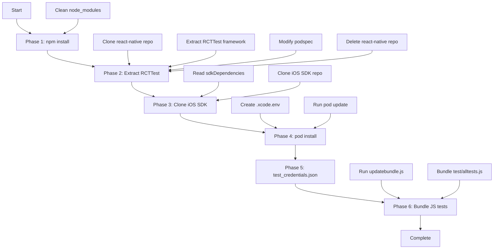

# prepareios.js — Detailed Setup Process

This document provides a deep dive into the `prepareios.js` setup script, explaining each phase, why it's necessary, and what it does.

## Overview

The iOS test suite for React Native requires several components that aren't part of the standard repository:
- React Native's test infrastructure (RCTTest)
- iOS SDK libraries (from another repository)
- Bundled JavaScript tests
- Test credentials configuration

`prepareios.js` automates the setup of all these dependencies.

## Script Location

```
iosTests/prepareios.js
```

**Usage**:
```bash
cd iosTests
./prepareios.js
```

## Complete Setup Flow



## Phase 1: Install npm Dependencies

### What It Does

1. Removes existing node_modules: Clean slate to avoid version conflicts
2. Removes yarn.lock: Forces fresh dependency resolution
3. Installs dependencies: Installs all packages from `package.json`

### Key Dependencies Installed

From `iosTests/package.json`:
```json
{
  "dependencies": {
    "react": "18.3.1",
    "react-native": "0.81.5",
    "react-native-force": "file:../"
  },
  "devDependencies": {
    "@babel/core": "^7.22.0",
    "@babel/preset-env": "^7.22.0",
    "metro-react-native-babel-preset": "0.82.0"
  }
}
```

**Note**: `react-native-force` points to parent directory (`../`) — this is the package we're testing!

### Why This Phase Is Needed

- React Native and its peer dependencies must be available for bundling
- `react-native-force` (the SDK being tested) must be linked
- Build tools (Babel, Metro) must be installed

### Console Output Example

```
=== Installing npm dependencies
yarn install v1.22.19
[1/4] Resolving packages...
[2/4] Fetching packages...
[3/4] Linking dependencies...
[4/4] Building fresh packages...
Done in 45.23s.
```

## Phase 2: Extract RCTTest Framework

### What It Does

1. **Reads React Native version** from parent `package.json` peerDependencies

2. **Clones React Native repository** (shallow clone of specific version):
   - Uses `--branch v0.81.5` to checkout exact version tag
   - Uses `--single-branch` to only download one branch (faster)
   - Uses `--depth 1` for shallow clone with no history (faster)

3. **Extracts RCTTest framework**:
   - Removes any existing RCTTest directory
   - Moves `react-native/packages/rn-tester/RCTTest` to current directory

4. **Modifies podspec** for standalone use:
   - Updates package reference to be standalone
   - Sets version to match React Native version

5. **Deletes cloned repo** (only needed RCTTest)

### Why This Phase Is Needed

**RCTTest is not distributed as a CocoaPod or npm package.** It's internal React Native test infrastructure used by `rn-tester` (React Native's own test app).

**What RCTTest provides**:
- `RCTTestRunner.h/m` - Test execution framework
- `RCTTestModule` - Native module for test result reporting
- Test utilities and helpers

**Why we need it**:
- Mobile SDK's test pattern mirrors React Native's own testing approach
- Without RCTTest, we'd have to reimplement the test runner from scratch
- This ensures compatibility with React Native's testing conventions

### RCTTest Framework Contents

```
RCTTest/
├── React-RCTTest.podspec     # CocoaPods specification
├── RCTTestRunner.h           # Test runner interface
├── RCTTestRunner.m           # Test runner implementation
├── RCTTestModule.h           # Test module interface
├── RCTTestModule.m           # Test reporting module
└── (other test utilities)
```

**How it's used** (referenced in `ios/Podfile`):
```ruby
pod 'React-RCTTest', :path => '../RCTTest'
```

### Console Output Example

```
=== Getting react native git repo (for test runner classes)
Cloning into 'react-native'...
remote: Enumerating objects: 15234, done.
remote: Counting objects: 100% (15234/15234), done.
remote: Compressing objects: 100% (12421/12421), done.
remote: Total 15234 (delta 2567), reused 6891 (delta 1543)
Receiving objects: 100% (15234/15234), 234.56 MiB | 5.23 MiB/s, done.
Resolving deltas: 100% (2567/2567), done.
```

## Phase 3: Clone iOS SDK

### What It Does

The `updatesdk.js` helper script:

1. **Reads sdkDependencies** from `package.json`
2. **Parses repo URL and branch** from configuration
3. **Clones iOS SDK** with shallow clone

### Configuration in package.json

```json
{
  "sdkDependencies": {
    "SalesforceMobileSDK-iOS": "https://github.com/forcedotcom/SalesforceMobileSDK-iOS.git#dev"
  }
}
```

**Format**: `<repo-url>#<branch>`
- **Repo URL**: GitHub repository
- **Branch**: Branch or tag to clone (typically `dev` during development)

### Why This Phase Is Needed

**CocoaPods can't easily use local file paths for development.**

During development, you might be:
- Testing unreleased iOS SDK changes
- Working on a feature branch
- Using a fork of the iOS SDK

The `sdkDependencies` mechanism allows:
```json
// Test with a specific branch
"SalesforceMobileSDK-iOS": "https://github.com/forcedotcom/SalesforceMobileSDK-iOS.git#feature/new-auth"

// Test with a fork
"SalesforceMobileSDK-iOS": "https://github.com/youruser/SalesforceMobileSDK-iOS.git#your-branch"
```

**Then in Podfile**, pods reference the cloned directory:
```ruby
pod 'SalesforceSDKCore', :path => '../mobile_sdk/SalesforceMobileSDK-iOS'
pod 'SmartStore', :path => '../mobile_sdk/SalesforceMobileSDK-iOS'
pod 'MobileSync', :path => '../mobile_sdk/SalesforceMobileSDK-iOS'
```

### Directory Structure After Clone

```
iosTests/
└── mobile_sdk/
    └── SalesforceMobileSDK-iOS/
        ├── libs/
        │   ├── SalesforceSDKCommon/
        │   ├── SalesforceSDKCore/
        │   ├── SmartStore/
        │   └── MobileSync/
        ├── *.podspec files
        └── README.md
```

### Console Output Example

```
=== Installing sdk dependencies
Cloning into 'mobile_sdk/SalesforceMobileSDK-iOS'...
remote: Enumerating objects: 3421, done.
remote: Counting objects: 100% (3421/3421), done.
remote: Compressing objects: 100% (2891/2891), done.
remote: Total 3421 (delta 567), reused 1234 (delta 234)
Receiving objects: 100% (3421/3421), 12.34 MiB | 3.45 MiB/s, done.
Resolving deltas: 100% (567/567), done.
```

## Phase 4: Setup CocoaPods

### What It Does

1. **Gets node binary path** using `command -v node`

2. **Creates .xcode.env file** with NODE_BINARY export

3. **Runs pod update** in ios/ directory

### Why This Phase Is Needed

#### .xcode.env File

React Native needs to know where the Node.js binary is located during build. This is used by:
- Metro bundler scripts
- React Native build phases

**Without this file**, Xcode build fails with:
```
error: NODE_BINARY not found
```

#### CocoaPods Installation

The `ios/Podfile` specifies dependencies:

```ruby
platform :ios, '18.0'

target 'SalesforceReactTestApp' do
  # React Native pods
  use_react_native!(
    :path => '../node_modules/react-native',
    :hermes_enabled => true
  )
  
  # Test infrastructure
  pod 'React-RCTTest', :path => '../RCTTest'
  
  # iOS SDK (from cloned directory)
  pod 'SalesforceSDKCore', :path => '../mobile_sdk/SalesforceMobileSDK-iOS'
  pod 'SmartStore', :path => '../mobile_sdk/SalesforceMobileSDK-iOS'
  pod 'MobileSync', :path => '../mobile_sdk/SalesforceMobileSDK-iOS'
  
  # Bridge modules (from parent repo)
  pod 'SalesforceReact', :path => '../../'
end
```

**pod update** resolves all dependencies and creates:
- `Pods/` directory with all frameworks
- `SalesforceReactTestApp.xcworkspace` Xcode workspace
- `Podfile.lock` with resolved versions

### Podfile Breakdown

**React Native pods** (`use_react_native!`):
- `React-Core`
- `React-RCTImage`
- `React-RCTNetwork`
- `React-RCTText`
- `React-hermes` (JavaScript engine)
- Many others (~40 pods total)

**Test infrastructure**:
- `React-RCTTest` (from extracted framework)

**iOS SDK dependencies**:
- `SalesforceSDKCommon` - Common utilities
- `SalesforceSDKCore` - Core SDK (OAuth, REST, etc.)
- `SmartStore` - Encrypted storage
- `MobileSync` - Sync framework

**Bridge module**:
- `SalesforceReact` (from `../../`, the parent directory — this is the React Native SDK repo itself)

### Console Output Example

```
=== Installing pod dependencies
Analyzing dependencies
Downloading dependencies
Installing React-Core (0.81.5)
Installing React-hermes (0.81.5)
Installing SalesforceSDKCore (13.0.0)
Installing SmartStore (13.0.0)
Installing MobileSync (13.0.0)
... (40+ pods)
Generating Pods project
Integrating client project

[!] Please close any current Xcode sessions and use `SalesforceReactTestApp.xcworkspace` for this project from now on.
Pod installation complete! There are 45 dependencies from the Podfile and 62 total pods installed.
```

## Phase 5: Create Test Credentials Placeholder

### What It Does

Creates an empty `test_credentials.json` file in `iosTests/` directory.

### Why This Phase Is Needed

The test app's AppDelegate tries to load this file. If it doesn't exist, the app still builds but authentication tests will fail.

### Manual Population Required

**After prepareios.js completes**, you must populate this file:

```json
{
  "test_client_id": "your-connected-app-consumer-key",
  "test_login_domain": "login.salesforce.com",
  "test_redirect_uri": "sfdc://success",
  "test_username": "test@example.com",
  "test_password": "yourpassword",
  "test_security_token": "yourtoken"
}
```

**Alternative**: Use environment variables:
```bash
node create_test_credentials_from_env.js
```

Reads from:
- `SFDC_TEST_CLIENT_ID`
- `SFDC_TEST_LOGIN_DOMAIN`
- `SFDC_TEST_REDIRECT_URI`
- `SFDC_TEST_USERNAME`
- `SFDC_TEST_PASSWORD`

### Security Note

This file is in `.gitignore` and should never be committed:
```gitignore
test_credentials.json
```

### Console Output Example

```
=== Creating test_credentials.json
```

## Phase 6: Bundle JavaScript Tests

### What It Does

The `updatebundle.js` helper script runs React Native's bundler (Metro) to create a JavaScript bundle.

Bundles JavaScript with parameters:
- Platform: iOS
- Dev mode: true (source maps, better errors)
- Entry file: `node_modules/react-native-force/test/alltests.js`
- Output: `ios/index.ios.bundle`
- Assets: `ios/`

### Why This Phase Is Needed

**React Native apps require a JavaScript bundle.**

During development with Metro running, the app loads JavaScript dynamically from the packager. But for testing in CI or without Metro, we need a pre-bundled file.

**The test app loads this bundle** in `AppDelegate.m`:
```objective-c
#ifdef DEBUG
  // Try Metro bundler first (if running)
  return [[RCTBundleURLProvider sharedSettings] jsBundleURLForBundleRoot:@"index"];
#else
  // Use pre-bundled file
  return [[NSBundle mainBundle] URLForResource:@"index.ios" withExtension:@"bundle"];
#endif
```

### Entry Point: test/alltests.js

**File**: `test/alltests.js`

```javascript
// Import all test modules
import * as oauth from './oauth.test';
import * as net from './net.test';
import * as smartstore from './smartstore.test';
import * as mobilesync from './mobilesync.test';
import * as harness from './harness.test';

// Export all tests
export {
  oauth,
  net,
  smartstore,
  mobilesync,
  harness
};

// Register test modules
import { registerTestModule } from '../src/react.force.test';

registerTestModule('oauth', oauth);
registerTestModule('net', net);
registerTestModule('smartstore', smartstore);
registerTestModule('mobilesync', mobilesync);
registerTestModule('harness', harness);
```

**This bundles**:
- All test files from `test/`
- The `react-native-force` library (from `src/`)
- React Native core libraries
- All dependencies

### Bundle Contents

The resulting `ios/index.ios.bundle` is a single JavaScript file (~2-3 MB) containing:
- React Native framework code
- Test harness code
- All test modules
- Mobile SDK JavaScript API

### Console Output Example

```
=== Creating index.ios.bundle
warning: the transform cache was reset.
                 Welcome to Metro
              Fast - Scalable - Integrated

info Writing bundle output to:, ios/index.ios.bundle
info Done writing bundle output
info Copying 0 asset files
info Done copying assets
```

## Complete Directory Structure After Setup

```
iosTests/
├── node_modules/               # npm dependencies (Phase 1)
│   ├── react/
│   ├── react-native/
│   └── react-native-force/     # Symlink to ../
├── RCTTest/                    # Extracted test framework (Phase 2)
│   ├── React-RCTTest.podspec
│   ├── RCTTestRunner.h
│   └── RCTTestRunner.m
├── mobile_sdk/                 # Cloned iOS SDK (Phase 3)
│   └── SalesforceMobileSDK-iOS/
│       └── libs/
│           ├── SalesforceSDKCore/
│           ├── SmartStore/
│           └── MobileSync/
├── ios/                        # iOS project
│   ├── .xcode.env              # Node path (Phase 4)
│   ├── Pods/                   # CocoaPods dependencies (Phase 4)
│   ├── Podfile
│   ├── Podfile.lock
│   ├── index.ios.bundle        # JavaScript bundle (Phase 6)
│   ├── SalesforceReactTestApp.xcodeproj
│   ├── SalesforceReactTestApp.xcworkspace  # ← Open this in Xcode
│   ├── SalesforceReactTestApp/
│   │   ├── AppDelegate.{h,m}
│   │   ├── Info.plist
│   │   └── main.m
│   └── SalesforceReactTests/   # XCTest suite
│       ├── ReactTestCase.{h,m}
│       ├── OAuthReactTestCase.m
│       ├── NetReactTestCase.m
│       ├── SmartStoreReactTestCase.m
│       └── MobileSyncReactTestCase.m
├── test_credentials.json       # Empty placeholder (Phase 5)
├── package.json
├── prepareios.js               # This script
├── updatebundle.js
└── updatesdk.js
```

## Troubleshooting

### Phase 1 Failures

**Error**: `yarn: command not found`

**Solution**: Install Yarn:
```bash
npm install -g yarn
```

**Error**: Network timeout during install

**Solution**: Check network connection, try again:
```bash
yarn install --network-timeout 100000
```

### Phase 2 Failures

**Error**: `gsed: command not found`

**Solution**: Install GNU sed:
```bash
brew install gnu-sed
```

**Error**: Git clone times out

**Solution**: Check GitHub access, or clone manually with longer timeout

### Phase 3 Failures

**Error**: Cannot clone iOS SDK (permission denied)

**Solution**: Check GitHub access, SSH keys, or use HTTPS URL in sdkDependencies

### Phase 4 Failures

**Error**: `pod: command not found`

**Solution**: Install CocoaPods:
```bash
sudo gem install cocoapods
```

**Error**: Xcode version mismatch

**Solution**: Update Xcode to 15 or later

**Error**: Pod install fails for React-Core

**Solution**: Clean CocoaPods cache:
```bash
cd ios
rm -rf Pods Podfile.lock
pod cache clean --all
pod install
```

### Phase 6 Failures

**Error**: Metro bundler fails

**Solution**: Clear Metro cache by running updatebundle.js again or starting Metro with reset cache flag

**Error**: Cannot find entry file

**Solution**: Verify `react-native-force` is properly linked:
```bash
ls -la node_modules/react-native-force
# Should point to ../
```

## Manual Setup (Alternative to Script)

If `prepareios.js` fails, you can run each phase's operations manually by following the descriptions in each phase section above.

## Related Scripts

### updatesdk.js
Clones iOS SDK based on `sdkDependencies` in `package.json`.

**Usage**:
```bash
node updatesdk.js
```

**Customization**:
```json
{
  "sdkDependencies": {
    "SalesforceMobileSDK-iOS": "https://github.com/youruser/SalesforceMobileSDK-iOS.git#your-branch"
  }
}
```

### updatebundle.js
Bundles JavaScript tests using Metro bundler.

**Usage**:
```bash
node updatebundle.js
```

**When to re-run**:
- After modifying test files (`test/*.test.js`)
- After modifying SDK source (`src/`)
- When testing without Metro bundler running

### create_test_credentials_from_env.js
Generates `test_credentials.json` from environment variables.

**Usage**:
```bash
export SFDC_TEST_CLIENT_ID="your_client_id"
export SFDC_TEST_USERNAME="test@example.com"
export SFDC_TEST_PASSWORD="yourpassword"
# ... other variables

node create_test_credentials_from_env.js
```

## CI/CD Considerations

When running tests in CI:

```yaml
- name: Prepare iOS Tests
  run: |
    cd iosTests
    ./prepareios.js
    
- name: Populate Test Credentials
  env:
    SFDC_TEST_CLIENT_ID: secrets_value_here
    SFDC_TEST_USERNAME: secrets_value_here
    SFDC_TEST_PASSWORD: secrets_value_here
  run: |
    cd iosTests
    node create_test_credentials_from_env.js

- name: Start Metro Bundler
  run: |
    cd iosTests
    npm start &
    sleep 10

- name: Run Tests
  run: |
    cd iosTests/ios
    xcodebuild test \
      -workspace SalesforceReactTestApp.xcworkspace \
      -scheme SalesforceReactTestApp \
      -destination 'platform=iOS Simulator,name=iPhone 15,OS=18.0'
```

## Summary

`prepareios.js` orchestrates a complex setup:
1. Installs npm dependencies (React Native, SDK, build tools)
2. Extracts React Native's internal test framework
3. Clones iOS SDK from configured repository
4. Configures and installs CocoaPods dependencies
5. Creates test credentials placeholder
6. Bundles JavaScript tests for offline execution

**Why so complex?**
- React Native test infrastructure isn't packaged separately
- iOS SDK lives in another repository
- CocoaPods needs local SDK for development
- Tests need both native and JavaScript code bundled

**Result**: A fully functional iOS test app ready to run XCTest suites that exercise the React Native bridge.
