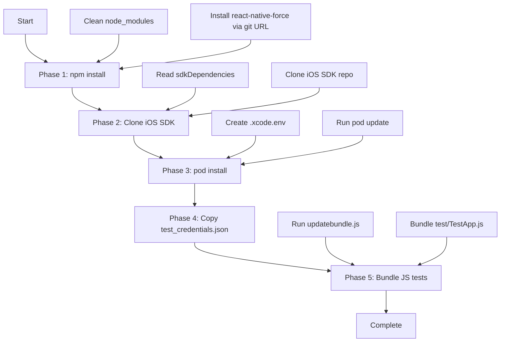

# prepareios.js — Detailed Setup Process

This document provides a deep dive into the `prepareios.js` setup script, explaining each phase, why it's necessary, and what it does.

## Overview

The iOS test suite uses a UI-driven test architecture where XCUITest automation drives a React Native test app. The test app displays buttons for each test, and XCUITest finds and taps these buttons to execute tests.

`prepareios.js` automates the setup of all dependencies needed for this test infrastructure.

## Script Location

```
iosTests/prepareios.js
```

**Usage**:
```bash
cd iosTests
./prepareios.js
```

## Complete Setup Flow


```mermaid
graph TB
    A[Start] --> B[Phase 1: npm install]
    B --> C[Phase 2: Clone iOS SDK]
    C --> D[Phase 3: pod install]
    D --> E[Phase 4: Copy test_credentials.json]
    E --> F[Phase 5: Bundle JS tests]
    F --> G[Complete]
    
    C1[Clean node_modules] --> B
    C2[Install react-native-force via git URL] --> B
    
    D1[Read sdkDependencies] --> C
    D2[Clone iOS SDK repo] --> C
    
    E1[Create .xcode.env] --> D
    E2[Run pod update] --> D
    
    G1[Run updatebundle.js] --> F
    G2[Bundle test/TestApp.js] --> F
```

## Phase 1: Install npm Dependencies

### What It Does

1. Removes existing node_modules: Clean slate to avoid version conflicts
2. Removes yarn.lock: Forces fresh dependency resolution
3. Installs dependencies: Installs all packages from `package.json`

### Key Dependencies Installed

From `iosTests/package.json`:
```json
{
  "dependencies": {
    "react": "19.2.3",
    "react-native": "0.84.1",
    "react-native-force": "git+https://github.com/forcedotcom/SalesforceMobileSDK-ReactNative.git#dev"
  },
  "devDependencies": {
    "@babel/core": "...",
    "@babel/preset-env": "...",
    "metro-react-native-babel-preset": "..."
  }
}
```

**Important**: `react-native-force` uses a git URL instead of `file:..` to avoid yarn cache conflicts when both iOS and Android test apps install dependencies sequentially.

### Why This Phase Is Needed

- React Native and its peer dependencies must be available for bundling
- `react-native-force` (the SDK being tested) must be installed from git
- Build tools (Babel, Metro) must be installed

### Console Output Example

```
=== Installing npm dependencies
yarn install v1.22.19
[1/4] Resolving packages...
[2/4] Fetching packages...
[3/4] Linking dependencies...
[4/4] Building fresh packages...
Done in 45.23s.
```

## Phase 2: Clone iOS SDK

### What It Does

The `updatesdk.js` helper script:

1. **Reads sdkDependencies** from `package.json`
2. **Parses repo URL and branch** from configuration
3. **Clones iOS SDK** with shallow clone

### Configuration in package.json

```json
{
  "sdkDependencies": {
    "SalesforceMobileSDK-iOS": "https://github.com/forcedotcom/SalesforceMobileSDK-iOS.git#dev"
  }
}
```

**Format**: `<repo-url>#<branch>`
- **Repo URL**: GitHub repository
- **Branch**: Branch or tag to clone (typically `dev` during development)

### Why This Phase Is Needed

**CocoaPods requires local SDK code for development.**

During development, you might be:
- Testing unreleased iOS SDK changes
- Working on a feature branch
- Using a fork of the iOS SDK

The `sdkDependencies` mechanism allows:
```json
// Test with a specific branch
"SalesforceMobileSDK-iOS": "https://github.com/forcedotcom/SalesforceMobileSDK-iOS.git#feature/new-auth"

// Test with a fork
"SalesforceMobileSDK-iOS": "https://github.com/youruser/SalesforceMobileSDK-iOS.git#your-branch"
```

**Then in Podfile**, pods reference the cloned directory:
```ruby
pod 'SalesforceSDKCore', :path => '../mobile_sdk/SalesforceMobileSDK-iOS'
pod 'SmartStore', :path => '../mobile_sdk/SalesforceMobileSDK-iOS'
pod 'MobileSync', :path => '../mobile_sdk/SalesforceMobileSDK-iOS'
```

### Directory Structure After Clone

```
iosTests/
└── mobile_sdk/
    └── SalesforceMobileSDK-iOS/
        ├── libs/
        │   ├── SalesforceSDKCommon/
        │   ├── SalesforceSDKCore/
        │   ├── SmartStore/
        │   └── MobileSync/
        ├── *.podspec files
        └── README.md
```

### Console Output Example

```
=== Installing sdk dependencies
Cloning into 'mobile_sdk/SalesforceMobileSDK-iOS'...
remote: Enumerating objects: 3421, done.
remote: Counting objects: 100% (3421/3421), done.
remote: Compressing objects: 100% (2891/2891), done.
remote: Total 3421 (delta 567), reused 1234 (delta 234)
Receiving objects: 100% (3421/3421), 12.34 MiB | 3.45 MiB/s, done.
Resolving deltas: 100% (567/567), done.
```

## Phase 3: Setup CocoaPods

### What It Does

1. **Gets node binary path** using `command -v node`

2. **Creates .xcode.env file** with NODE_BINARY export

3. **Runs pod update** in ios/ directory

### Why This Phase Is Needed

#### .xcode.env File

React Native needs to know where the Node.js binary is located during build. This is used by:
- Metro bundler scripts
- React Native build phases

**Without this file**, Xcode build fails with:
```
error: NODE_BINARY not found
```

#### CocoaPods Installation

The `ios/Podfile` specifies dependencies:

```ruby
platform :ios, '18.0'

target 'SalesforceReactTestApp' do
  # React Native pods
  use_react_native!(
    :path => '../node_modules/react-native',
    :hermes_enabled => true
  )
  
  # iOS SDK (from cloned directory)
  pod 'SalesforceSDKCore', :path => '../mobile_sdk/SalesforceMobileSDK-iOS'
  pod 'SmartStore', :path => '../mobile_sdk/SalesforceMobileSDK-iOS'
  pod 'MobileSync', :path => '../mobile_sdk/SalesforceMobileSDK-iOS'
  
  # Bridge modules (from git URL via npm)
  pod 'SalesforceReact', :path => '../node_modules/react-native-force'
end

target 'SalesforceReactTestAppUITests' do
  # XCUITest framework (no additional dependencies needed)
end
```

**pod update** resolves all dependencies and creates:
- `Pods/` directory with all frameworks
- `SalesforceReactTestApp.xcworkspace` Xcode workspace
- `Podfile.lock` with resolved versions

### Podfile Breakdown

**React Native pods** (`use_react_native!`):
- `React-Core`
- `React-RCTImage`
- `React-RCTNetwork`
- `React-RCTText`
- `React-hermes` (JavaScript engine)
- Many others (~40 pods total)

**iOS SDK dependencies**:
- `SalesforceSDKCommon` - Common utilities
- `SalesforceSDKCore` - Core SDK (OAuth, REST, etc.)
- `SmartStore` - Encrypted storage
- `MobileSync` - Sync framework

**Bridge module**:
- `SalesforceReact` (from `../node_modules/react-native-force`, installed via git URL)

### Console Output Example

```
=== Installing pod dependencies
Analyzing dependencies
Downloading dependencies
Installing React-Core (0.84.1)
Installing React-hermes (0.84.1)
Installing SalesforceSDKCore (14.0.0)
Installing SmartStore (14.0.0)
Installing MobileSync (14.0.0)
... (40+ pods)
Generating Pods project
Integrating client project

[!] Please close any current Xcode sessions and use `SalesforceReactTestApp.xcworkspace` for this project from now on.
Pod installation complete! There are 45 dependencies from the Podfile and 62 total pods installed.
```

## Phase 4: Copy Test Credentials

### What It Does

Copies `shared/test/test_credentials.json` (at the repo root) into `iosTests/ios/test_credentials.json`. If the source file does not exist, an empty placeholder is created and a warning is printed.

### Why This Phase Is Needed

The test app uses instant login that reads credentials from this file. The credentials are passed via launch arguments to bypass the OAuth UI.

### Setting Up Credentials

A `.sample` template is checked into the repo at `shared/test/test_credentials.json.sample`. Copy it and fill in your values:

```bash
cp shared/test/test_credentials.json.sample shared/test/test_credentials.json
# Edit with your Salesforce org credentials
```

The file format:

```json
{
  "test_client_id": "__INSERT_CLIENT_ID_HERE__",
  "test_login_domain": "https://login.salesforce.com",
  "test_redirect_uri": "testsfdc:///mobilesdk/detect/oauth/done",
  "refresh_token": "__INSERT_REFRESH_TOKEN_HERE__",
  "instance_url": "__INSERT_INSTANCE_URL_HERE__",
  "identity_url": "__INSERT_IDENTITY_URL_HERE__",
  "organization_id": "__INSERT_ORG_ID_HERE__",
  "username": "__INSERT_USERNAME_HERE__",
  "user_id": "__INSERT_USER_ID_HERE__",
  "display_name": "__INSERT_DISPLAY_NAME_HERE__",
  "photo_url": "__INSERT_PHOTO_URL_HERE__"
}
```

**Alternative**: Use environment variables in CI:
```bash
cd iosTests
node create_test_credentials_from_env.js
```

Reads from:
- `SFDC_TEST_CLIENT_ID`
- `SFDC_TEST_LOGIN_DOMAIN`
- `SFDC_TEST_REDIRECT_URI`
- `SFDC_TEST_USERNAME`
- `SFDC_TEST_PASSWORD`

### Security Note

The credentials file is gitignored at multiple levels and should never be committed:
```gitignore
shared/test/test_credentials.json
iosTests/ios/test_credentials.json
```

### Console Output Example

```
=== Copying test_credentials.json
```

## Phase 5: Bundle JavaScript Tests

### What It Does

The `updatebundle.js` helper script runs React Native's bundler (Metro) to create a JavaScript bundle.

Bundles JavaScript with parameters:
- Platform: iOS
- Dev mode: false (to avoid DevTools bridge crashes)
- Minify: false (to preserve test function names)
- Entry file: `test/TestApp.js`
- Output: `ios/main.jsbundle`
- Assets: `ios/`

### Why This Phase Is Needed

**The test app displays test buttons in a React Native UI.**

The `TestApp.js` file renders a scrollable list of buttons for each test. When XCUITest taps a button, the corresponding test executes and displays results inline.

### Entry Point: test/TestApp.js

**File**: `test/TestApp.js`

```javascript
import React from 'react';
import { View, Text, ScrollView, TouchableOpacity } from 'react-native';
import { runTest } from './testRunner';

// Import all test suites
import * as oauth from './oauth.test';
import * as net from './net.test';
import * as smartstore from './smartstore.test';
import * as mobilesync from './mobilesync.test';
import * as harness from './harness.test';

export default function TestApp() {
  // Render buttons for each test
  return (
    <ScrollView testID="testList" accessibilityLabel="testList">
      <TouchableOpacity testID="run_test_GetAuthCredentials" accessibilityLabel="run_test_GetAuthCredentials">
        <Text>OAuth: GetAuthCredentials</Text>
      </TouchableOpacity>
      {/* ... more test buttons ... */}
    </ScrollView>
  );
}
```

**This bundles**:
- Test app UI (TestApp.js)
- Pure JS test runner (testRunner.js)
- All test files from `test/`
- The `react-native-force` library
- React Native core libraries
- All dependencies

### Bundle Contents

The resulting `ios/main.jsbundle` is a single JavaScript file (~2-3 MB) containing:
- React Native framework code
- Test app UI code
- Pure JS test runner
- All test modules
- Mobile SDK JavaScript API

### Console Output Example

```
=== Creating main.jsbundle
warning: the transform cache was reset.
                 Welcome to Metro
              Fast - Scalable - Integrated

info Writing bundle output to:, ios/main.jsbundle
info Done writing bundle output
info Copying 0 asset files
info Done copying assets
```

## Complete Directory Structure After Setup

```
iosTests/
├── node_modules/               # npm dependencies (Phase 1)
│   ├── react/
│   ├── react-native/
│   └── react-native-force/     # Installed from git URL
├── mobile_sdk/                 # Cloned iOS SDK (Phase 2)
│   └── SalesforceMobileSDK-iOS/
│       └── libs/
│           ├── SalesforceSDKCore/
│           ├── SmartStore/
│           └── MobileSync/
├── ios/                        # iOS project
│   ├── .xcode.env              # Node path (Phase 3)
│   ├── Pods/                   # CocoaPods dependencies (Phase 3)
│   ├── Podfile
│   ├── Podfile.lock
│   ├── main.jsbundle           # JavaScript bundle (Phase 5)
│   ├── test_credentials.json   # Test credentials (Phase 4)
│   ├── SalesforceReactTestApp.xcodeproj
│   ├── SalesforceReactTestApp.xcworkspace  # ← Open this in Xcode
│   ├── SalesforceReactTestApp/
│   │   ├── AppDelegate.{h,m}
│   │   ├── Info.plist
│   │   └── main.m
│   └── SalesforceReactTestAppUITests/   # XCUITest suite
│       ├── BaseReactNativeTest.swift
│       ├── ReactHarnessTests.swift
│       ├── ReactOAuthTests.swift
│       ├── ReactNetTests.swift
│       ├── ReactSmartStoreTests.swift
│       └── ReactMobileSyncTests.swift
├── package.json
├── prepareios.js               # This script
├── updatebundle.js
└── updatesdk.js
```

## Troubleshooting

### Phase 1 Failures

**Error**: `yarn: command not found`

**Solution**: Install Yarn:
```bash
npm install -g yarn
```

**Error**: Network timeout during install

**Solution**: Check network connection, try again:
```bash
yarn install --network-timeout 100000
```

### Phase 2 Failures

**Error**: Cannot clone iOS SDK (permission denied)

**Solution**: Check GitHub access, SSH keys, or use HTTPS URL in sdkDependencies

### Phase 3 Failures

**Error**: `pod: command not found`

**Solution**: Install CocoaPods:
```bash
sudo gem install cocoapods
```

**Error**: Xcode version mismatch

**Solution**: Update Xcode to 15 or later

**Error**: Pod install fails for React-Core

**Solution**: Clean CocoaPods cache:
```bash
cd ios
rm -rf Pods Podfile.lock
pod cache clean --all
pod install
```

### Phase 5 Failures

**Error**: Metro bundler fails

**Solution**: Clear Metro cache by running updatebundle.js again or starting Metro with reset cache flag

**Error**: Cannot find entry file

**Solution**: Verify `test/TestApp.js` exists:
```bash
ls -la ../test/TestApp.js
```

## Manual Setup (Alternative to Script)

If `prepareios.js` fails, you can run each phase's operations manually by following the descriptions in each phase section above.

## Related Scripts

### updatesdk.js
Clones iOS SDK based on `sdkDependencies` in `package.json`.

**Usage**:
```bash
node updatesdk.js
```

**Customization**:
```json
{
  "sdkDependencies": {
    "SalesforceMobileSDK-iOS": "https://github.com/youruser/SalesforceMobileSDK-iOS.git#your-branch"
  }
}
```

### updatebundle.js
Bundles JavaScript tests using Metro bundler.

**Usage**:
```bash
node updatebundle.js
```

**When to re-run**:
- After modifying test files (`test/*.test.js`)
- After modifying SDK source (`src/`)
- After modifying test app UI (`test/TestApp.js`)

### create_test_credentials_from_env.js
Generates `test_credentials.json` from environment variables.

**Usage**:
```bash
export SFDC_TEST_CLIENT_ID="your_client_id"
export SFDC_TEST_USERNAME="test@example.com"
export SFDC_TEST_PASSWORD="yourpassword"
# ... other variables

node create_test_credentials_from_env.js
```

## CI/CD Considerations

When running tests in CI:

```yaml
- name: Prepare iOS Tests
  run: |
    cd iosTests
    ./prepareios.js
    
- name: Populate Test Credentials
  env:
    SFDC_TEST_CLIENT_ID: secrets_value_here
    SFDC_TEST_USERNAME: secrets_value_here
    SFDC_TEST_PASSWORD: secrets_value_here
  run: |
    cd iosTests
    node create_test_credentials_from_env.js

- name: Run Tests
  run: |
    cd iosTests/ios
    xcodebuild test \
      -workspace SalesforceReactTestApp.xcworkspace \
      -scheme SalesforceReactTestApp \
      -destination 'platform=iOS Simulator,name=iPhone 15,OS=18.0'
```

## Summary

`prepareios.js` orchestrates a streamlined setup for UI-driven testing:
1. Installs npm dependencies (React Native, SDK via git URL, build tools)
2. Clones iOS SDK from configured repository
3. Configures and installs CocoaPods dependencies
4. Copies test credentials from `shared/test/test_credentials.json`
5. Bundles JavaScript test app for offline execution

**Why this approach?**
- No coupling to React Native internal APIs (no RCTTestModule)
- Git URL dependencies avoid yarn cache conflicts
- CocoaPods needs local SDK for development
- XCUITest drives the app like a real user would
- Tests display results inline in the app UI

**Result**: A fully functional iOS test app ready to run XCUITest suites that drive the React Native test UI.
