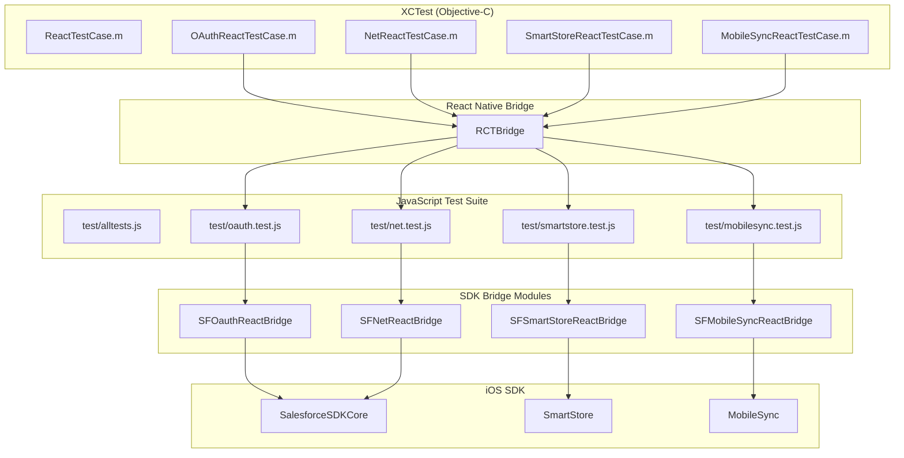
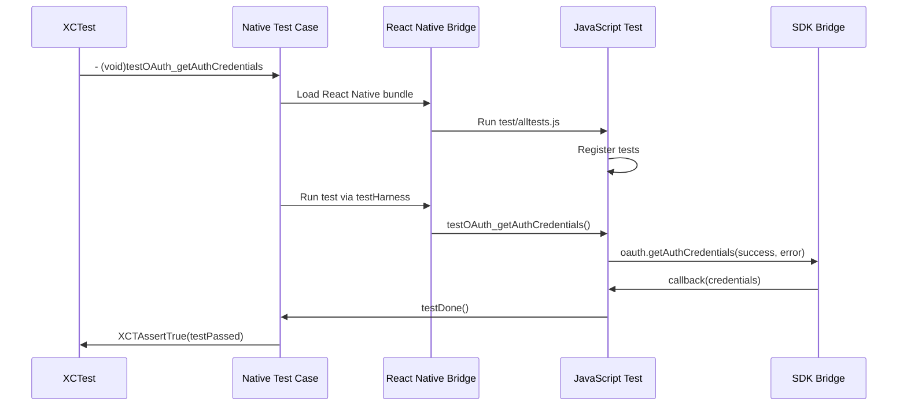

# iOS Test App Documentation

This document describes the iOS test application structure and how to run tests for the Salesforce Mobile SDK React Native bridge.

## Table of Contents

- [Overview](#overview)
- [Test Architecture](#test-architecture)
- [Directory Structure](#directory-structure)
- [Setup and Running Tests](#setup-and-running-tests)
- [Writing Tests](#writing-tests)
- [Test Utilities](#test-utilities)
- [Troubleshooting](#troubleshooting)

## Overview

The iOS test app is a React Native application that runs JavaScript tests through the native iOS XCTest framework. This approach allows testing the complete bridge from JavaScript → React Native → iOS Native → iOS SDK.

### Key Components

1. **JavaScript Test Suite** (`test/`) - Shared test files for all platforms
2. **iOS Test App** (`iosTests/`) - React Native app that loads tests
3. **XCTest Suite** (`iosTests/ios/SalesforceReactTests/`) - Native test runner
4. **Test Harness** (`src/react.force.test.ts`) - Bridge between JS and native tests

## Test Architecture



## Directory Structure

```
iosTests/
├── ios/                                  # iOS native project
│   ├── SalesforceReactTestApp.xcworkspace  # Xcode workspace
│   ├── SalesforceReactTestApp.xcodeproj    # Xcode project
│   ├── Podfile                             # CocoaPods dependencies
│   ├── SalesforceReactTestApp/             # App target
│   │   ├── AppDelegate.{h,m}               # App initialization
│   │   ├── Info.plist                      # App configuration
│   │   ├── main.m                          # App entry point
│   │   └── test_credentials.json           # Test credentials (gitignored)
│   └── SalesforceReactTests/               # Test target
│       ├── ReactTestCase.{h,m}             # Base test class
│       ├── OAuthReactTestCase.m            # OAuth tests
│       ├── NetReactTestCase.m              # REST API tests
│       ├── SmartStoreReactTestCase.m       # SmartStore tests
│       ├── MobileSyncReactTestCase.m       # MobileSync tests
│       └── HarnessReactTestCase.m          # Test harness tests
│
├── index.js                              # React Native entry point
├── package.json                          # npm dependencies
├── metro.config.js                       # Metro bundler config
├── prepareios.js                         # Setup script
├── updatebundle.js                       # Bundle update script
├── updatesdk.js                          # SDK update script
└── README.md                             # Quick start guide
```

## Setup and Running Tests

### Prerequisites

- **Xcode**: 15 or later
- **Node.js**: 20 or later
- **CocoaPods**: 1.10 or later
- **Salesforce Org**: For authentication tests

### Step 1: Setup Test Workspace

From the `iosTests` directory:

```bash
cd iosTests
./prepareios.js
```

**What it does** (6 phases):
1. **Phase 1**: Installs npm dependencies (React Native, SDK, build tools)
2. **Phase 2**: Clones React Native repo and extracts RCTTest framework
3. **Phase 3**: Clones iOS SDK from configured repository branch
4. **Phase 4**: Creates Xcode configuration and runs pod install
5. **Phase 5**: Creates test_credentials.json placeholder
6. **Phase 6**: Bundles JavaScript tests into index.ios.bundle

**For detailed explanation of each phase**, see [PREPAREIOS_DETAILED.md](./PREPAREIOS_DETAILED.md).

**Key files created**:
- `node_modules/` - npm dependencies
- `RCTTest/` - React Native test framework (extracted from RN source)
- `mobile_sdk/SalesforceMobileSDK-iOS/` - Cloned iOS SDK
- `ios/Pods/` - CocoaPods dependencies
- `ios/.xcode.env` - Node binary path for Xcode
- `ios/index.ios.bundle` - Bundled JavaScript tests
- `test_credentials.json` - Empty credentials file (must be populated)

### Step 2: Configure Test Credentials

Create `ios/SalesforceReactTestApp/test_credentials.json`:

```json
{
  "test_client_id": "<your-connected-app-consumer-key>",
  "test_login_domain": "login.salesforce.com",
  "test_redirect_uri": "sfdc://success",
  "test_username": "<test-user@example.com>",
  "test_password": "<password>",
  "test_security_token": "<security-token>"
}
```

**Note**: This file is gitignored for security.

**Alternative** (using environment variables):

```bash
cd iosTests
node create_test_credentials_from_env.js
```

This reads credentials from environment variables:
- `SFDC_TEST_CLIENT_ID`
- `SFDC_TEST_LOGIN_DOMAIN`
- `SFDC_TEST_REDIRECT_URI`
- `SFDC_TEST_USERNAME`
- `SFDC_TEST_PASSWORD`

### Step 3: Start Metro Bundler

In a terminal window:

```bash
cd iosTests
npm start
```

**Why?** React Native needs the Metro bundler to serve JavaScript to the native app.

### Step 4: Run Tests in Xcode

1. Open workspace:
   ```bash
   cd iosTests/ios
   open SalesforceReactTestApp.xcworkspace
   ```

2. Select scheme: `SalesforceReactTestApp`

3. Select device: Any iOS Simulator or device (iOS 18.0+)

4. Run tests: `Product > Test` or `⌘U`

### Alternative: Command Line

```bash
cd iosTests/ios
xcodebuild test \
  -workspace SalesforceReactTestApp.xcworkspace \
  -scheme SalesforceReactTestApp \
  -destination 'platform=iOS Simulator,name=iPhone 15,OS=18.0'
```

## Test Execution Flow

### How Tests Run



### ReactTestCase Base Class

All test cases inherit from `ReactTestCase`:

```objective-c
@interface ReactTestCase : XCTestCase

// Override to return JS test file name
- (NSString *)testModule;

// Run a single test
- (void)runTest:(NSString *)testName;

@end
```

**Example subclass**:

```objective-c
@interface OAuthReactTestCase : ReactTestCase
@end

@implementation OAuthReactTestCase

- (NSString *)testModule {
    return @"oauth";  // Loads test/oauth.test.js
}

// XCTest method
- (void)testOAuth_getAuthCredentials {
    [self runTest:@"getAuthCredentials"];
}

- (void)testOAuth_authenticate {
    [self runTest:@"authenticate"];
}

@end
```

### Test Harness (`react.force.test`)

**Location**: `src/react.force.test.tsx`

Provides utilities to connect JavaScript tests to native test framework:

```typescript
// Register a test function
export function registerTest(testFunc: Function): void {
  const testName = testFunc.name;
  registeredTests[testName] = testFunc;
}

// Called when test passes
export function testDone(): void {
  sendResult(true, "Test passed");
}

// Called when test fails
export function testFailed(message: string): void {
  sendResult(false, message);
}

// Assertions
export function assertEqual(
  message: string, 
  actual: any, 
  expected: any
): void {
  if (actual !== expected) {
    testFailed(`${message}: expected ${expected}, got ${actual}`);
  }
}
```

## Writing Tests

### JavaScript Test Structure

**Location**: `test/<module>.test.js`

```javascript
// test/oauth.test.js
import { oauth } from '../src';
import { registerTest, testDone, testFailed, assertEqual } from '../src/react.force.test';

// Test function
function testGetAuthCredentials() {
  oauth.getAuthCredentials(
    (credentials) => {
      // Assertions
      assertEqual('accessToken should exist', 
                  typeof credentials.accessToken, 
                  'string');
      assertEqual('userId should exist', 
                  typeof credentials.userId, 
                  'string');
      
      // Mark test as passed
      testDone();
    },
    (error) => {
      // Mark test as failed
      testFailed(`getAuthCredentials failed: ${error.message}`);
    }
  );
}

// Register the test
registerTest(testGetAuthCredentials);

// Export for test discovery
export { testGetAuthCredentials };
```

### Test Naming Convention

**Format**: `test<Module>_<methodName>`

Examples:
- `testOAuth_getAuthCredentials`
- `testNet_query`
- `testSmartStore_registerSoup`
- `testMobileSync_syncDown`

**JavaScript function**: Remove underscores, use camelCase
- `testOAuth_getAuthCredentials` → `testGetAuthCredentials()`
- `testSmartStore_registerSoup` → `testRegisterSoup()`

### Adding a New Test

**1. Add JavaScript test function** (`test/oauth.test.js`):

```javascript
function testGetUserInfo() {
  oauth.getUserInfo(
    (userInfo) => {
      assertEqual('userName should exist', 
                  typeof userInfo.userName, 
                  'string');
      testDone();
    },
    testFailed
  );
}

registerTest(testGetUserInfo);
```

**2. Add to test suite** (`test/alltests.js`):

```javascript
import * as oauth from './oauth.test';
import * as net from './net.test';
// ... imports

// Export all tests
export { oauth, net, ... };
```

**3. Add XCTest method** (`iosTests/ios/SalesforceReactTests/OAuthReactTestCase.m`):

```objective-c
- (void)testOAuth_getUserInfo {
    [self runTest:@"getUserInfo"];
}
```

**4. Run tests** (see [Setup and Running Tests](#setup-and-running-tests))

### Test Patterns

#### Async Operations

```javascript
function testAsyncOperation() {
  someAsyncCall(
    (result) => {
      // Verify result
      assertEqual('Expected value', result.value, 'expected');
      
      // Must call testDone() for async tests
      testDone();
    },
    testFailed
  );
}
```

#### Chained Operations

```javascript
function testChainedOperations() {
  oauth.getAuthCredentials(
    (credentials) => {
      // First operation succeeded
      net.query('SELECT Id FROM Account LIMIT 1',
        (result) => {
          // Second operation succeeded
          assertEqual('Should have records', result.totalSize > 0, true);
          testDone();
        },
        testFailed
      );
    },
    testFailed
  );
}
```

#### Cleanup

```javascript
function testWithCleanup() {
  // Create test data
  smartstore.registerSoup(
    false,
    'test_soup',
    [new SoupIndexSpec('Id', 'string')],
    (soupName) => {
      // Test operations...
      
      // Cleanup
      smartstore.removeSoup(
        false,
        'test_soup',
        () => testDone(),
        testFailed
      );
    },
    testFailed
  );
}
```

### Assertions

```javascript
import { assertEqual, assertTrue, assertFalse } from '../src/react.force.test';

// Equality
assertEqual('Message', actual, expected);

// Boolean
assertTrue('Message', condition);
assertFalse('Message', condition);

// Type checking
assertEqual('Should be string', typeof value, 'string');
assertEqual('Should be number', typeof value, 'number');
assertEqual('Should be object', typeof value, 'object');

// Null/undefined
assertTrue('Should be defined', value !== undefined);
assertTrue('Should not be null', value !== null);

// Array length
assertEqual('Should have 5 items', array.length, 5);

// Object properties
assertTrue('Should have property', 'propertyName' in object);
```

## Test Utilities

### Test Credentials Loading

**Objective-C** (`ReactTestCase.m`):

```objective-c
- (NSDictionary *)loadTestCredentials {
    NSString *path = [[NSBundle mainBundle] 
                      pathForResource:@"test_credentials" 
                      ofType:@"json"];
    NSData *data = [NSData dataWithContentsOfFile:path];
    return [NSJSONSerialization JSONObjectWithData:data 
                                          options:0 
                                            error:nil];
}
```

**Usage in tests**:

```objective-c
- (void)setUp {
    [super setUp];
    
    NSDictionary *credentials = [self loadTestCredentials];
    NSString *clientId = credentials[@"test_client_id"];
    // Configure SDK...
}
```

### Waiting for Async Operations

**XCTest expectations**:

```objective-c
- (void)testSomethingAsync {
    XCTestExpectation *expectation = 
        [self expectationWithDescription:@"Async operation"];
    
    // Trigger operation
    [self runTest:@"asyncTest"];
    
    // Wait up to 30 seconds
    [self waitForExpectations:@[expectation] timeout:30.0];
}
```

**JavaScript timeout**:

```javascript
function testWithTimeout() {
  const timeout = setTimeout(() => {
    testFailed('Test timed out after 10 seconds');
  }, 10000);
  
  someAsyncCall(
    (result) => {
      clearTimeout(timeout);
      testDone();
    },
    (error) => {
      clearTimeout(timeout);
      testFailed(error.message);
    }
  );
}
```

## Test Categories

### 1. OAuth Tests (`test/oauth.test.js`)

Tests authentication and session management:

- `testGetAuthCredentials` - Get current user credentials
- `testAuthenticate` - OAuth login flow
- `testLogout` - User logout

**Prerequisites**: Valid test credentials

### 2. Net Tests (`test/net.test.js`)

Tests REST API functionality:

- `testVersions` - API versions endpoint
- `testResources` - Available resources
- `testDescribeGlobal` - All SObjects
- `testMetadata` - SObject metadata
- `testDescribe` - Full SObject describe
- `testQuery` - SOQL queries
- `testCreate` - Create records
- `testUpdate` - Update records
- `testDelete` - Delete records
- `testRetrieve` - Retrieve by ID
- `testSearch` - SOSL search

**Prerequisites**: Authenticated user

### 3. SmartStore Tests (`test/smartstore.test.js`)

Tests encrypted storage:

- `testRegisterSoup` - Create soup
- `testUpsertSoupEntries` - Insert/update entries
- `testQuerySoup` - Query soup
- `testRetrieveSoupEntries` - Get by IDs
- `testRemoveFromSoup` - Delete entries
- `testRemoveSoup` - Drop soup
- `testSoupExists` - Check existence
- `testRunSmartQuery` - Smart SQL
- `testCursor` - Cursor navigation

**Prerequisites**: None (self-contained)

### 4. MobileSync Tests (`test/mobilesync.test.js`)

Tests data synchronization:

- `testSyncDown` - Sync from Salesforce
- `testSyncUp` - Sync to Salesforce
- `testReSync` - Re-run named sync
- `testGetSyncStatus` - Check sync status
- `testCleanResyncGhosts` - Clean deleted records

**Prerequisites**: Authenticated user, registered soups

### 5. Harness Tests (`test/harness.test.js`)

Tests the test framework itself:

- `testRegister` - Test registration
- `testAssertions` - Assertion functions
- `testAsyncHandling` - Async test handling

**Prerequisites**: None

## Troubleshooting

### Tests Don't Run

**Problem**: XCTest shows "Test did not run" or hangs

**Solutions**:
1. Ensure Metro bundler is running (`npm start` in `iosTests/`)
2. Check console for JavaScript errors
3. Verify React Native bundle loaded (check Xcode console)
4. Try Product > Clean Build Folder (⌘⇧K)

### Authentication Failures

**Problem**: OAuth tests fail with "Not authenticated"

**Solutions**:
1. Verify `test_credentials.json` exists and is valid
2. Check Connected App configuration in Salesforce
3. Verify redirect URI matches (callback URL)
4. Ensure test user has correct permissions
5. Try manual login in simulator first

### Build Errors

**Problem**: Xcode build fails with CocoaPods errors

**Solutions**:
```bash
cd iosTests/ios
rm -rf Pods Podfile.lock
pod deintegrate
pod install
```

### Metro Bundler Issues

**Problem**: "Unable to resolve module" errors

**Solutions**:
```bash
cd iosTests
rm -rf node_modules
npm install
npm start -- --reset-cache
```

### Test Timeout

**Problem**: Tests hang or timeout

**Solutions**:
1. Increase timeout in XCTest method
2. Check JavaScript console for errors
3. Add logging in JavaScript test:
   ```javascript
   console.log('Starting test...');
   console.log('Result:', result);
   ```
4. Check native logs in Xcode console

### SDK Version Mismatch

**Problem**: Tests fail after SDK update

**Solutions**:
```bash
cd iosTests
./updatesdk.js  # Update to latest SDK
./prepareios.js # Rebuild
```

## CI/CD Integration

### GitHub Actions Example

```yaml
name: iOS Tests

on: [push, pull_request]

jobs:
  test:
    runs-on: macos-latest
    
    steps:
    - uses: actions/checkout@v3
    
    - name: Setup Node
      uses: actions/setup-node@v3
      with:
        node-version: '20'
    
    - name: Setup Test Credentials
      env:
        SFDC_TEST_CLIENT_ID: ${{ secrets.TEST_CLIENT_ID }}
        SFDC_TEST_USERNAME: ${{ secrets.TEST_USERNAME }}
        SFDC_TEST_PASSWORD: ${{ secrets.TEST_PASSWORD }}
      run: |
        cd iosTests
        node create_test_credentials_from_env.js
    
    - name: Install Dependencies
      run: |
        cd iosTests
        npm install
        cd ios
        pod install
    
    - name: Start Metro Bundler
      run: |
        cd iosTests
        npm start &
        sleep 10  # Wait for bundler to start
    
    - name: Run Tests
      run: |
        cd iosTests/ios
        xcodebuild test \
          -workspace SalesforceReactTestApp.xcworkspace \
          -scheme SalesforceReactTestApp \
          -destination 'platform=iOS Simulator,name=iPhone 15,OS=18.0' \
          -resultBundlePath TestResults
    
    - name: Upload Test Results
      if: always()
      uses: actions/upload-artifact@v3
      with:
        name: test-results
        path: iosTests/ios/TestResults
```

## Best Practices

### 1. Keep Tests Isolated

Each test should be independent:
```javascript
function testIsolated() {
  // Setup
  const soupName = 'test_soup_' + Date.now();
  
  smartstore.registerSoup(false, soupName, indexes,
    (name) => {
      // Test
      // Cleanup
      smartstore.removeSoup(false, soupName, testDone, testFailed);
    },
    testFailed
  );
}
```

### 2. Clean Up Test Data

Always clean up:
```javascript
function testWithCleanup() {
  const testId = '001TEST' + Date.now();
  
  net.create('Account', { Name: 'Test' },
    (result) => {
      // Test operations...
      
      // Always cleanup
      net.del('Account', result.id, testDone, testFailed);
    },
    testFailed
  );
}
```

### 3. Use Meaningful Messages

```javascript
// ❌ Bad
assertEqual('Failed', actual, expected);

// ✅ Good
assertEqual('Account name should match', actual.Name, expected.Name);
```

### 4. Handle Errors Gracefully

```javascript
function testErrorHandling() {
  oauth.getAuthCredentials(
    (credentials) => {
      // Continue test
    },
    (error) => {
      // Don't just call testFailed - provide context
      testFailed(`Authentication failed (${error.code}): ${error.message}`);
    }
  );
}
```

## Further Reading

- [JavaScript API Reference](../javascript/API_REFERENCE.md) - Complete API documentation
- [iOS Bridge Overview](../ios/README.md) - iOS implementation details
- [Architecture Guide](../ARCHITECTURE.md) - Overall architecture
- [Main README](../../README.md) - Getting started guide
