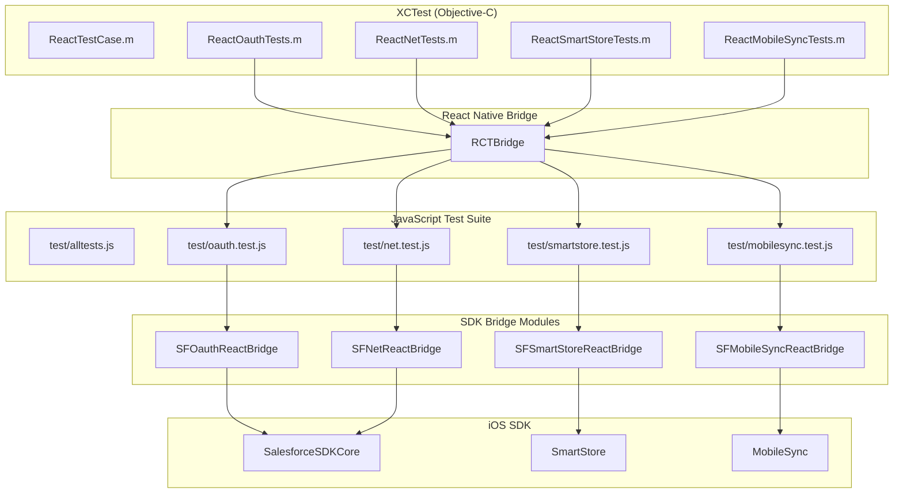
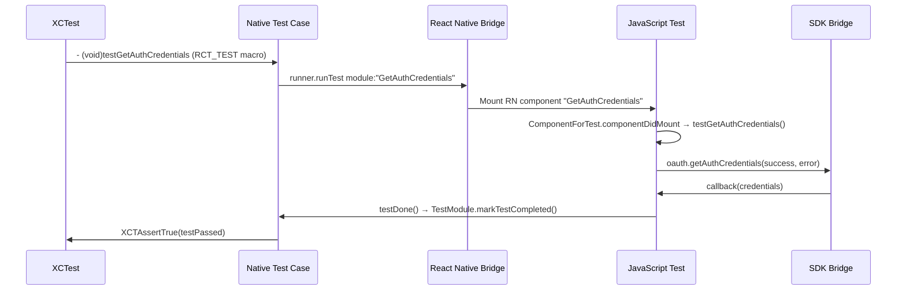

# iOS Test App Documentation

This document describes the iOS test application structure and how to run tests for the Salesforce Mobile SDK React Native bridge.

## Table of Contents

- [Overview](#overview)
- [Test Architecture](#test-architecture)
- [Directory Structure](#directory-structure)
- [Setup and Running Tests](#setup-and-running-tests)
- [Writing Tests](#writing-tests)
- [Test Utilities](#test-utilities)
- [Troubleshooting](#troubleshooting)

## Overview

The iOS test app is a React Native application that runs JavaScript tests through the native iOS XCTest framework. This approach allows testing the complete bridge from JavaScript → React Native → iOS Native → iOS SDK.

### Key Components

1. **JavaScript Test Suite** (`test/`) - Shared test files for all platforms
2. **iOS Test App** (`iosTests/`) - React Native app that loads tests
3. **XCTest Suite** (`iosTests/ios/SalesforceReactTests/`) - Native test runner
4. **Test Harness** (`src/react.force.test.tsx`) - Bridge between JS and native tests

## Test Architecture



## Directory Structure

```
iosTests/
├── ios/                                  # iOS native project
│   ├── SalesforceReactTestApp.xcworkspace  # Xcode workspace (generated by pod install)
│   ├── SalesforceReactTestApp.xcodeproj    # Xcode project
│   ├── Podfile                             # CocoaPods dependencies
│   ├── SalesforceReactTestApp/             # App target
│   │   ├── AppDelegate.{h,m}               # App initialization
│   │   ├── Info.plist                      # App configuration
│   │   ├── main.m                          # App entry point
│   │   └── test_credentials.json           # Test credentials (gitignored)
│   └── SalesforceReactTests/               # Test target
│       ├── ReactTestCase.{h,m}             # Base test class
│       ├── ReactOauthTests.m               # OAuth tests
│       ├── ReactNetTests.m                 # REST API tests
│       ├── ReactSmartStoreTests.m          # SmartStore tests
│       ├── ReactMobileSyncTests.m          # MobileSync tests
│       └── ReactHarnessTests.m             # Test harness tests
│
├── index.js                              # React Native entry point
├── package.json                          # npm dependencies
├── metro.config.js                       # Metro bundler config
├── prepareios.js                         # Setup script
├── updatebundle.js                       # Bundle update script
├── updatesdk.js                          # SDK update script
└── README.md                             # Quick start guide
```

## Setup and Running Tests

### Prerequisites

- **Xcode**: 15 or later
- **Node.js**: 20 or later
- **CocoaPods**: 1.10 or later
- **Salesforce Org**: For authentication tests

### Step 1: Setup Test Workspace

From the `iosTests` directory:

```bash
cd iosTests
./prepareios.js
```

**What it does** (6 phases):
1. **Phase 1**: Installs npm dependencies (React Native, SDK, build tools)
2. **Phase 2**: Clones React Native repo and extracts RCTTest framework
3. **Phase 3**: Clones iOS SDK from configured repository branch
4. **Phase 4**: Creates Xcode configuration and runs pod install
5. **Phase 5**: Creates test_credentials.json placeholder
6. **Phase 6**: Bundles JavaScript tests into index.ios.bundle

**For detailed explanation of each phase**, see [PREPAREIOS_DETAILED.md](./PREPAREIOS_DETAILED.md).

**Key files created**:
- `node_modules/` - npm dependencies
- `RCTTest/` - React Native test framework (extracted from RN source)
- `mobile_sdk/SalesforceMobileSDK-iOS/` - Cloned iOS SDK
- `ios/Pods/` - CocoaPods dependencies
- `ios/.xcode.env` - Node binary path for Xcode
- `ios/index.ios.bundle` - Bundled JavaScript tests
- `test_credentials.json` - Empty credentials file (must be populated)

### Step 2: Configure Test Credentials

Create `ios/SalesforceReactTestApp/test_credentials.json`:

```json
{
  "test_client_id": "<your-connected-app-consumer-key>",
  "test_login_domain": "login.salesforce.com",
  "test_redirect_uri": "sfdc://success",
  "test_username": "<test-user@example.com>",
  "test_password": "<password>",
  "test_security_token": "<security-token>"
}
```

**Note**: This file is gitignored for security.

**Alternative** (using environment variables):

```bash
cd iosTests
node create_test_credentials_from_env.js
```

This reads credentials from environment variables:
- `SFDC_TEST_CLIENT_ID`
- `SFDC_TEST_LOGIN_DOMAIN`
- `SFDC_TEST_REDIRECT_URI`
- `SFDC_TEST_USERNAME`
- `SFDC_TEST_PASSWORD`

### Step 3: Start Metro Bundler

In a terminal window:

```bash
cd iosTests
npm start
```

**Why?** React Native needs the Metro bundler to serve JavaScript to the native app.

### Step 4: Run Tests in Xcode

1. Open workspace:
   ```bash
   cd iosTests/ios
   open SalesforceReactTestApp.xcworkspace
   ```

2. Select scheme: `SalesforceReactTestApp`

3. Select device: Any iOS Simulator or device (iOS 18.0+)

4. Run tests: `Product > Test` or `⌘U`

### Alternative: Command Line

```bash
cd iosTests/ios
xcodebuild test \
  -workspace SalesforceReactTestApp.xcworkspace \
  -scheme SalesforceReactTestApp \
  -destination 'platform=iOS Simulator,name=iPhone 15,OS=18.0'
```

## Test Execution Flow

### How Tests Run



### ReactTestCase Base Class

All test cases inherit from `ReactTestCase` (in `iosTests/ios/SalesforceReactTests/ReactTestCase.h/m`). It uses React Native's `RCTTestRunner` (from React Native's RCTTest framework, extracted by `prepareios.js`).

```objective-c
#import <RCTTest/RCTTestRunner.h>

#define RCT_TEST(name)                        \
- (void)test##name                            \
{                                             \
    [self.runner runTest:_cmd module:@#name]; \
}

@interface ReactTestCase : XCTestCase

@property (nonatomic, strong) RCTTestRunner* runner;
@property (nonatomic, strong) NSString *jsSuitePath;

@end
```

**Example subclass** (actual `ReactOauthTests.m`):

```objective-c
#import "ReactTestCase.h"

@interface ReactOauthTests : ReactTestCase
@end

@implementation ReactOauthTests

- (void)setUp {
    self.jsSuitePath = @"node_modules/react-native-force/test/oauth.test";
    [super setUp];
}

// RCT_TEST macro generates - (void)testGetAuthCredentials
RCT_TEST(GetAuthCredentials)

@end
```

The `RCT_TEST(Name)` macro generates an XCTest method `testName` that invokes `[self.runner runTest:_cmd module:@"Name"]`. The runner mounts the registered React Native component (named `"Name"`) which kicks off the JS test.

### Test Harness (`react.force.test.tsx`)

**Location**: `src/react.force.test.tsx`

The test harness exports just two functions and connects JavaScript tests to the native test framework via `AppRegistry`:

```typescript
import { AppRegistry, NativeModules, View } from "react-native";
const { SalesforceTestBridge, TestModule } = NativeModules;

// Mounts JS test as a React Native component named after the test function
export const registerTest = (test: any) => {
  AppRegistry.registerComponent(
    test.name.substring("test".length),
    () => testComponentProvider(test)
  );
};

// Called from JS test to signal completion to native
export const testDone = () => {
  if (TestModule) {                  // iOS via RCTTestModule
    TestModule.markTestCompleted();
  } else if (SalesforceTestBridge) { // Android via SalesforceTestBridge
    SalesforceTestBridge.markTestCompleted();
  }
};
```

Note: there are no `testFailed`, `assertEqual`, `assertTrue`, etc. helpers in the harness. Test files use plain JS conditions and `testDone()` to signal pass/fail (assertion failures are reported by RCTTestRunner via thrown errors / non-completion).

## Writing Tests

### JavaScript Test Structure

**Location**: `test/<module>.test.js`

Tests use Chai for assertions and the `registerTest`/`testDone` harness:

```javascript
// test/oauth.test.js (actual file)
import { assert } from 'chai';
import * as oauth from '../src/react.force.oauth';
import { registerTest, testDone } from '../src/react.force.test';

testGetAuthCredentials = () => {
    oauth.getAuthCredentials(
        (creds) => {
            assert.containsAllKeys(
              creds,
              ["accessToken","instanceUrl","loginUrl","orgId","refreshToken","userAgent","userId"],
              'Wrong keys in credentials'
            );
            testDone();
        },
        (error) => { throw error; }
    );

    return false; // not done
};

registerTest(testGetAuthCredentials);
```

### Test Naming Convention

**Format**: JS test function names start with `test` followed by the module-specific name, in camelCase. The `RCT_TEST(Name)` macro on the iOS side passes `Name` (without `test` prefix) as the React Native module name; the harness registers the JS test under that same name (using `test.name.substring("test".length)`).

Example mapping:
| JavaScript Function | iOS Macro | Module Name (registered) |
|---------------------|-----------|--------------------------|
| `testGetAuthCredentials` | `RCT_TEST(GetAuthCredentials)` | `GetAuthCredentials` |
| `testRegisterSoup` | `RCT_TEST(RegisterSoup)` | `RegisterSoup` |

### Adding a New Test

**1. Add JavaScript test function** (`test/oauth.test.js`):

```javascript
import { assert } from 'chai';
import * as oauth from '../src/react.force.oauth';
import { registerTest, testDone } from '../src/react.force.test';

testGetUserInfo = () => {
    oauth.getUserInfo(
        (userInfo) => {
            assert.isString(userInfo.userName, 'userName should be a string');
            testDone();
        },
        (error) => { throw error; }
    );
    return false;
};

registerTest(testGetUserInfo);
```

**2. Add the test to the bundled JS entry** (`iosTests/index.js` imports the test files - verify in actual project)

**3. Add XCTest method** (`iosTests/ios/SalesforceReactTests/ReactOauthTests.m`):

```objective-c
RCT_TEST(GetUserInfo)  // generates - (void)testGetUserInfo
```

**4. Run tests** (see [Setup and Running Tests](#setup-and-running-tests))

### Test Patterns

Tests use Chai for assertions. Throw errors on failure; call `testDone()` on success.

#### Async Operations

```javascript
testAsyncOperation = () => {
    someAsyncCall(
        (result) => {
            assert.equal(result.value, 'expected');
            testDone();
        },
        (error) => { throw error; }
    );
    return false;
};
```

#### Chained Operations

```javascript
testChainedOperations = () => {
    oauth.getAuthCredentials(
        (credentials) => {
            net.query(
                'SELECT Id FROM Contact LIMIT 1',
                (result) => {
                    assert.isAbove(result.totalSize, 0, 'Should have records');
                    testDone();
                },
                (error) => { throw error; }
            );
        },
        (error) => { throw error; }
    );
    return false;
};
```

#### Cleanup

```javascript
testWithCleanup = () => {
    smartstore.registerSoup(
        false, 'test_soup',
        [{path: 'Id', type: 'string'}],
        (soupName) => {
            // Test operations, then cleanup
            smartstore.removeSoup(
                false, 'test_soup',
                () => testDone(),
                (error) => { throw error; }
            );
        },
        (error) => { throw error; }
    );
    return false;
};
```

### Assertions

The test files use [Chai](https://www.chaijs.com/) for assertions:

```javascript
import { assert } from 'chai';

// Equality
assert.equal(actual, expected, 'Message');

// Type checking
assert.isString(value);
assert.isNumber(value);
assert.isObject(value);

// Null/undefined
assert.isDefined(value);
assert.isNotNull(value);

// Object keys
assert.containsAllKeys(obj, ['key1', 'key2']);

// Array length
assert.lengthOf(array, 5);
```

## Test Utilities

### Test Credentials Loading

The `iosTests/test_credentials.json` file is loaded from the test bundle at runtime. It must be populated with valid Salesforce org credentials before running tests (see Step 2 above).

### Waiting for Async Operations

**XCTest expectations**:

```objective-c
- (void)testSomethingAsync {
    XCTestExpectation *expectation = 
        [self expectationWithDescription:@"Async operation"];
    
    // Trigger operation
    [self runTest:@"asyncTest"];
    
    // Wait up to 30 seconds
    [self waitForExpectations:@[expectation] timeout:30.0];
}
```

**JavaScript timeout** (RCTTestRunner enforces a default timeout; for custom timeouts):

```javascript
testWithTimeout = () => {
    const timeout = setTimeout(() => {
        throw new Error('Test timed out after 10 seconds');
    }, 10000);

    someAsyncCall(
        (result) => {
            clearTimeout(timeout);
            testDone();
        },
        (error) => {
            clearTimeout(timeout);
            throw error;
        }
    );
    return false;
};
```

## Test Categories

### 1. OAuth Tests (`test/oauth.test.js`)

Tests authentication credentials retrieval:

- `testGetAuthCredentials` - Get current user credentials

**Prerequisites**: Valid test credentials, authenticated user

### 2. Net Tests (`test/net.test.js`)

Tests REST API functionality:

- `testGetApiVersion` - Get current API version
- `testVersions` - Versions endpoint
- `testResources` - Resources endpoint
- `testDescribeGlobal` - Describe all sobjects
- `testMetaData` - SObject metadata
- `testDescribe` - SObject describe
- `testDescribeLayout` - Layout describe
- `testCreateRetrieve` - Create + retrieve record
- `testUpsertUpdateRetrieve` - Upsert/update flow
- `testCreateDelRetrieve` - Create/delete flow
- `testQuery` - SOQL query
- `testSearch` - SOSL search
- `testPublicApiCall` - Public (unauthenticated) API call
- `testCollectionCreateRetrieve` - Collections API create
- `testCollectionUpsertUpdateRetrieve` - Collections API upsert
- `testCollectionCreateDeleteRetrieve` - Collections API delete

**Prerequisites**: Authenticated user

### 3. SmartStore Tests (`test/smartstore.test.js`)

Tests encrypted storage:

- `testGetDatabaseSize`
- `testRegisterExistsRemoveExists`
- `testGetSoupIndexSpecs`
- `testUpsertRetrieve`
- `testQuerySoup`
- `testMoveCursor`
- `testSmartQuerySoup`
- `testRemoveFromSoup`
- `testClearSoup`
- `testGetRemoveStores`
- `testGetRemoveGlobalStores`

**Prerequisites**: None (self-contained on-device storage)

### 4. MobileSync Tests (`test/mobilesync.test.js`)

Tests data synchronization:

- `testSyncUp` - Sync to Salesforce
- `testSyncDown` - Sync from Salesforce
- `testReSync` - Re-run named sync
- `testCleanResyncGhosts` - Clean server-deleted records
- `testGetSyncStatusDeleteSync` - Status check + delete sync

**Prerequisites**: Authenticated user, registered soups

### 5. Harness Tests (`test/harness.test.js`)

Sanity checks for the test framework itself:

- `testPassing` - Synchronous pass
- `testAsyncPassing` - Asynchronous pass

**Prerequisites**: None

## Troubleshooting

### Tests Don't Run

**Problem**: XCTest shows "Test did not run" or hangs

**Solutions**:
1. Ensure Metro bundler is running (`npm start` in `iosTests/`)
2. Check console for JavaScript errors
3. Verify React Native bundle loaded (check Xcode console)
4. Try Product > Clean Build Folder (⌘⇧K)

### Authentication Failures

**Problem**: OAuth tests fail with "Not authenticated"

**Solutions**:
1. Verify `test_credentials.json` exists and is valid
2. Check Connected App configuration in Salesforce
3. Verify redirect URI matches (callback URL)
4. Ensure test user has correct permissions
5. Try manual login in simulator first

### Build Errors

**Problem**: Xcode build fails with CocoaPods errors

**Solutions**:
```bash
cd iosTests/ios
rm -rf Pods Podfile.lock
pod deintegrate
pod install
```

### Metro Bundler Issues

**Problem**: "Unable to resolve module" errors

**Solutions**:
```bash
cd iosTests
rm -rf node_modules
npm install
npm start -- --reset-cache
```

### Test Timeout

**Problem**: Tests hang or timeout

**Solutions**:
1. Increase timeout in XCTest method
2. Check JavaScript console for errors
3. Add logging in JavaScript test:
   ```javascript
   console.log('Starting test...');
   console.log('Result:', result);
   ```
4. Check native logs in Xcode console

### SDK Version Mismatch

**Problem**: Tests fail after SDK update

**Solutions**:
```bash
cd iosTests
./updatesdk.js  # Update to latest SDK
./prepareios.js # Rebuild
```

## CI/CD Integration

### GitHub Actions Example

```yaml
name: iOS Tests

on: [push, pull_request]

jobs:
  test:
    runs-on: macos-latest
    
    steps:
    - uses: actions/checkout@v3
    
    - name: Setup Node
      uses: actions/setup-node@v3
      with:
        node-version: '20'
    
    - name: Setup Test Credentials
      env:
        SFDC_TEST_CLIENT_ID: ${{ secrets.TEST_CLIENT_ID }}
        SFDC_TEST_USERNAME: ${{ secrets.TEST_USERNAME }}
        SFDC_TEST_PASSWORD: ${{ secrets.TEST_PASSWORD }}
      run: |
        cd iosTests
        node create_test_credentials_from_env.js
    
    - name: Install Dependencies
      run: |
        cd iosTests
        npm install
        cd ios
        pod install
    
    - name: Start Metro Bundler
      run: |
        cd iosTests
        npm start &
        sleep 10  # Wait for bundler to start
    
    - name: Run Tests
      run: |
        cd iosTests/ios
        xcodebuild test \
          -workspace SalesforceReactTestApp.xcworkspace \
          -scheme SalesforceReactTestApp \
          -destination 'platform=iOS Simulator,name=iPhone 15,OS=18.0' \
          -resultBundlePath TestResults
    
    - name: Upload Test Results
      if: always()
      uses: actions/upload-artifact@v3
      with:
        name: test-results
        path: iosTests/ios/TestResults
```

## Best Practices

### 1. Keep Tests Isolated

Each test should be independent:
```javascript
testIsolated = () => {
    const soupName = 'test_soup_' + Date.now();

    smartstore.registerSoup(false, soupName, indexes,
        (name) => {
            smartstore.removeSoup(
                false, soupName,
                () => testDone(),
                (error) => { throw error; }
            );
        },
        (error) => { throw error; }
    );
    return false;
};
```

### 2. Clean Up Test Data

Always clean up after creating server-side data:
```javascript
testWithCleanup = () => {
    net.create('Account', { Name: 'Test' },
        (result) => {
            net.del('Account', result.id,
                () => testDone(),
                (error) => { throw error; }
            );
        },
        (error) => { throw error; }
    );
    return false;
};
```

### 3. Use Meaningful Assertion Messages

```javascript
// ❌ Bad
assert.equal(actual, expected);

// ✅ Good
assert.equal(actual.Name, expected.Name, 'Account name should match');
```

### 4. Handle Errors Gracefully

```javascript
testErrorHandling = () => {
    oauth.getAuthCredentials(
        (credentials) => { /* continue */ testDone(); },
        (error) => {
            // Throw with context so RCTTestRunner reports the failure clearly
            throw new Error(
                `Authentication failed (${error.code}): ${error.message}`
            );
        }
    );
    return false;
};
```

## Further Reading

- [JavaScript API Reference](../javascript/API_REFERENCE.md) - Complete API documentation
- [iOS Bridge Overview](../ios/README.md) - iOS implementation details
- [Architecture Guide](../ARCHITECTURE.md) - Overall architecture
- [Main README](../../README.md) - Getting started guide
