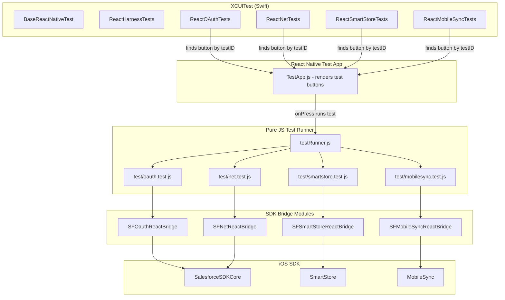
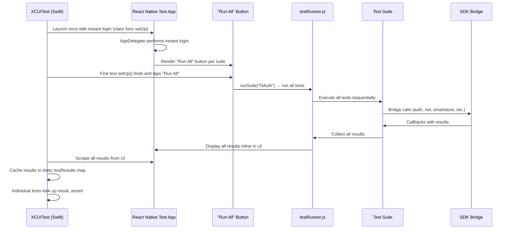

# iOS Test App Documentation

This document describes the iOS test application structure and how to run tests for the Salesforce Mobile SDK React Native bridge.

## Table of Contents

- [Overview](#overview)
- [Test Architecture](#test-architecture)
- [Directory Structure](#directory-structure)
- [Setup and Running Tests](#setup-and-running-tests)
- [Writing Tests](#writing-tests)
- [Test Utilities](#test-utilities)
- [Troubleshooting](#troubleshooting)

## Overview

The iOS test app uses **UI-driven testing** where XCUITest automation drives a React Native app that displays test buttons. This approach allows testing the complete stack from UI automation → React Native UI → JavaScript tests → iOS SDK bridge.

### Key Components

1. **XCUITest Suite** (`iosTests/ios/SalesforceReactTestAppUITests/`) - Swift test classes that find and tap test buttons
2. **React Native Test App** (`test/TestApp.js`) - Displays scrollable list of test buttons
3. **Pure JS Test Runner** (`test/testRunner.js`) - Executes tests and displays results inline
4. **JavaScript Test Suite** (`test/`) - Shared test files for all platforms (oauth, net, smartstore, mobilesync)

### Key Benefits

- **No React Native internal API coupling**: No RCTTestModule or test bridge code
- **Works with precompiled binaries**: Standard React Native app with no special test infrastructure
- **Full error messages visible**: Test results display inline in the app UI
- **Manual testing possible**: Can tap buttons in the app to run tests manually
- **Instant login**: Credentials passed via launch arguments to bypass OAuth UI

## Test Architecture

The iOS test suite uses **UI-driven testing** with XCUITest automation:


```mermaid
graph TB
    subgraph "XCUITest (Swift)"
        A[BaseReactNativeTest]
        B[ReactHarnessTests]
        C[ReactOAuthTests]
        D[ReactNetTests]
        E[ReactSmartStoreTests]
        F[ReactMobileSyncTests]
    end
    
    subgraph "React Native Test App"
        G[TestApp.js - renders test buttons]
    end
    
    subgraph "Pure JS Test Runner"
        H[testRunner.js]
        I[test/oauth.test.js]
        J[test/net.test.js]
        K[test/smartstore.test.js]
        L[test/mobilesync.test.js]
    end
    
    subgraph "SDK Bridge Modules"
        M[SFOauthReactBridge]
        N[SFNetReactBridge]
        O[SFSmartStoreReactBridge]
        P[SFMobileSyncReactBridge]
    end
    
    subgraph "iOS SDK"
        Q[SalesforceSDKCore]
        R[SmartStore]
        S[MobileSync]
    end
    
    C -->|finds button by testID| G
    D -->|finds button by testID| G
    E -->|finds button by testID| G
    F -->|finds button by testID| G
    
    G -->|onPress runs test| H
    H --> I
    H --> J
    H --> K
    H --> L
    
    I --> M
    J --> N
    K --> O
    L --> P
    
    M --> Q
    N --> Q
    O --> R
    P --> S
```

## Directory Structure

```
iosTests/
├── ios/                                  # iOS native project
│   ├── SalesforceReactTestApp.xcworkspace  # Xcode workspace (generated by pod install)
│   ├── SalesforceReactTestApp.xcodeproj    # Xcode project
│   ├── Podfile                             # CocoaPods dependencies
│   ├── SalesforceReactTestApp/             # App target
│   │   ├── AppDelegate.{h,m}               # App initialization
│   │   ├── Info.plist                      # App configuration
│   │   ├── main.m                          # App entry point
│   │   └── test_credentials.json           # Test credentials (gitignored)
│   └── SalesforceReactTests/               # Test target
│       ├── ReactTestCase.{h,m}             # Base test class
│       ├── ReactOauthTests.m               # OAuth tests
│       ├── ReactNetTests.m                 # REST API tests
│       ├── ReactSmartStoreTests.m          # SmartStore tests
│       ├── ReactMobileSyncTests.m          # MobileSync tests
│       └── ReactHarnessTests.m             # Test harness tests
│
├── index.js                              # React Native entry point
├── package.json                          # npm dependencies
├── metro.config.js                       # Metro bundler config
├── prepareios.js                         # Setup script
├── updatebundle.js                       # Bundle update script
├── updatesdk.js                          # SDK update script
└── README.md                             # Quick start guide
```

## Setup and Running Tests

### Prerequisites

- **Xcode**: 15 or later
- **Node.js**: 20 or later
- **CocoaPods**: 1.10 or later
- **Salesforce Org**: For authentication tests

### Step 1: Setup Test Workspace

From the `iosTests` directory:

```bash
cd iosTests
./prepareios.js
```

**What it does** (5 phases):
1. **Phase 1**: Installs npm dependencies (React Native, SDK via git URL, build tools)
2. **Phase 2**: Clones iOS SDK from configured repository branch
3. **Phase 3**: Creates Xcode configuration and runs pod install
4. **Phase 4**: Copies test_credentials.json from shared/test/
5. **Phase 5**: Bundles JavaScript test app into main.jsbundle

**For detailed explanation of each phase**, see [PREPAREIOS_DETAILED.md](./PREPAREIOS_DETAILED.md).

**Key files created**:
- `node_modules/` - npm dependencies
- `mobile_sdk/SalesforceMobileSDK-iOS/` - Cloned iOS SDK
- `ios/Pods/` - CocoaPods dependencies
- `ios/.xcode.env` - Node binary path for Xcode
- `ios/main.jsbundle` - Bundled JavaScript test app
- `ios/test_credentials.json` - Copied from `shared/test/test_credentials.json` (must be populated)

### Step 2: Configure Test Credentials

Both iOS and Android tests share a single credentials source at `shared/test/test_credentials.json` (relative to the repo root). Copy the sample template and fill in your values:

```bash
cp shared/test/test_credentials.json.sample shared/test/test_credentials.json
```

The `prepareios.js` script (Phase 5) copies this file into `iosTests/ios/test_credentials.json` automatically. See the [sample template](../../shared/test/test_credentials.json.sample) for the expected fields.

**Note**: Both `shared/test/test_credentials.json` and `iosTests/ios/test_credentials.json` are gitignored for security.

**Alternative** (using environment variables in CI):

```bash
cd iosTests
node create_test_credentials_from_env.js
```

This reads credentials from environment variables:
- `SFDC_TEST_CLIENT_ID`
- `SFDC_TEST_LOGIN_DOMAIN`
- `SFDC_TEST_REDIRECT_URI`
- `SFDC_TEST_USERNAME`
- `SFDC_TEST_PASSWORD`

### Step 3: Run Tests in Xcode

1. Open workspace:
   ```bash
   cd iosTests/ios
   open SalesforceReactTestApp.xcworkspace
   ```

2. Select scheme: `SalesforceReactTestApp`

3. Select device: Any iOS Simulator or device (iOS 18.0+)

4. Run tests: `Product > Test` or `⌘U`

### Alternative: Command Line

```bash
cd iosTests/ios
xcodebuild test \
  -workspace SalesforceReactTestApp.xcworkspace \
  -scheme SalesforceReactTestApp \
  -destination 'platform=iOS Simulator,name=iPhone 15,OS=18.0'
```

## Test Execution Flow

### How Tests Run (Batch Execution)

Tests now use **batch suite execution** (adopted from Hybrid SDK's JSTestCase pattern):

1. **App launches once** per test class via `class func setUp()`
2. **First test's setUp()** taps "Run All" button for the suite
3. **All tests run** sequentially in JavaScript
4. **Results collected** from UI into `static var testResults` map
5. **Individual tests** look up their cached result and assert


```mermaid
sequenceDiagram
    participant XCUITest as XCUITest (Swift)
    participant App as React Native Test App
    participant RunAll as "Run All" Button
    participant Runner as testRunner.js
    participant Tests as Test Suite
    participant SDK as SDK Bridge
    
    XCUITest->>App: Launch once with instant login (class func setUp)
    App->>App: AppDelegate performs instant login
    App->>RunAll: Render "Run All" button per suite
    XCUITest->>RunAll: First test setUp() finds and taps "Run All"
    RunAll->>Runner: runSuite("OAuth") → run all tests
    Runner->>Tests: Execute all tests sequentially
    Tests->>SDK: Bridge calls (auth, net, smartstore, etc.)
    SDK->>Tests: Callbacks with results
    Tests->>Runner: Collect all results
    Runner->>App: Display all results inline in UI
    XCUITest->>App: Scrape all results from UI
    XCUITest->>XCUITest: Cache results in static testResults map
    XCUITest->>XCUITest: Individual tests look up result, assert
```

### BaseReactNativeTest Class

All XCUITest classes inherit from `BaseReactNativeTest` which implements batch execution:

```swift
import XCTest

struct TestResult {
    let success: Bool
    let message: String?
}

class BaseReactNativeTest: XCTestCase {
    static var app: XCUIApplication!
    static var testResults: [String: [String: TestResult]] = [:] // { suite: { test: result } }
    
    var suiteName: String { fatalError("Subclass must override") }
    var testNames: [String] { fatalError("Subclass must override") }
    
    override class func setUp() {
        super.setUp()
        // Launch once per test class (not per test)
        app = XCUIApplication()
        let credentials = loadTestCredentials()
        app.launchArguments = ["-creds", credentials]
        app.launch()
        XCTAssertTrue(app.descendants(matching: .any).matching(identifier: "testList")
                      .firstMatch.waitForExistence(timeout: 30))
    }
    
    override func setUp() {
        super.setUp()
        // Run suite if not already run (batch execution)
        if Self.testResults[suiteName] == nil {
            runSuiteAndCollectResults()
        }
    }
    
    private func runSuiteAndCollectResults() {
        // Tap "Run All" button for suite
        let runButton = app.descendants(matching: .any)
                          .matching(identifier: "runSuite_\(suiteName)").firstMatch
        XCTAssertTrue(runButton.waitForExistence(timeout: 10), 
                      "Run All button not found - bundle may be stale")
        runButton.tap()
        
        // Wait for suite completion (check last test result)
        let lastTest = testNames.last!
        let passed = app.descendants(matching: .any)
                       .matching(identifier: "result_\(lastTest)_pass")
                       .firstMatch.waitForExistence(timeout: 300)
        let failed = app.descendants(matching: .any)
                       .matching(identifier: "result_\(lastTest)_fail")
                       .firstMatch.waitForExistence(timeout: 5)
        XCTAssertTrue(passed || failed, "Suite did not complete")
        
        // Collect all results from UI
        var results: [String: TestResult] = [:]
        for testName in testNames {
            let passElement = app.descendants(matching: .any)
                                .matching(identifier: "result_\(testName)_pass").firstMatch
            let failElement = app.descendants(matching: .any)
                                .matching(identifier: "result_\(testName)_fail").firstMatch
            
            if passElement.exists {
                results[testName] = TestResult(success: true, message: nil)
            } else if failElement.exists {
                let errorElement = app.descendants(matching: .any)
                                     .matching(identifier: "error_\(testName)").firstMatch
                results[testName] = TestResult(success: false, 
                                              message: errorElement.label)
            }
        }
        Self.testResults[suiteName] = results
    }
    
    func runTest(_ name: String) {
        // Look up cached result from batch execution
        if let result = Self.testResults[suiteName]?[name] {
            XCTAssertTrue(result.success, 
                         "\(name) failed: \(result.message ?? "unknown")")
        } else {
            XCTFail("No result found for \(name)")
        }
    }
}
```

**Example subclass**:

```swift
class ReactOAuthTests: BaseReactNativeTest {
    override var suiteName: String { "OAuth" }
    override var testNames: [String] { ["testGetAuthCredentials"] }
    
    func testGetAuthCredentials() {
        runTest("testGetAuthCredentials")
    }
}
```

### Test App UI (`test/TestApp.js`)

The test app renders a scrollable list of buttons for each test:

```javascript
import React, { useState } from 'react';
import { ScrollView, TouchableOpacity, Text, View } from 'react-native';
import { runTest } from './testRunner';

export default function TestApp() {
    const [results, setResults] = useState({});
    
    const handleRunTest = (testName) => {
        runTest(testName, (result) => {
            setResults(prev => ({ ...prev, [testName]: result }));
        });
    };
    
    return (
        <ScrollView testID="testList" accessibilityLabel="testList">
            <TouchableOpacity 
                testID="run_test_GetAuthCredentials"
                accessibilityLabel="run_test_GetAuthCredentials"
                onPress={() => handleRunTest('testGetAuthCredentials')}>
                <Text>OAuth: GetAuthCredentials</Text>
                {results.testGetAuthCredentials && (
                    <Text>{results.testGetAuthCredentials}</Text>
                )}
            </TouchableOpacity>
            {/* More test buttons... */}
        </ScrollView>
    );
}
```

### Test Runner (`test/testRunner.js`)

The pure JavaScript test runner executes tests and captures results:

```javascript
export function runTest(testName, callback) {
    try {
        // Import test module
        const testModule = require('./oauth.test');
        const testFn = testModule[testName];
        
        // Execute test
        const result = testFn();
        
        if (result === false) {
            // Async test - will call callback later
            return;
        }
        
        callback('PASS');
    } catch (error) {
        callback(`FAIL: ${error.message}`);
    }
}
```

## Writing Tests

### JavaScript Test Structure

**Location**: `test/<module>.test.js`

Tests use a lightweight custom assert module (test/assert.js) and throw errors on failure:

```javascript
// test/oauth.test.js (actual file)
import { assert } from './assert';
import * as oauth from '../src/react.force.oauth';

export function testGetAuthCredentials(callback) {
    oauth.getAuthCredentials(
        (creds) => {
            assert.containsAllKeys(
              creds,
              ["accessToken","instanceUrl","loginUrl","orgId","refreshToken","userAgent","userId"],
              'Wrong keys in credentials'
            );
            callback('PASS');
        },
        (error) => { 
            callback(`FAIL: ${error.message}`); 
        }
    );
}
```

### Test Naming Convention

**Format**: JS test function names start with `test` followed by the module-specific name, in camelCase. The XCUITest button has `testID="run_test_<TestName>"` and the test runner looks up the function by name.

Example mapping:
| JavaScript Function | Button testID | XCUITest Method |
|---------------------|---------------|-----------------|
| `testGetAuthCredentials` | `run_test_GetAuthCredentials` | `func testGetAuthCredentials()` |
| `testRegisterSoup` | `run_test_RegisterSoup` | `func testRegisterSoup()` |

### Adding a New Test

**1. Add JavaScript test function** (`test/oauth.test.js`):

```javascript
import { assert } from './assert';
import * as oauth from '../src/react.force.oauth';

export function testGetUserInfo(callback) {
    oauth.getUserInfo(
        (userInfo) => {
            assert.isString(userInfo.userName, 'userName should be a string');
            callback('PASS');
        },
        (error) => { 
            callback(`FAIL: ${error.message}`); 
        }
    );
}
```

**2. Add button to TestApp** (`test/TestApp.js`):

```javascript
<TouchableOpacity 
    testID="run_test_GetUserInfo"
    accessibilityLabel="run_test_GetUserInfo"
    onPress={() => handleRunTest('testGetUserInfo')}>
    <Text>OAuth: GetUserInfo</Text>
    {results.testGetUserInfo && (
        <Text>{results.testGetUserInfo}</Text>
    )}
</TouchableOpacity>
```

**3. Add XCUITest method** (`iosTests/ios/SalesforceReactTestAppUITests/ReactOAuthTests.swift`):

```swift
func testGetUserInfo() {
    runTest(testID: "run_test_GetUserInfo")
}
```

**4. Run tests** (see [Setup and Running Tests](#setup-and-running-tests))

### Test Patterns

Tests use a lightweight custom assert module (test/assert.js). Call the callback with "PASS" on success, or "FAIL: <message>" on failure.

#### Async Operations

```javascript
export function testAsyncOperation(callback) {
    someAsyncCall(
        (result) => {
            assert.equal(result.value, 'expected');
            callback('PASS');
        },
        (error) => { 
            callback(`FAIL: ${error.message}`); 
        }
    );
}
```

#### Chained Operations

```javascript
export function testChainedOperations(callback) {
    oauth.getAuthCredentials(
        (credentials) => {
            net.query(
                'SELECT Id FROM Contact LIMIT 1',
                (result) => {
                    assert.isAbove(result.totalSize, 0, 'Should have records');
                    callback('PASS');
                },
                (error) => { 
                    callback(`FAIL: ${error.message}`); 
                }
            );
        },
        (error) => { 
            callback(`FAIL: ${error.message}`); 
        }
    );
}
```

#### Cleanup

```javascript
export function testWithCleanup(callback) {
    smartstore.registerSoup(
        false, 'test_soup',
        [{path: 'Id', type: 'string'}],
        (soupName) => {
            // Test operations, then cleanup
            smartstore.removeSoup(
                false, 'test_soup',
                () => callback('PASS'),
                (error) => { 
                    callback(`FAIL: ${error.message}`); 
                }
            );
        },
        (error) => { 
            callback(`FAIL: ${error.message}`); 
        }
    );
}
```

### Assertions

The test files use test/assert.js for assertions:

```javascript
import { assert } from './assert';

// Equality
assert.equal(actual, expected, 'Message');

// Type checking
assert.isString(value);
assert.isNumber(value);
assert.isObject(value);

// Null/undefined
assert.isDefined(value);
assert.isNotNull(value);

// Object keys
assert.containsAllKeys(obj, ['key1', 'key2']);

// Array length
assert.lengthOf(array, 5);
```

## Test Utilities

### Test Credentials Loading

The `iosTests/ios/test_credentials.json` file is loaded from the test bundle at runtime. It is copied from `shared/test/test_credentials.json` by `prepareios.js` and must be populated with valid Salesforce org credentials before running tests (see Step 2 above).

### Waiting for Async Operations

**XCTest expectations**:

```objective-c
- (void)testSomethingAsync {
    XCTestExpectation *expectation = 
        [self expectationWithDescription:@"Async operation"];
    
    // Trigger operation
    [self runTest:@"asyncTest"];
    
    // Wait up to 30 seconds
    [self waitForExpectations:@[expectation] timeout:30.0];
}
```

**JavaScript timeout** (RCTTestRunner enforces a default timeout; for custom timeouts):

```javascript
testWithTimeout = () => {
    const timeout = setTimeout(() => {
        throw new Error('Test timed out after 10 seconds');
    }, 10000);

    someAsyncCall(
        (result) => {
            clearTimeout(timeout);
            testDone();
        },
        (error) => {
            clearTimeout(timeout);
            throw error;
        }
    );
    return false;
};
```

## Test Categories

### 1. OAuth Tests (`test/oauth.test.js`)

Tests authentication credentials retrieval:

- `testGetAuthCredentials` - Get current user credentials

**Prerequisites**: Valid test credentials, authenticated user

### 2. Net Tests (`test/net.test.js`)

Tests REST API functionality:

- `testGetApiVersion` - Get current API version
- `testVersions` - Versions endpoint
- `testResources` - Resources endpoint
- `testDescribeGlobal` - Describe all sobjects
- `testMetaData` - SObject metadata
- `testDescribe` - SObject describe
- `testDescribeLayout` - Layout describe
- `testCreateRetrieve` - Create + retrieve record
- `testUpsertUpdateRetrieve` - Upsert/update flow
- `testCreateDelRetrieve` - Create/delete flow
- `testQuery` - SOQL query
- `testSearch` - SOSL search
- `testPublicApiCall` - Public (unauthenticated) API call
- `testCollectionCreateRetrieve` - Collections API create
- `testCollectionUpsertUpdateRetrieve` - Collections API upsert
- `testCollectionCreateDeleteRetrieve` - Collections API delete

**Prerequisites**: Authenticated user

### 3. SmartStore Tests (`test/smartstore.test.js`)

Tests encrypted storage:

- `testGetDatabaseSize`
- `testRegisterExistsRemoveExists`
- `testGetSoupIndexSpecs`
- `testUpsertRetrieve`
- `testQuerySoup`
- `testMoveCursor`
- `testSmartQuerySoup`
- `testRemoveFromSoup`
- `testClearSoup`
- `testGetRemoveStores`
- `testGetRemoveGlobalStores`

**Prerequisites**: None (self-contained on-device storage)

### 4. MobileSync Tests (`test/mobilesync.test.js`)

Tests data synchronization:

- `testSyncUp` - Sync to Salesforce
- `testSyncDown` - Sync from Salesforce
- `testReSync` - Re-run named sync
- `testCleanResyncGhosts` - Clean server-deleted records
- `testGetSyncStatusDeleteSync` - Status check + delete sync

**Prerequisites**: Authenticated user, registered soups

### 5. Harness Tests (`test/harness.test.js`)

Sanity checks for the test framework itself:

- `testPassing` - Synchronous pass
- `testAsyncPassing` - Asynchronous pass

**Prerequisites**: None

## Troubleshooting

### Tests Don't Run

**Problem**: XCTest shows "Test did not run" or hangs

**Solutions**:
1. Ensure Metro bundler is running (`npm start` in `iosTests/`)
2. Check console for JavaScript errors
3. Verify React Native bundle loaded (check Xcode console)
4. Try Product > Clean Build Folder (⌘⇧K)

### Authentication Failures

**Problem**: OAuth tests fail with "Not authenticated"

**Solutions**:
1. Verify `test_credentials.json` exists and is valid
2. Check Connected App configuration in Salesforce
3. Verify redirect URI matches (callback URL)
4. Ensure test user has correct permissions
5. Try manual login in simulator first

### Build Errors

**Problem**: Xcode build fails with CocoaPods errors

**Solutions**:
```bash
cd iosTests/ios
rm -rf Pods Podfile.lock
pod deintegrate
pod install
```

### Metro Bundler Issues

**Problem**: "Unable to resolve module" errors

**Solutions**:
```bash
cd iosTests
rm -rf node_modules
npm install
npm start -- --reset-cache
```

### Test Timeout

**Problem**: Tests hang or timeout

**Solutions**:
1. Increase timeout in XCTest method
2. Check JavaScript console for errors
3. Add logging in JavaScript test:
   ```javascript
   console.log('Starting test...');
   console.log('Result:', result);
   ```
4. Check native logs in Xcode console

### SDK Version Mismatch

**Problem**: Tests fail after SDK update

**Solutions**:
```bash
cd iosTests
./updatesdk.js  # Update to latest SDK
./prepareios.js # Rebuild
```

## CI/CD Integration

### GitHub Actions Example

```yaml
name: iOS Tests

on: [push, pull_request]

jobs:
  test:
    runs-on: macos-latest
    
    steps:
    - uses: actions/checkout@v3
    
    - name: Setup Node
      uses: actions/setup-node@v3
      with:
        node-version: '20'
    
    - name: Setup Test Credentials
      env:
        SFDC_TEST_CLIENT_ID: ${{ secrets.TEST_CLIENT_ID }}
        SFDC_TEST_USERNAME: ${{ secrets.TEST_USERNAME }}
        SFDC_TEST_PASSWORD: ${{ secrets.TEST_PASSWORD }}
      run: |
        cd iosTests
        node create_test_credentials_from_env.js
    
    - name: Install Dependencies
      run: |
        cd iosTests
        npm install
        cd ios
        pod install
    
    - name: Start Metro Bundler
      run: |
        cd iosTests
        npm start &
        sleep 10  # Wait for bundler to start
    
    - name: Run Tests
      run: |
        cd iosTests/ios
        xcodebuild test \
          -workspace SalesforceReactTestApp.xcworkspace \
          -scheme SalesforceReactTestApp \
          -destination 'platform=iOS Simulator,name=iPhone 15,OS=18.0' \
          -resultBundlePath TestResults
    
    - name: Upload Test Results
      if: always()
      uses: actions/upload-artifact@v3
      with:
        name: test-results
        path: iosTests/ios/TestResults
```

## Best Practices

### 1. Keep Tests Isolated

Each test should be independent:
```javascript
testIsolated = () => {
    const soupName = 'test_soup_' + Date.now();

    smartstore.registerSoup(false, soupName, indexes,
        (name) => {
            smartstore.removeSoup(
                false, soupName,
                () => testDone(),
                (error) => { throw error; }
            );
        },
        (error) => { throw error; }
    );
    return false;
};
```

### 2. Clean Up Test Data

Always clean up after creating server-side data:
```javascript
testWithCleanup = () => {
    net.create('Account', { Name: 'Test' },
        (result) => {
            net.del('Account', result.id,
                () => testDone(),
                (error) => { throw error; }
            );
        },
        (error) => { throw error; }
    );
    return false;
};
```

### 3. Use Meaningful Assertion Messages

```javascript
// ❌ Bad
assert.equal(actual, expected);

// ✅ Good
assert.equal(actual.Name, expected.Name, 'Account name should match');
```

### 4. Handle Errors Gracefully

```javascript
testErrorHandling = () => {
    oauth.getAuthCredentials(
        (credentials) => { /* continue */ testDone(); },
        (error) => {
            // Throw with context so RCTTestRunner reports the failure clearly
            throw new Error(
                `Authentication failed (${error.code}): ${error.message}`
            );
        }
    );
    return false;
};
```

## Further Reading

- [JavaScript API Reference](../javascript/API_REFERENCE.md) - Complete API documentation
- [iOS Bridge Overview](../ios/README.md) - iOS implementation details
- [Architecture Guide](../ARCHITECTURE.md) - Overall architecture
- [Main README](../../README.md) - Getting started guide
