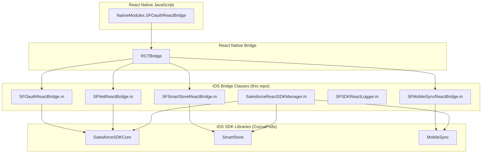

# iOS Bridge Implementation

This document describes the iOS native bridge implementation that connects React Native JavaScript to iOS SDK libraries.

## Table of Contents

- [Overview](#overview)
- [Architecture](#architecture)
- [Bridge Classes](#bridge-classes)
- [CocoaPods Integration](#cocoapods-integration)
- [Threading Model](#threading-model)
- [Error Handling](#error-handling)
- [Development Guide](#development-guide)

## Overview

The iOS bridge consists of Objective-C classes that implement React Native's `RCTBridgeModule` protocol. These classes receive calls from JavaScript, invoke iOS SDK APIs, and return results via callbacks.

### Location

All iOS bridge code lives in `ios/SalesforceReact/` directory within this repository.

### Technology Stack

- **Language**: Objective-C (for React Native bridge compatibility)
- **Framework**: React Native bridge (`RCTBridgeModule`)
- **Dependencies**: Salesforce iOS SDK libraries (via CocoaPods)
- **Build System**: Xcode, CocoaPods

## Architecture



## Bridge Classes

### Overview Table

| Class | JavaScript Module | Salesforce SDK | Purpose |
|-------|------------------|----------------|---------|
| `SFOauthReactBridge` | `SFOauthReactBridge` | `SFUserAccountManager`, `SFOAuthCredentials` | OAuth/authentication |
| `SFNetReactBridge` | `SFNetReactBridge` | `SFRestAPI` | REST API requests |
| `SFSmartStoreReactBridge` | `SFSmartStoreReactBridge` | `SFSmartStore` | Encrypted storage |
| `SFMobileSyncReactBridge` | `SFMobileSyncReactBridge` | `SFMobileSyncManager` | Data synchronization |
| `SFSDKReactLogger` | N/A (internal) | `SFSDKLogger` | Logging utilities |
| `SalesforceReactSDKManager` | N/A (internal) | `MobileSyncSDKManager` | SDK initialization |

### SFOauthReactBridge

**Location**: `ios/SalesforceReact/SFOauthReactBridge.{h,m}`

**Purpose**: OAuth authentication and user session management

**iOS SDK Dependencies**:
- `SFUserAccountManager` - User account management
- `SFOAuthCredentials` - OAuth credentials storage
- `SFOAuthInfo` - OAuth flow information

**Exported Methods**:
- `getAuthCredentials:callback:` - Get current user credentials
- `authenticate:callback:` - Trigger OAuth login flow
- `logoutCurrentUser:callback:` - Logout current user

**Example Implementation**:
```objective-c
@implementation SFOauthReactBridge

RCT_EXPORT_MODULE();

RCT_EXPORT_METHOD(getAuthCredentials:(NSDictionary *)args 
                  callback:(RCTResponseSenderBlock)callback)
{
    SFOAuthCredentials *creds = 
        [SFUserAccountManager sharedInstance].currentUser.credentials;
    
    if (nil != creds) {
        NSDictionary* credentialsDict = @{
            @"accessToken": creds.accessToken,
            @"refreshToken": creds.refreshToken,
            @"userId": creds.userId,
            @"orgId": creds.organizationId,
            @"instanceUrl": creds.instanceUrl.absoluteString,
            // ... more fields
        };
        callback(@[[NSNull null], credentialsDict]);
    } else {
        NSError *error = [self createNotAuthenticatedError];
        callback(@[error, [NSNull null]]);
    }
}

@end
```

**Key Patterns**:
- Uses `dispatch_async(dispatch_get_main_queue(), ...)` for UI operations (login flow)
- Observes `kSFNotificationUserDidLogout` for logout completion
- Returns credentials as NSDictionary

### SFNetReactBridge

**Location**: `ios/SalesforceReact/SFNetReactBridge.{h,m}`

**Purpose**: Salesforce REST API requests

**iOS SDK Dependencies**:
- `SFRestAPI` - REST client
- `SFRestRequest` - REST request builder
- `SFRestMethod` - HTTP methods

**Exported Methods**:
- `sendRequest:callback:` - Send arbitrary REST request

**Request Processing**:
```objective-c
RCT_EXPORT_METHOD(sendRequest:(NSDictionary *)argsDict 
                  callback:(RCTResponseSenderBlock)callback)
{
    // 1. Parse arguments
    SFRestMethod method = [self parseMethod:argsDict];
    NSString *path = argsDict[@"path"];
    NSDictionary *queryParams = argsDict[@"queryParams"];
    
    // 2. Build request
    SFRestRequest *request = [SFRestRequest requestWithMethod:method 
                                                         path:path 
                                                  queryParams:queryParams];
    
    // 3. Handle file uploads
    NSDictionary *fileParams = argsDict[@"fileParams"];
    if (fileParams) {
        // Add file data to request
    }
    
    // 4. Send request
    [[SFRestAPI sharedInstance] send:request 
                            delegate:nil 
                       resultHandler:^(id response, NSError *error) {
        if (error) {
            callback(@[error, [NSNull null]]);
        } else {
            callback(@[[NSNull null], response]);
        }
    }];
}
```

**Features**:
- Automatic OAuth token refresh on 401
- File upload support (multipart/form-data)
- Binary response handling (base64 encoded)
- Custom headers and endpoints

### SFSmartStoreReactBridge

**Location**: `ios/SalesforceReact/SFSmartStoreReactBridge.{h,m}`

**Purpose**: Encrypted SQLite database operations

**iOS SDK Dependencies**:
- `SFSmartStore` - Database manager
- `SFSoupSpec` - Soup definition
- `SFSoupIndex` - Index specification
- `SFQuerySpec` - Query specification

**Exported Methods**:
- `registerSoup:callback:`
- `removeSoup:callback:`
- `soupExists:callback:`
- `querySoup:callback:`
- `runSmartQuery:callback:`
- `upsertSoupEntries:callback:`
- `removeFromSoup:callback:`
- `moveCursorToPageIndex:callback:`
- `closeCursor:callback:`
- And more...

**Soup Operations**:
```objective-c
RCT_EXPORT_METHOD(registerSoup:(NSDictionary *)argsDict 
                      callback:(RCTResponseSenderBlock)callback)
{
    // 1. Get store
    SFSmartStore *store = [self getStoreFromArgs:argsDict];
    
    // 2. Parse soup name and indexes
    NSString *soupName = argsDict[@"soupName"];
    NSArray *indexSpecs = [self convertIndexSpecs:argsDict[@"indexes"]];
    
    // 3. Register soup
    NSError *error = nil;
    BOOL success = [store registerSoup:soupName 
                        withIndexSpecs:indexSpecs 
                                 error:&error];
    
    // 4. Return result
    if (success) {
        callback(@[[NSNull null], soupName]);
    } else {
        callback(@[error, [NSNull null]]);
    }
}
```

**Key Features**:
- User-specific and global stores
- Named stores support
- Cursor-based pagination
- Smart SQL queries (complex SQL with joins)

### SFMobileSyncReactBridge

**Location**: `ios/SalesforceReact/SFMobileSyncReactBridge.{h,m}`

**Purpose**: Bidirectional sync between SmartStore and Salesforce

**iOS SDK Dependencies**:
- `SFMobileSyncManager` - Sync orchestration
- `SFSyncDownTarget` - Sync down configuration
- `SFSyncUpTarget` - Sync up configuration
- `SFSyncState` - Sync status tracking

**Exported Methods**:
- `syncDown:callback:`
- `syncUp:callback:`
- `reSync:callback:`
- `getSyncStatus:callback:`
- `deleteSync:callback:`
- `cleanResyncGhosts:callback:`

**Sync Operation**:
```objective-c
RCT_EXPORT_METHOD(syncDown:(NSDictionary *)argsDict 
                  callback:(RCTResponseSenderBlock)callback)
{
    // 1. Get sync manager
    SFMobileSyncManager *syncManager = [self getSyncManagerFromArgs:argsDict];
    
    // 2. Parse target and options
    SFSyncDownTarget *target = [self buildSyncDownTarget:argsDict[@"target"]];
    NSString *soupName = argsDict[@"soupName"];
    SFSyncOptions *options = [self parseSyncOptions:argsDict[@"options"]];
    NSString *syncName = argsDict[@"syncName"];
    
    // 3. Start sync
    SFSyncState *syncState = [syncManager syncDownWithTarget:target 
                                                    soupName:soupName 
                                                     options:options 
                                                    syncName:syncName 
                                                   onUpdate:^(SFSyncState *state) {
        // Progress callback (not exposed to JS in current implementation)
    }];
    
    // 4. Return initial state
    callback(@[[NSNull null], [self syncStateToDict:syncState]]);
}
```

**Sync Features**:
- SOQL, SOSL, MRU, custom sync targets
- Named syncs for easy re-sync
- Merge modes (OVERWRITE, LEAVE_IF_CHANGED)
- Ghost record cleanup

### SFSDKReactLogger

**Location**: `ios/SalesforceReact/SFSDKReactLogger.{h,m}`

**Purpose**: Logging wrapper for SDK bridge

**Methods**:
```objective-c
@interface SFSDKReactLogger : NSObject

+ (void)d:(Class)cls format:(NSString *)format, ...;  // Debug
+ (void)i:(Class)cls format:(NSString *)format, ...;  // Info
+ (void)w:(Class)cls format:(NSString *)format, ...;  // Warning
+ (void)e:(Class)cls format:(NSString *)format, ...;  // Error

@end
```

**Usage**:
```objective-c
#import "SFSDKReactLogger.h"

[SFSDKReactLogger d:[self class] format:@"Method called with args: %@", args];
```

### SalesforceReactSDKManager

**Location**: `ios/SalesforceReact/SalesforceReactSDKManager.{h,m}`

**Purpose**: SDK initialization and configuration

**Inheritance**: Extends `MobileSyncSDKManager` (which extends `SalesforceSDKManager`)

**Role**:
- Initializes iOS SDK components
- Configures OAuth settings
- Sets up user account management
- Provides React Native-specific SDK configuration

**Usage** (in React Native app):
```objective-c
// AppDelegate.m
#import <SalesforceReact/SalesforceReactSDKManager.h>

- (BOOL)application:(UIApplication *)application 
    didFinishLaunchingWithOptions:(NSDictionary *)launchOptions
{
    // Initialize SDK
    [SalesforceReactSDKManager initializeSDK];
    
    // Configure Connected App
    [[SalesforceReactSDKManager sharedManager] 
        setConnectedAppId:@"<consumer-key>"];
    [[SalesforceReactSDKManager sharedManager] 
        setConnectedAppCallbackUri:@"<redirect-uri>"];
    
    // Configure OAuth scopes
    [[SalesforceReactSDKManager sharedManager] 
        setOAuthScopes:@[@"web", @"api"]];
    
    return YES;
}
```

## CocoaPods Integration

### SalesforceReact.podspec

**Location**: Root of this repository

```ruby
Pod::Spec.new do |s|
  s.name         = "SalesforceReact"
  s.version      = "14.0.0"
  s.summary      = "Salesforce Mobile SDK for iOS - SalesforceReact"
  s.homepage     = "https://github.com/forcedotcom/SalesforceMobileSDK-ReactNative"
  s.license      = { :type => "Salesforce.com Mobile SDK License" }
  s.author       = { "Wolfgang Mathurin" => "wmathurin@salesforce.com" }
  s.platform     = :ios, "18.0"
  
  # Dependencies
  s.dependency 'React-Core'
  s.dependency 'SalesforceSDKCommon', "~>14.0.0"
  s.dependency 'SalesforceAnalytics', "~>14.0.0"
  s.dependency 'SalesforceSDKCore', "~>14.0.0"
  s.dependency 'SmartStore', "~>14.0.0"
  s.dependency 'MobileSync', "~>14.0.0"
  
  # Source files
  s.source_files = 'ios/SalesforceReact/**/*.{h,m}'
  
  # Public headers
  s.public_header_files = [
    'ios/SalesforceReact/SFNetReactBridge.h',
    'ios/SalesforceReact/SFOauthReactBridge.h',
    'ios/SalesforceReact/SFSDKReactLogger.h',
    'ios/SalesforceReact/SFSmartStoreReactBridge.h',
    'ios/SalesforceReact/SFMobileSyncReactBridge.h',
    'ios/SalesforceReact/SalesforceReactSDKManager.h'
  ]
  
  # Prefix header
  s.prefix_header_contents = '#import "SFSDKReactLogger.h"'
  
  s.requires_arc = true
end
```

### Installing in React Native App

**Podfile**:
```ruby
platform :ios, '18.0'

target 'MyReactNativeApp' do
  # React Native pods
  use_react_native!
  
  # Salesforce Mobile SDK
  pod 'SalesforceReact', :path => './node_modules/react-native-force'
end
```

**Install**:
```bash
cd ios
pod install
```

### Dependency Tree

```
SalesforceReact (this pod)
├── React-Core (React Native)
├── SalesforceSDKCommon
│   └── FMDB/SQLCipher
├── SalesforceAnalytics
│   └── SalesforceSDKCommon
├── SalesforceSDKCore
│   ├── SalesforceSDKCommon
│   └── SalesforceAnalytics
├── SmartStore
│   ├── SalesforceSDKCore
│   └── SQLCipher
└── MobileSync
    ├── SalesforceSDKCore
    └── SmartStore
```

## Threading Model

### Bridge Thread

React Native bridge methods are called on the React Native bridge thread (background thread), not the main thread.

**Thread Safety**:
```objective-c
RCT_EXPORT_METHOD(someMethod:(NSDictionary *)args 
                    callback:(RCTResponseSenderBlock)callback)
{
    // This code runs on React Native bridge thread
    // Safe for most iOS SDK operations
    
    // For UI operations, dispatch to main queue
    dispatch_async(dispatch_get_main_queue(), ^{
        // UI code here
        [[SFUserAccountManager sharedInstance] loginWithCompletion:...];
    });
}
```

### Main Thread Requirements

Some iOS SDK operations must run on the main thread:
- **OAuth login**: Presents web view for authentication
- **Logout**: May trigger UI updates
- **Biometric authentication**: Uses system UI

**Pattern**:
```objective-c
RCT_EXPORT_METHOD(authenticate:(NSDictionary *)args 
                      callback:(RCTResponseSenderBlock)callback)
{
    __weak typeof(self) weakSelf = self;
    dispatch_async(dispatch_get_main_queue(), ^{
        __strong typeof(weakSelf) strongSelf = weakSelf;
        
        [[SFUserAccountManager sharedInstance] 
            loginWithCompletion:^(SFOAuthInfo *authInfo, 
                                  SFUserAccount *userAccount) {
            // Success - this block runs on main thread
            [strongSelf sendAuthCredentials:callback];
        } 
        failure:^(SFOAuthInfo *authInfo, NSError *error) {
            // Error - this block runs on main thread
            callback(@[error, [NSNull null]]);
        }];
    });
}
```

### Background Operations

Most SmartStore and networking operations run on background threads automatically:
- **Database queries**: SmartStore uses background threads
- **Network requests**: SFRestAPI uses network threads
- **Sync operations**: MobileSync uses background thread pool

## Error Handling

### Error Callback Pattern

iOS bridge methods use a standard error callback pattern:

```objective-c
// Success
callback(@[[NSNull null], result]);

// Error
callback(@[error, [NSNull null]]);
```

### Creating NSError

```objective-c
- (NSError *)createNotAuthenticatedError {
    NSDictionary *userInfo = @{
        NSLocalizedDescriptionKey: @"User not authenticated",
        NSLocalizedFailureReasonErrorKey: @"No authenticated user found"
    };
    
    return [NSError errorWithDomain:@"SFOAuthReactBridge"
                               code:1001
                           userInfo:userInfo];
}
```

### Error Propagation

```objective-c
RCT_EXPORT_METHOD(someMethod:(NSDictionary *)args 
                    callback:(RCTResponseSenderBlock)callback)
{
    NSError *error = nil;
    
    BOOL success = [self performOperation:&error];
    
    if (success) {
        callback(@[[NSNull null], @"OK"]);
    } else {
        callback(@[error, [NSNull null]]);
    }
}
```

### Common Error Scenarios

**OAuth Errors**:
```objective-c
- User cancels login → error with domain @"SFOAuthError"
- Invalid credentials → error with code 401
- Network timeout → error with NSURLErrorDomain
```

**REST API Errors**:
```objective-c
- 401 Unauthorized → Automatic token refresh and retry
- 403 Forbidden → Permissions error
- 404 Not Found → Resource not found
- 500+ Server Error → Salesforce server issue
```

**SmartStore Errors**:
```objective-c
- Soup doesn't exist → error with description
- Invalid query → SQL syntax error
- Database full → storage limit error
```

## Development Guide

### Prerequisites

- **Xcode**: 15+
- **CocoaPods**: 1.10+
- **Node.js**: 20+
- **React Native**: 0.81.5

### Building Bridge Code

The iOS bridge is built as part of the React Native app build:

```bash
cd ios
pod install
xcodebuild -workspace MyApp.xcworkspace -scheme MyApp
```

### Adding New Bridge Methods

1. **Add method to .h file**:
```objective-c
// SFOauthReactBridge.h
@interface SFOauthReactBridge : NSObject <RCTBridgeModule>
@end
```

2. **Implement in .m file**:
```objective-c
// SFOauthReactBridge.m
RCT_EXPORT_METHOD(newMethod:(NSDictionary *)args 
                    callback:(RCTResponseSenderBlock)callback)
{
    // Implementation
}
```

3. **Add JavaScript wrapper** (in `src/react.force.oauth.ts`):
```typescript
export const newMethod = (
  successCB: ExecSuccessCallback<ResultType>,
  errorCB: ExecErrorCallback
): void => {
  exec(successCB, errorCB, "newMethod", {});
};
```

4. **Add tests** (in `test/oauth.test.js`):
```javascript
function testNewMethod() {
  oauth.newMethod(
    (result) => {
      // Assertions
      testDone();
    },
    (error) => {
      testFailed(error);
    }
  );
}

registerTest(testNewMethod);
```

### Debugging Bridge

**Xcode Debugging**:
1. Open `.xcworkspace` in Xcode
2. Set breakpoint in bridge .m file
3. Run app in Xcode
4. Trigger JavaScript call
5. Breakpoint hits in Objective-C code

**Logging**:
```objective-c
[SFSDKReactLogger d:[self class] format:@"Args: %@", args];
[SFSDKReactLogger e:[self class] format:@"Error: %@", error];
```

**JavaScript Console**:
```typescript
import { forceLog } from 'react-native-force';

forceLog.setLogLevel('debug');
// Now see bridge calls in console
```

### Testing

See [ios-tests/README.md](../ios-tests/README.md) for iOS testing details.

### Code Style

**Objective-C Conventions**:
- Use ARC (Automatic Reference Counting)
- Prefix constants with `k` (e.g., `kAccessToken`)
- Use `@property` for instance variables
- Always use `strong`/`weak` for blocks
- Document public methods with comments

**Example**:
```objective-c
// Public method documentation
/**
 * Retrieves the current user's authentication credentials.
 *
 * @param args Request arguments (currently unused)
 * @param callback Callback with (error, credentials)
 */
RCT_EXPORT_METHOD(getAuthCredentials:(NSDictionary *)args 
                          callback:(RCTResponseSenderBlock)callback)
{
    // Implementation
}
```

## Best Practices

### 1. Always Use Weak-Strong Dance for Blocks

```objective-c
RCT_EXPORT_METHOD(authenticate:(NSDictionary *)args 
                      callback:(RCTResponseSenderBlock)callback)
{
    __weak typeof(self) weakSelf = self;
    dispatch_async(dispatch_get_main_queue(), ^{
        __strong typeof(weakSelf) strongSelf = weakSelf;
        
        // Use strongSelf, not self
        [strongSelf doSomething];
    });
}
```

### 2. Check for Nil Before Accessing

```objective-c
SFOAuthCredentials *creds = 
    [SFUserAccountManager sharedInstance].currentUser.credentials;

if (creds) {
    // Safe to access creds.accessToken
} else {
    // Handle nil case
}
```

### 3. Use NSNull for Null Values

```objective-c
// ❌ Bad
NSDictionary *dict = @{
    @"value": nil  // Crashes!
};

// ✅ Good
NSDictionary *dict = @{
    @"value": value ?: [NSNull null]
};
```

### 4. Convert Data Types Carefully

```objective-c
// String from argument
NSString *str = [argsDict sfsdk_nonNullObjectForKey:@"key"];

// Boolean from argument
BOOL flag = [argsDict[@"flag"] boolValue];

// Number from argument
NSNumber *num = argsDict[@"number"];
NSInteger intValue = [num integerValue];
```

### 5. Handle Errors Gracefully

```objective-c
NSError *error = nil;
BOOL success = [self performOperation:&error];

if (!success) {
    if (error) {
        callback(@[error, [NSNull null]]);
    } else {
        // Create generic error
        NSError *genericError = [NSError errorWithDomain:@"Bridge"
                                                    code:-1
                                                userInfo:nil];
        callback(@[genericError, [NSNull null]]);
    }
    return;
}

callback(@[[NSNull null], result]);
```

## Further Reading

- [API Reference](API_REFERENCE.md) - Complete iOS bridge API reference
- [iOS SDK Documentation](https://forcedotcom.github.io/SalesforceMobileSDK-iOS) - iOS SDK docs
- [JavaScript API](../javascript/README.md) - JavaScript API overview
- [Architecture](../ARCHITECTURE.md) - Overall architecture
- [Testing Guide](../ios-tests/README.md) - Running iOS tests
