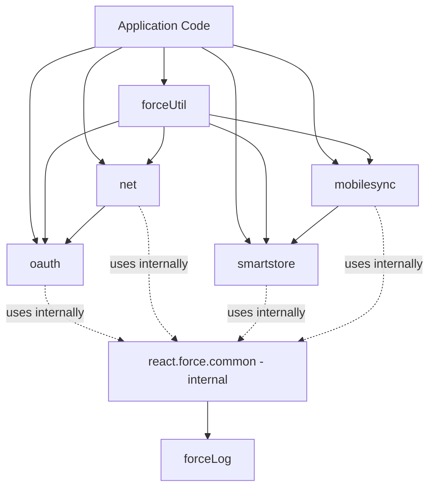

# JavaScript/TypeScript API Overview

This document provides an overview of all JavaScript/TypeScript modules in the Salesforce Mobile SDK for React Native.

## Table of Contents

- [Module Organization](#module-organization)
- [Import Patterns](#import-patterns)
- [Callback vs Promise Patterns](#callback-vs-promise-patterns)
- [Module Summaries](#module-summaries)
- [TypeScript Support](#typescript-support)

## Module Organization

The SDK is organized into the following modules:

### Core Modules

1. **oauth** (`react.force.oauth`) - Authentication and user management
2. **net** (`react.force.net`) - Salesforce REST API client
3. **smartstore** (`react.force.smartstore`) - Encrypted on-device storage
4. **mobilesync** (`react.force.mobilesync`) - Data synchronization framework

### Utility Modules

5. **forceUtil** (`react.force.util`) - Promise wrappers and utilities
6. **forceLog** (`react.force.log`) - Logging configuration
7. **forceTest** (`react.force.test`) - Test harness utilities (used by the SDK's own test suite)
8. **forceClient** - Alias for `net` (kept for backward compatibility)

> Note: `react.force.common` exists as an internal helper but is **not exported** from `react-native-force`. Application code should use the public modules listed above.

### Module Dependency Graph



(`react.force.common` is internal; not exported from the package.)

## Import Patterns

### Named Imports (Recommended)

```typescript
import { 
  oauth, 
  net, 
  smartstore, 
  mobilesync,
  forceUtil,
  forceLog
} from 'react-native-force';
```

### Namespace Import

```typescript
import * as force from 'react-native-force';

force.oauth.getAuthCredentials(success, error);
force.net.query(soql, success, error);
```

### Legacy Import

```typescript
// For backward compatibility
import { forceClient } from 'react-native-force';
forceClient.query(soql, success, error); // Same as net.query
```

### Type Imports

```typescript
import type {
  UserAccount,
  QuerySpec,
  StoreCursor,
  SyncOptions,
  SyncEvent
} from 'react-native-force';
```

## Callback vs Promise Patterns

The SDK provides callback-based APIs (for React Native bridge compatibility) and utilities to convert them to promises.

### Callback-Based API (Native)

All SDK methods use callbacks internally:

```typescript
import { oauth } from 'react-native-force';

oauth.getAuthCredentials(
  (credentials) => {
    // Success
    console.log('Access token:', credentials.accessToken);
  },
  (error) => {
    // Error
    console.error('Authentication failed:', error);
  }
);
```

### Promise-Based API (Recommended)

Convert to promises using `forceUtil.promiser`:

```typescript
import { oauth, forceUtil } from 'react-native-force';

// Create promise wrapper
const getAuthCredentials = forceUtil.promiser(oauth.getAuthCredentials);

// Use with async/await
try {
  const credentials = await getAuthCredentials();
  console.log('Access token:', credentials.accessToken);
} catch (error) {
  console.error('Authentication failed:', error);
}
```

### Batch Promise Conversion

```typescript
import { oauth, net, smartstore, forceUtil } from 'react-native-force';

// Create promise-based wrappers
const api = {
  // OAuth
  getAuthCredentials: forceUtil.promiser(oauth.getAuthCredentials),
  authenticate: forceUtil.promiser(oauth.authenticate),
  logout: forceUtil.promiser(oauth.logout),
  
  // REST API
  query: forceUtil.promiser(net.query),
  create: forceUtil.promiser(net.create),
  update: forceUtil.promiser(net.update),
  del: forceUtil.promiser(net.del),
  
  // SmartStore
  registerSoup: forceUtil.promiser(smartstore.registerSoup),
  querySoup: forceUtil.promiser(smartstore.querySoup),
  upsertSoupEntries: forceUtil.promiser(smartstore.upsertSoupEntries)
};

// Use with async/await
async function fetchAccounts() {
  const result = await api.query('SELECT Id, Name FROM Account LIMIT 10');
  return result.records;
}
```

## Module Summaries

### 1. OAuth Module (`react.force.oauth`)

**Purpose**: User authentication and session management

**Key Functions**:
- `authenticate()` - Trigger OAuth login flow
- `getAuthCredentials()` - Get current user credentials
- `logout()` - Log out current user

**Common Use Cases**:
- Check if user is authenticated
- Force login when needed
- Get access token for API calls
- Logout functionality

**Example**:
```typescript
const credentials = await forceUtil.promiser(oauth.getAuthCredentials)();
console.log(`Logged in as: ${credentials.userId}`);
```

**See**: [API Reference - OAuth](API_REFERENCE.md#oauth-module)

### 2. Net Module (`react.force.net`)

**Purpose**: Salesforce REST API client

**Key Functions**:
- `query()` - Execute SOQL query
- `create()` - Create record
- `update()` - Update record
- `del()` - Delete record
- `retrieve()` - Retrieve record by ID
- `search()` - Execute SOSL search
- `sendRequest()` - Send custom REST request

**Common Use Cases**:
- Query Salesforce records
- CRUD operations on SObjects
- Full-text search
- Custom REST endpoint calls
- File uploads/downloads

**Example**:
```typescript
const result = await forceUtil.promiser(net.query)(
  'SELECT Id, Name FROM Account WHERE Industry = \'Technology\' LIMIT 10'
);
console.log(`Found ${result.totalSize} accounts`);
```

**See**: [API Reference - Net](API_REFERENCE.md#net-module)

### 3. SmartStore Module (`react.force.smartstore`)

**Purpose**: Encrypted on-device SQLite database

**Key Concepts**:
- **Soup**: A table in the database (like a collection)
- **Entry**: A JSON document stored in a soup (like a row)
- **Index**: Indexed fields for querying (like database indexes)
- **Cursor**: Paginated query results

**Key Functions**:
- `registerSoup()` - Create a soup with indexes
- `upsertSoupEntries()` - Insert or update entries
- `querySoup()` - Query soup with QuerySpec
- `runSmartQuery()` - Execute Smart SQL query
- `removeFromSoup()` - Delete entries
- `removeSoup()` - Drop soup

**Common Use Cases**:
- Cache Salesforce records locally
- Store app data securely
- Offline data access
- Complex local queries

**Example**:
```typescript
// Register soup
await forceUtil.promiser(smartstore.registerSoup)(
  false, // isGlobalStore
  'accounts',
  [
    { path: 'Id', type: 'string' },
    { path: 'Name', type: 'string' },
    { path: 'LastModifiedDate', type: 'string' }
  ]
);

// Query soup
const querySpec = smartstore.buildExactQuerySpec('Name', 'Acme', 10);
const cursor = await forceUtil.promiser(smartstore.querySoup)(
  false,
  'accounts',
  querySpec
);
console.log(`Found ${cursor.totalEntries} entries`);
```

**See**: [API Reference - SmartStore](API_REFERENCE.md#smartstore-module)

### 4. MobileSync Module (`react.force.mobilesync`)

**Purpose**: Bidirectional sync between SmartStore and Salesforce

**Key Concepts**:
- **Sync Down**: Download records from Salesforce to SmartStore
- **Sync Up**: Upload local changes from SmartStore to Salesforce
- **Sync Target**: Defines what to sync (SOQL query, MRU list, etc.)
- **Merge Mode**: How to handle conflicts (OVERWRITE, LEAVE_IF_CHANGED)

**Key Functions**:
- `syncDown()` - Download records from Salesforce
- `syncUp()` - Upload local changes to Salesforce
- `reSync()` - Re-run a named sync
- `getSyncStatus()` - Check sync progress
- `cleanResyncGhosts()` - Remove deleted records

**Common Use Cases**:
- Sync Salesforce records for offline access
- Upload user edits back to Salesforce
- Handle conflict resolution
- Track sync progress

**Example**:
```typescript
// Sync down accounts
const syncDown = await forceUtil.promiser(mobilesync.syncDown)(
  false, // isGlobalStore
  {
    type: 'soql',
    query: 'SELECT Id, Name, Industry FROM Account WHERE LastModifiedDate > LAST_N_DAYS:7'
  },
  'accounts', // soup name
  {
    mergeMode: 'OVERWRITE'
  }
);

console.log(`Synced ${syncDown.totalSize} accounts`);
```

**See**: [API Reference - MobileSync](API_REFERENCE.md#mobilesync-module)

### 5. ForceUtil Module (`react.force.util`)

**Purpose**: Utility functions for promise conversion

**Key Functions**:
- `promiser(func)` - Convert callback-based function to promise
- `promiserNoRejection(func)` - Promise that never rejects
- `timeoutPromiser(millis)` - Create delay promise

**Common Use Cases**:
- Convert SDK callbacks to async/await
- Add timeout to operations
- Handle promise rejections globally

**Example**:
```typescript
import { net, forceUtil } from 'react-native-force';

// Convert to promise
const query = forceUtil.promiser(net.query);

// Use with async/await
const result = await query('SELECT Id FROM Account');

// With timeout
await Promise.race([
  query('SELECT Id FROM Account'),
  forceUtil.timeoutPromiser(5000).then(() => {
    throw new Error('Query timeout');
  })
]);
```

**See**: [API Reference - ForceUtil](API_REFERENCE.md#forceutil-module)

### 6. ForceLog Module (`react.force.log`)

**Purpose**: Logging configuration and console wrapper

**Key Functions**:
- `setLogLevel(level)` - Set log level ('debug', 'info', 'warn', 'error')
- `getLogLevel()` - Get current log level
- `sdkConsole` - Wrapped console object

**Common Use Cases**:
- Control SDK log verbosity
- Debug issues during development
- Disable logs in production

**Example**:
```typescript
import { forceLog } from 'react-native-force';

// Set log level
forceLog.setLogLevel('debug'); // Verbose logging
forceLog.setLogLevel('error'); // Only errors

// Use SDK console
forceLog.sdkConsole.debug('Debug message');
forceLog.sdkConsole.info('Info message');
forceLog.sdkConsole.error('Error message');
```

**See**: [API Reference - ForceLog](API_REFERENCE.md#forcelog-module)

## TypeScript Support

### Type Exports

All types are exported from the main package:

```typescript
import type {
  // OAuth types
  UserAccount,
  OAuthMethod,
  
  // SmartStore types
  StoreConfig,
  SoupIndexSpec,
  QuerySpec,
  StoreCursor,
  QuerySpecType,
  StoreOrder,
  
  // MobileSync types
  SyncDownTarget,
  SyncUpTarget,
  SyncOptions,
  SyncEvent,
  SyncStatus,
  
  // Common types
  ExecSuccessCallback,
  ExecErrorCallback,
  HttpMethod,
  LogLevel
} from 'react-native-force';
```

### Generic Type Parameters

Many SDK functions support generic type parameters for type-safe results:

```typescript
import { net, smartstore, forceUtil } from 'react-native-force';
import type { StoreCursor } from 'react-native-force';

// Define your types
interface Account {
  Id: string;
  Name: string;
  Industry: string;
}

// Type-safe query
const query = forceUtil.promiser(net.query<{ records: Account[] }>);
const result = await query('SELECT Id, Name, Industry FROM Account');
result.records.forEach(account => {
  console.log(account.Name); // TypeScript knows this is a string
});

// Type-safe soup query
const querySoup = forceUtil.promiser(smartstore.querySoup<Account>);
const cursor: StoreCursor<Account> = await querySoup(false, 'accounts', querySpec);
cursor.currentPageOrderedEntries.forEach(account => {
  console.log(account.Industry); // Type-safe access
});
```

### Creating Type-Safe Wrappers

```typescript
// api.ts - Type-safe API wrapper
import { oauth, net, smartstore, forceUtil } from 'react-native-force';
import type { UserAccount, StoreCursor } from 'react-native-force';

export const api = {
  oauth: {
    getAuthCredentials: (): Promise<UserAccount> => 
      forceUtil.promiser(oauth.getAuthCredentials)(),
    
    logout: (): Promise<void> => 
      forceUtil.promiser(oauth.logout)()
  },
  
  net: {
    query: <T = any>(soql: string): Promise<T> => 
      forceUtil.promiser(net.query<T>)(soql),
    
    create: (objectType: string, fields: Record<string, any>): Promise<{ id: string }> =>
      forceUtil.promiser(net.create)(objectType, fields)
  },
  
  smartstore: {
    querySoup: <T>(soupName: string, querySpec: any): Promise<StoreCursor<T>> =>
      forceUtil.promiser(smartstore.querySoup<T>)(false, soupName, querySpec)
  }
};

// Usage
const credentials = await api.oauth.getAuthCredentials();
const accounts = await api.net.query<{ records: Account[] }>('SELECT Id, Name FROM Account');
```

## Error Handling

### Callback-Based Error Handling

```typescript
oauth.getAuthCredentials(
  (credentials) => {
    // Success
  },
  (error) => {
    // Error handling
    if (error.message.includes('not authenticated')) {
      // Trigger login
      oauth.authenticate(success, error);
    }
  }
);
```

### Promise-Based Error Handling

```typescript
try {
  const credentials = await forceUtil.promiser(oauth.getAuthCredentials)();
} catch (error) {
  if (error.message.includes('not authenticated')) {
    // Trigger login
    await forceUtil.promiser(oauth.authenticate)();
  }
}
```

### Network Error Handling

```typescript
const query = forceUtil.promiser(net.query);

try {
  const result = await query('SELECT Id FROM Account');
} catch (error) {
  if (error.status === 401) {
    // Unauthorized - token expired
    // SDK automatically refreshes token and retries
  } else if (error.status === 403) {
    // Forbidden - insufficient permissions
  } else if (error.status === 404) {
    // Not found
  } else {
    // Other error
  }
}
```

## Best Practices

### 1. Always Use Promises

```typescript
// ❌ Bad - Callback hell
oauth.getAuthCredentials(
  (creds) => {
    net.query('SELECT Id FROM Account',
      (result) => {
        smartstore.upsertSoupEntries(false, 'accounts', result.records,
          (entries) => {
            console.log('Saved');
          },
          (error) => console.error(error)
        );
      },
      (error) => console.error(error)
    );
  },
  (error) => console.error(error)
);

// ✅ Good - Async/await with promises
const getAuth = forceUtil.promiser(oauth.getAuthCredentials);
const query = forceUtil.promiser(net.query);
const upsertSoup = forceUtil.promiser(smartstore.upsertSoupEntries);

try {
  const creds = await getAuth();
  const result = await query('SELECT Id FROM Account');
  await upsertSoup(false, 'accounts', result.records);
  console.log('Saved');
} catch (error) {
  console.error(error);
}
```

### 2. Create Reusable API Wrappers

```typescript
// lib/salesforce.ts
import { oauth, net, smartstore, mobilesync, forceUtil } from 'react-native-force';

export const salesforce = {
  auth: {
    getCurrentUser: forceUtil.promiser(oauth.getAuthCredentials),
    login: forceUtil.promiser(oauth.authenticate),
    logout: forceUtil.promiser(oauth.logout)
  },
  
  api: {
    query: forceUtil.promiser(net.query),
    create: forceUtil.promiser(net.create),
    update: forceUtil.promiser(net.update),
    delete: forceUtil.promiser(net.del)
  },
  
  store: {
    register: forceUtil.promiser(smartstore.registerSoup),
    query: forceUtil.promiser(smartstore.querySoup),
    upsert: forceUtil.promiser(smartstore.upsertSoupEntries)
  },
  
  sync: {
    down: forceUtil.promiser(mobilesync.syncDown),
    up: forceUtil.promiser(mobilesync.syncUp)
  }
};

// Usage
import { salesforce } from './lib/salesforce';

const user = await salesforce.auth.getCurrentUser();
const accounts = await salesforce.api.query('SELECT Id, Name FROM Account');
```

### 3. Handle Offline Scenarios

```typescript
import { net, smartstore, forceUtil } from 'react-native-force';
import NetInfo from '@react-native-community/netinfo';

async function getAccounts() {
  const isConnected = await NetInfo.fetch().then(state => state.isConnected);
  
  if (isConnected) {
    // Online - fetch from Salesforce
    const result = await forceUtil.promiser(net.query)(
      'SELECT Id, Name FROM Account'
    );
    
    // Cache in SmartStore
    await forceUtil.promiser(smartstore.upsertSoupEntries)(
      false,
      'accounts',
      result.records
    );
    
    return result.records;
  } else {
    // Offline - read from SmartStore
    const querySpec = smartstore.buildAllQuerySpec('Name', 'ascending', 100);
    const cursor = await forceUtil.promiser(smartstore.querySoup)(
      false,
      'accounts',
      querySpec
    );
    
    return cursor.currentPageOrderedEntries;
  }
}
```

### 4. Use TypeScript for Safety

```typescript
// Define interfaces for your data
interface Account {
  Id: string;
  Name: string;
  Industry: string | null;
  AnnualRevenue: number | null;
}

interface QueryResult<T> {
  totalSize: number;
  done: boolean;
  records: T[];
}

// Type-safe API calls
async function fetchAccounts(): Promise<Account[]> {
  const query = forceUtil.promiser(net.query<QueryResult<Account>>);
  const result = await query('SELECT Id, Name, Industry, AnnualRevenue FROM Account');
  return result.records;
}
```

## Next Steps

- **[Complete API Reference](API_REFERENCE.md)** - Detailed API documentation with examples
- **[Architecture Guide](../ARCHITECTURE.md)** - Understanding the bridge pattern
- **[iOS Implementation](../ios/README.md)** - iOS-specific details
